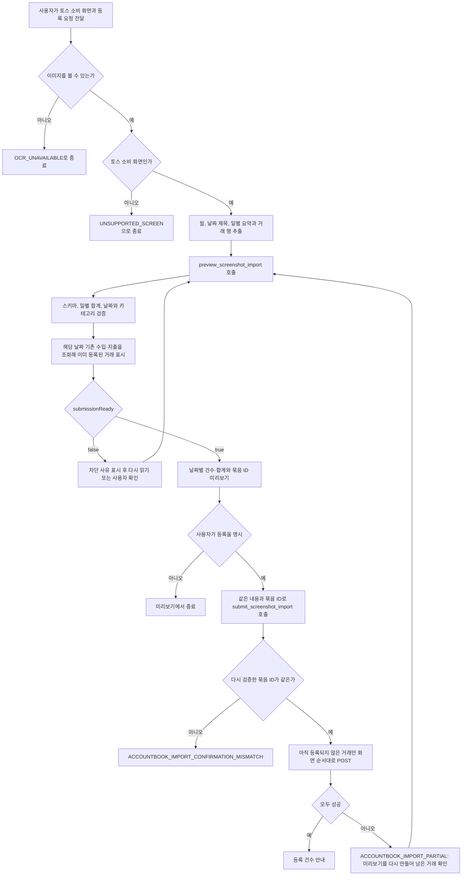
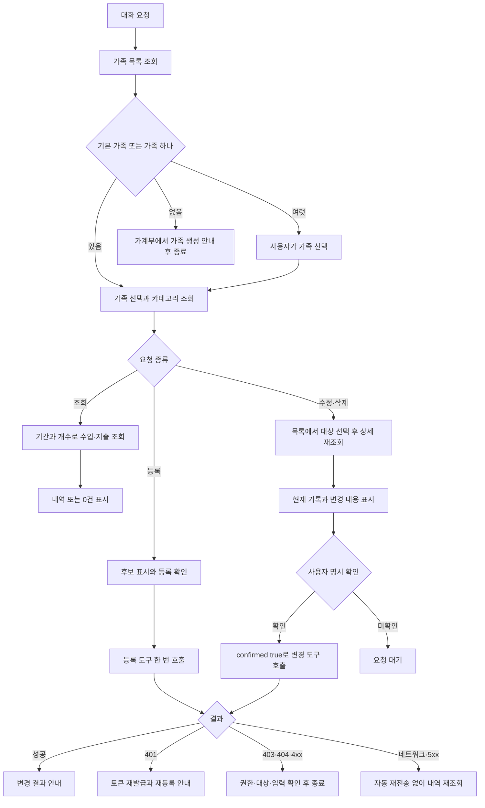

# Flow: accountbook

## 토스 화면 가져오기

미리보기 도구는 조회만 하며 등록 요청을 보내지 않는다.
등록 도구는 미리보기와 같은 검증을 처음부터 다시 수행한다.
묶음 ID는 가족, 기본 카테고리, 날짜별 거래 내용과 새로 등록할 거래 목록의 해시다.
확인한 뒤 내용이 바뀌거나 가계부의 기존 기록이 달라지면 그 ID로는 등록되지 않는다.

## 날짜와 화면 경계

- 화면에 표시된 월과 날짜 제목을 사용한다.
- 연도가 보이지 않으면 오늘의 한국 날짜보다 미래가 되지 않는 가장 가까운 연도로 추정하고 미리보기에 알린다.
- 선택한 날짜가 오늘의 한국 날짜보다 미래이면 등록하지 않는다.
- 다음 날짜 제목만 보이고 거래 행이 잘렸으면 해당 날짜를 선택하지 않는다.
- 한 날짜가 스크린샷 여러 장에 걸치면 에이전트가 한 날짜로 합친다. 장 사이에 빠진 행이 있으면 일별 합계가 맞지 않아 등록되지 않는다.
- 금액이 회색인 행은 토스가 일별 합계에서 뺀 거래이므로 추출하지 않는다.
- 화면에 거래 시각이 없으므로 API의 `LocalDateTime`에는 해당 날짜 정오를 넣는다.
  정오는 실제 거래 시각이 아니라 날짜가 timezone 변환으로 바뀌지 않게 하는 저장용 값이다.

## 이미 등록된 거래

화면의 일별 합계가 맞으면 그 날짜에 같은 금액과 설명의 거래가 몇 건인지가 정해진다.
도구는 해당 날짜의 기존 수입·지출에서 같은 날짜, 금액, 설명의 기록을 찾아 거래 한 건에 기록 하나씩 짝짓는다.
짝이 지어진 거래는 이미 등록된 것으로 보고 건너뛰며, 남은 거래만 등록한다.

- 같은 화면을 다시 보내면 새로 등록할 거래가 0건이다.
- 하루에 같은 금액과 설명의 거래가 두 건이고 기록이 하나면 한 건만 등록한다.
- 결제수단 없이 손으로 넣은 기록도 설명이 같으면 같은 거래로 본다.
- 설명을 다르게 적은 기존 기록은 같은 거래로 보지 못한다. 미리보기에서 사용자가 확인한다.

## 차단과 부분 실패

- 선택된 완전한 날짜가 없으면 `no_complete_day_selected`다.
- 카테고리 이름이 없으면 사용자가 고른 기본 카테고리를 사용한다. 그것도 없으면 `category_required`다.
  이미 등록된 거래에는 카테고리를 요구하지 않는다.
- 등록 도중 요청이 실패하면 남은 거래를 보내지 않는다.
  미리보기를 다시 만들면 등록된 거래는 건너뛰므로 남은 거래만 확인받아 등록한다.
  네트워크 오류나 5xx로 실패한 한 건도 저장됐다면 다시 만든 미리보기에서 이미 등록된 것으로 나온다.
- 같은 묶음의 등록이 겹치면 먼저 시작한 요청만 진행한다.

## 대화형 MCP 기록 관리

동시 요청은 profile별 MCP 프로세스가 처리하며 토큰과 기본 가족을 공유하지 않는다.
MCP 변경 요청에는 자동 재시도가 없다. 별도 요청이 같은 기록을 바꾸면 상세 조회와 변경 사이에 달라질 수 있다.
스킬은 사용자 확인 직전에 현재 기록을 다시 조회하며, 서버는 별도 동시 수정 잠금이나 멱등 키를 만들지 않는다.
