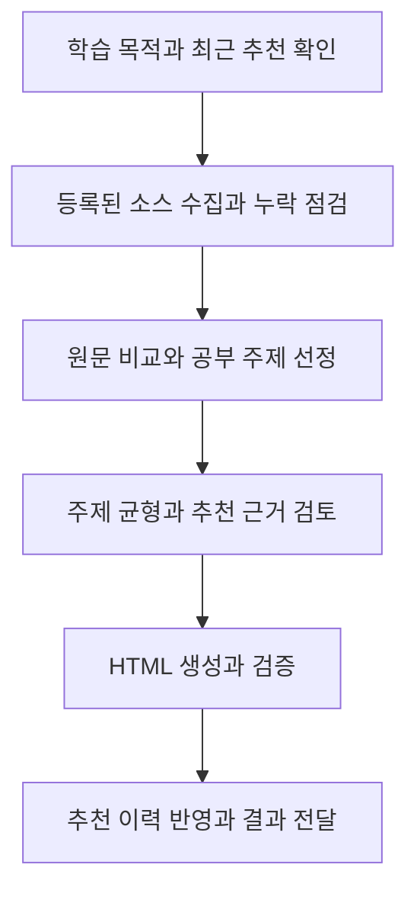

# 아침 공부 주제 추천

## 목표

**백엔드를 잘 만드는 데 도움이 되는 글을 중심으로, 자신의 설계와 구현에 적용할 판단을 얻도록 추천한다.**
AI도 관심 분야로 다루되 최근 업무가 AI라는 이유만으로 추천 전체를 AI로 채우지 않는다.
사용자가 이번 실행에서 다른 학습 목적을 명시하면 그 목적을 우선한다.

스크립트는 수집, 중복 판정, 형식 검증, HTML 생성과 이력 반영을 담당한다.
모델은 원문 비교, 학습 가치 판단, 주제 구성과 최근 추천의 편향 점검을 담당한다.
스크립트 검증 통과를 추천 품질의 근거로 삼지 않는다.

기본 실행은 `state/morning-study-history.json`을 사용하는 파일모드다.
누적 학습자료 API를 사용할 때만 `--library`를 명시한다.
library 모드는 서비스 Bearer 인증으로 API를 호출하며, 브라우저 관리자 세션을 복제해서 쓰지 않는다.
기존 이력 가져오기는 dry-run payload 생성과 관리자 UI commit을 분리한다.
career-os는 `imports/dry-run`까지만 실행하고, 실제 commit은 사용자가 본인 관리자 화면에서 수행한다.

## 워크플로 개요

추천 편향이나 소스 점검만 요청받으면 해당 단계의 근거와 개선 결과를 전달한다.
이 경우 새 추천을 생성하거나 추천 이력을 반영하지 않는다.

## 워크플로 상세

### 학습 목적과 최근 추천 확인

현재 요청을 우선하고, 필요한 개인 맥락은 `brain-search`로 private 커리어 현황과 학습 관심사를 확인한다.
실제 학습 경험은 읽기 전용 `sources/fos-study/`에서 필요한 만큼 확인한다.

새 추천을 생성할 때는 [실행 계약](references/execution.md)에 따라 최신 이력을 준비한다.
**준비에 실패하면 기존 파일을 보존하고 오래된 이력으로 새 추천을 계속하지 않는다.**

파일모드에서는 `state/morning-study-history.json`의 최근 7회 리포트를 비교해 AI, 백엔드와 그 밖의 관심사 분포를 판단한다.
library 모드에서는 후보 API가 돌려준 누적 추천 여부와 최근 주제를 기준으로 같은 판단을 한다.
이력이 부족하면 확인 가능한 범위를 밝힌다.
발행처 카테고리나 제목 키워드만으로 분야를 단정하지 않고 추천 주제와 자료 내용을 함께 본다.

**게시된 리포트가 이력에 없다면 동기화 완료를 최신성의 증거로 삼지 않는다.**
확인 가능한 Pages 리포트와 이력을 대조해 누락과 반복 추천을 알린다.
누락된 자료도 재추천 대상에서 제외하고, 이력 복구는 추천 생성과 분리해 다룬다.

### 등록된 소스 수집과 누락 점검

`config/external-reading-sources.ts`에 등록된 활성 소스를 모두 수집하고 소스별 결과를 확인한다.
소스를 추가하거나 점검할 때는 [소스 관리](references/source-management.md)를 따른다.
피드는 최신 항목을 제한된 개수만큼 제공하므로 블로그의 과거 글 전체를 수집했다고 표현하지 않는다.
백엔드 후보가 부족하면 수집 누락이나 실패부터 확인한다.

YouTube도 글과 함께 검토한다. 최근 추천에서 영상이 계속 빠졌다면 채널별 수집 결과와 탈락 이유를 확인한다.
영상 제목만으로 추천하지 않고 설명, 자막이나 공개 발표 자료에서 배울 내용을 확인한다.
백엔드 컨퍼런스 발표와 장애·성능 개선 사례를 탐색하되 영상 개수를 채우기 위한 추천은 하지 않는다.

### 원문 비교와 공부 주제 선정

국내 테크 블로그의 실제 문제, 제약, 선택한 대안과 결과를 먼저 비교한다.
백엔드 학습에서는 다음 영역에서 자신의 서비스에 적용할 판단을 찾는다.

- Java·Spring의 구현과 실행 특성
- 데이터 모델, 트랜잭션, DB와 캐시 성능
- 메시징, 동시성, 분산 시스템의 정확성과 장애 복구
- 테스트, 배포, 관측과 운영 중 문제 해결

피드 설명으로 후보를 좁힌 뒤 **추천할 원문을 읽고 아래 기준으로 비교한다.**

| 판단 기준 | 선택할 근거 | 제외하거나 보류할 조건 |
| --- | --- | --- |
| 학습 가치 | 문제, 제약, 대안과 결과가 있어 자신의 서비스에 적용할 수 있다 | 회사 이름, 최신성, 기능 발표나 사용 순서만으로 추천하게 된다 |
| 원문 근거 | 요약과 추천 이유를 원문에서 확인했다 | 원문을 읽지 못했고 공개 설명만으로 판단하기 어렵다 |
| AI·제품·사업 자료 | 설계, 실패 조건, 비용, 운영이나 사용자 가치에 연결된다 | AI와 관련됐다는 이유만으로 포함하게 된다 |

자료에서 공부 주제를 도출하고 자신의 서비스에 적용할 `careerQuestion`을 붙인다.
요약에는 원문이 다룬 문제와 선택을, 추천 이유에는 사용자가 얻을 판단을 쓴다.

이미 추천한 자료와 직전 리포트의 같은 주제는 제외한다.
**같은 개념의 `topicKey`를 바꿔 중복 검사를 피하지 않는다.**

### 주제 균형과 추천 근거 검토

최근 AI 추천이 많았다면 아직 다루지 않은 백엔드 문제를 우선 검토한다.
최종 구성에서 백엔드 학습 목적에 맞는 주제가 충분한지, AI나 특정 발행처에 쏠렸는지 다시 평가한다.

고정 비율이나 개수를 맞추기 위해 약한 글을 넣지 않는다.
적합한 백엔드 후보가 부족하면 이유를 밝히며, 추천할 자료가 없으면 빈 결과를 허용한다.

### HTML 생성과 검증

[실행 계약](references/execution.md)의 선택 형식으로 리포트를 만든다.
사용자용 결과는 HTML로 제공하고, JSON은 검증과 이력 반영에 사용한다.

추천 근거와 원문 일치 여부를 검토하고 출력 검증을 실행한다.
브라우저에서 공부 주제 순서, 카드, 원문 링크와 모바일 배치를 확인한다.

### 추천 이력 반영과 결과 전달

검증된 결과만 누적 이력에 반영하고 홈서버 release로 동기화한다.
이력 반영이나 release 발행이 실패하면 복구에 필요한 파일을 보존하고 실패 지점을 알린다.

비공개 경력 정보는 선별에만 사용한다.
외부 공유를 요청받은 경우에만 `report-publisher`로 게시한다.

결과와 수집·검증의 한계를 전달하고 불필요한 임시 파일을 정리한다.
사용자가 결과를 확인하기 전에 유일한 HTML 파일을 삭제하지 않는다.
