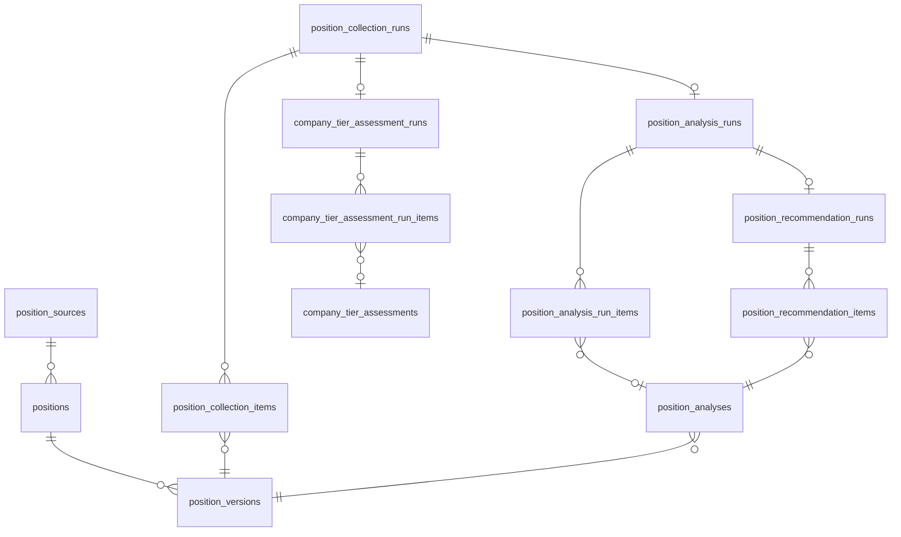

# 데이터 구조

이 문서는 각 스킬이 **무엇을 어디에 저장하고 어떤 제약을 두는지**를 담는다.
필드와 타입, 키와 유니크 제약, 지울 때 함께 지워지는 것이 여기 속한다.

무엇을 약속하는지는 [`prd.md`](prd.md), 어떤 순서로 도는지는 [`flow.md`](flow.md),
코드가 어디 있는지는 [`code-architecture.md`](code-architecture.md)가 담는다.

## 공통

### `fos_career` 도메인 구조

포지션 추천의 상태를 담는 database 다. table 은 다섯 묶음으로 나뉜다.

| 묶음 | table | 담는 것 |
| --- | --- | --- |
| 공고 원문 | `position_sources`, `positions`, `position_versions` | 외부 공고와 그 내용이 바뀐 이력. 판단을 섞지 않는다 |
| 실행 | `position_collection_runs`, `position_analysis_runs`, `company_tier_assessment_runs`, `position_recommendation_runs` 와 각 `*_items` | 수집 실행 하나에 분석, 회사 tier 평가, 추천 실행이 하나씩 붙는다 |
| 판단 | `position_analyses`, `company_tier_assessments` | 모델이 공고와 회사를 평가한 결과. 실행이 지워져도 남는다 |
| 회사 근거 | `company_evidence` | 외부에서 관측한 회사 사실. 추론은 담지 않는다 |
| 회사 설정과 사람이 정한 것 | `company_preferences`, `position_exclusions`, `position_analysis_policy` | 회사별 수집 주소와 우선순위, 개인 제외 규칙, 분석 정책 |

`request_receipts` 는 쓰기 요청의 멱등 키와 응답을 담는다. 도메인 데이터가 아니다.



묶음 사이에 지키는 규칙이다.

- **분석은 공고 version 에 붙는다.** 공고 본문이 바뀌면 새 version 이 생기고 이전 분석은 그 version 에 남는다.
- **판단은 덮어쓰지 않고 쌓는다.** 새 분석과 새 tier 평가는 행을 추가하고, 현재 값은 유효한 것 가운데 가장 최근 하나다.
- **판단을 만든 실행은 지울 수 없다.** 실행을 지우면 그 실행의 항목과 진단만 함께 지워지고 공고와 판단은 남는다.
- **회사는 `company_key` 로 잇고 `companies` table 을 두지 않는다.** `company_preferences`, `company_tier_assessments`, `company_evidence`, `position_exclusions` 가 같은 정규화 규칙의 `company_key` 를 쓴다. foreign key 는 없다.
- **칸끼리의 조건은 DB 의 `CHECK` 가 강제한다.** `scope` 마다 필수 칸이 다른 제외 규칙이나 HTTPS 만 받는 URL 이 그렇다. 이 제약은 `schema.prisma` 에 없고 migration SQL 에만 있다.

table 별 칸과 제약은 아래 `position-recommender` 절이 소유한다.
schema 는 `services/recommendation-api/prisma/` 가 관리하고,
migration 적용 절차는 [`services/recommendation-api/README.md`](../services/recommendation-api/README.md) 가 소유한다.

### 홈서버 release

파일이 어디에 놓이는지는
[`code-architecture.md`](code-architecture.md#비공개-작업본-동기화)가 소유한다.
여기에는 각 파일의 형식만 적는다. `releases/` 아래 파일은 만든 뒤 고치지 않는다.

| 파일 | 담는 것 |
| --- | --- |
| `release.json` | `schemaVersion`, `workspace`, `revision`, `contentDigest`, `createdAt`, `fileCount`, `archiveKey`, `archiveSha256`, `manifestKey`, `manifestSha256` |
| `current.json` | `release.json` 과 같은 식별·요약 필드에 `descriptorKey`, `descriptorSha256` |
| `sync-state.json` | 마지막으로 준비한 `revision`, `contentDigest`, 파일 hash |
| `skill-session.json` | 진행 중인 skill 이름, 시작 revision, 시작 시각 |
| `workspace-manifest.json` | 아래 manifest |
| `prepare-journal.json` | 아래 journal |

#### manifest

| 필드 | 값 |
| --- | --- |
| `schemaVersion` | `1` |
| `workspace` | `career-os` 고정 |
| `revision` | 홈서버가 부여한 release 식별자 |
| `parentRevision` | publish 를 시작할 때 확인한 이전 revision |
| `createdAt` | 홈서버가 기록한 UTC 시각 |
| `producer` | 만든 skill 과 `interactive` 또는 `automation` |
| `contentDigest` | 정렬한 파일 경로와 크기와 SHA-256 에서 만든 전체 digest |
| `files` | 상대 경로, byte 크기, SHA-256 목록 |

`files` 의 경로는 `applications/`, `library/`, `state/` 중 하나로 시작해야 한다.
일반 파일만 허용한다. symlink 와 `.env` 와 `.omc` 와 log 와 cache 와 임시 파일은 거절한다.

#### prepare-journal

transaction 식별자와 상태 하나, 그리고 root 별 `hadOriginal`, `backupDone`, `applyDone` 을 담는다.

| 상태 | 복구할 때 하는 일 |
| --- | --- |
| `started`, `staged` | 기존 root 를 건드리지 않았으므로 staging 만 지운다 |
| `backed_up`, `applied`, `restoring` | root 별 상태와 실제 경로를 대조해 새 root 를 지우고 backup 을 되돌린다 |
| `restored` | 되돌리기를 마쳤다 |
| `completed` | 새 root 와 `sync-state.json` 의 hash 가 같을 때만 backup 과 journal 을 지운다 |

`hadOriginal: false` 인 항목은 되돌릴 때 새 root 만 지운다.
기록과 실제 경로가 어긋나면 자동으로 판단하지 않고 `RESTORE_REQUIRED` 로 멈춘다.

#### 원격 명령의 응답

| 명령 | 응답 |
| --- | --- |
| `career-storage status` | `RemoteStatusResult`. `schemaVersion`, `action`, `ok`, `workspace`, nullable `current` |
| `career-storage export --revision <revision>` | release 의 tar |
| `career-storage publish` | `RemotePublishResult`. `schemaVersion`, `action`, `ok`, `revision`, `contentDigest`, `createdAt`, `fileCount`, `noChange` |

`current` 는 `revision`, `contentDigest`, `createdAt`, `fileCount` 를 가진다.
export tar 의 최상위는 `workspace-manifest.json` 과 세 관리 root 만,
publish tar 의 최상위는 `workspace-draft.json` 과 세 관리 root 만 허용한다.

절차와 실패 복구는 [`flow.md`](flow.md#비공개-작업본-동기화)가 소유한다.

## application-package-writer

### 적합도 판정과 점수

판단 기준은
[`fit-judgment.md`](../.claude/skills/application-package-writer/references/fit-judgment.md)가 소유한다.
행별 점수와 구분별 가중치는 모델이 공고를 보고 정해 `evidence/fit.md` 에 남긴다.
소계와 총점은 그 둘로 `fit_score.ts` 가 계산한다.
색 구간은 `render/constants.ts` 가 소유한다.

`evidence/status.md`의 준비 상태 값과 판단 기준은
[`application-quality-rubric.md`](../.claude/skills/application-package-writer/references/application-quality-rubric.md)의 「판정」이 소유한다.

첫 10줄의 `evidence`는 제출 문장이 현재 근거 범위 안에 있는지의 상태다.

| 값        | 뜻                                                  |
| --------- | --------------------------------------------------- |
| `safe`    | 제출 문장이 모두 확인한 근거 범위 안에 있다         |
| `revise`  | 근거보다 넓게 읽히는 문장이 있어 표현을 낮춰야 한다 |
| `blocked` | 근거를 확인하기 전에는 그 문장을 제출에 쓸 수 없다  |

첫 10줄의 `human-confirmation`은 본인 역할, 당시 제약, 기각한 대안, 결과의 확인 범위와 제출 문구 동의처럼 후보자만 확정할 수 있는 사실과 표현 확인 상태다.
값은 `complete` 또는 `needs_input`이며, `needs_input`이면 준비 상태를 `ready`로 둘 수 없다.

brain에는 경력, 역할 선호와 경험 경계 등 개인 지식을 두고, 지원별 사실과 표현 확인은 `evidence/candidate-interview.md`의 기존 계약을 따른다.
작성 취향은 스킬에서 유지하고, brain 검색 결과는 해당 문장을 판단하는 데 필요한 출처와 범위만 지원 기록에 연결한다.

## interview-practice

### `config/interview-question-sources.ts`

| 필드 | 값 |
| --- | --- |
| `key` | 출처 식별자. 고유하다 |
| 출처 종류 | 공식 문서, 기술 블로그, 공개 영상, GitHub 가이드 |
| 사용 역할 | 정답 근거, 사례 발견, 범위 확인 |
| 주제, URL, 수집 어댑터 | |

**정답 근거 역할은 공식 문서만 가진다.** 기술 블로그와 공개 영상과 GitHub 가이드는
사례 발견이나 범위 확인만 할 수 있다.

### 질문

각 질문의 `source` 는 `public/question-bank/sources.json` 의 식별자를 참조한다.
`bar` 는 공개 능력 수준 셋 중 하나다.

| `bar` | 수준 |
| --- | --- |
| `production` | 한 서비스의 정확성과 장애 복구와 운영 지표를 책임진다 |
| `large-scale` | 대규모 제품과 여러 팀이 쓰는 계약과 용량과 변경 안전성을 판단한다 |
| `global-scale` | 다중 리전과 조직 공통 기반의 실패 격리와 보안과 장기 trade-off 를 주도한다 |

현재 직장과 목표 회사와 개인 경험 경계를 `bar` 값이나 공개 질문 본문에 넣지 않는다.

### `interview-source-candidates.json`

실행별 후보풀이다. 시스템 임시 경로에 두고 질문 승격 뒤 지운다. 장기 상태로 두지 않는다.

각 후보는 출처 식별자, 출처 종류와 역할, 주제, 제목, URL, 게시 시각, 공개 설명, 자료 종류를 가진다.

### `state/drill-progress.json`

답변 연습의 진행과 복습 상태다. 학습 주제 생성 상태와 섞지 않는다.

| 담는 것 |
| --- |
| 질문별 시도와 최근 결과 |
| 다시 볼 질문과 복습 시점 |
| 기술·인성 모드가 공유하는 진행 정보 |

일별 답변 기록은 꼬리질문일 때 원 질문 식별자, 부모 질문, 깊이, 확인 축, 중단 이유를
선택 필드로 가진다.

## position-recommender

### 개인 공고 제외 설정

`fos_career.position_exclusions` 가 담는다.
`GET api/positions/v1/exclusions` 로 읽고 `PUT` 으로 전체를 바꾼다.

| 칸 | 타입 | 설명 |
| --- | --- | --- |
| `position_exclusion_id` | `CHAR(36)` PK | |
| `scope` | `ENUM('posting','company','company-role')` | |
| `company_key` | `VARCHAR(191)` NULL | `company` 와 `company-role` 에서 필수 |
| `source_key` | `VARCHAR(100)` NULL | `posting` 에서 쓴다 |
| `identity_hash` | `VARCHAR(512)` NULL | `posting` 에서 쓴다 |
| `normalized_url` | `VARCHAR(2048)` NULL | `posting` 에서 쓴다 |
| `title_keywords_json` | `JSON` NULL | `company-role` 에서 필수 |
| `decision_kind` | `ENUM('career-downside','manual')` | |
| `reason` | `TEXT` | |
| `evidence_urls_json` | `JSON` | HTTPS 만 담는다 |
| `confidence` | `ENUM('low','medium','high')` NULL | |
| `decided_at` | `DATE` | |
| `expires_at` | `DATE` NULL | |

`scope` 마다 필요한 칸이 다른 것은 `CHECK` 로 강제한다.

API 본문은 아래 모양이다.

```json
{
  "schemaVersion": 2,
  "exclusions": [
    {
      "scope": "posting",
      "source": "wanted",
      "identityHash": "wanted:example-id",
      "decisionKind": "career-downside",
      "reason": "공고의 역할 범위가 희망하는 모듈 소유권과 맞지 않는다.",
      "evidenceUrls": ["https://example.com/jobs/example-id"],
      "confidence": "medium",
      "decidedAt": "2026-09-10"
    }
  ]
}
```

`scope` 마다 요구하는 필드가 다르다.

| `scope` | 요구하는 것 | 언제 맞다고 보나 |
| --- | --- | --- |
| `posting` | 정식 `source` 는 반드시, 그리고 `identityHash` 와 HTTPS `url` 중 하나 이상 | 같은 소스에서 식별자나 정규화 URL 이 일치 |
| `company` | 정확한 회사명과 공개 근거 URL 두 개 이상 | 회사명이 정확히 일치 |
| `company-role` | 정확한 회사명과 공고명에서 찾을 `titleKeywords` | 회사명이 일치하고 제목에 keyword 가 있다 |

`decisionKind` 다.

| 값 | 뜻 |
| --- | --- |
| `career-downside` | 사용자가 업사이드 비교로 제외하기로 했다. 사유와 공개 근거를 함께 적는다 |
| `manual` | 지원 결과처럼 업사이드 비교와 다른 이유다 |

`expiresAt` 이 있으면 그날까지만 적용하고 다음 날부터 후보풀로 되돌린다. 재지원 간격이 여기 해당한다.

URL 정규화는 fragment 와 `utm_*` 와 `fbclid` 와 `gclid` 를 지우고
query 순서와 마지막 슬래시를 맞춘다. 공고 ID 를 담는 query 는 남긴다.

버전 1의 공고 규칙은 읽을 수 있다. 새 규칙은 버전 2로 저장한다.
**추천 실행이 이 규칙을 자동으로 만들거나 갱신하지 않는다.**
지원 결과와 재지원 간격의 원본은 private brain 이 소유한다.

선택 이유는 [ADR-123](adr/ADR-123-회사-근거와-개인-제외-정책은-backend가-소유한다.md)을 따른다.
읽는 시점과 실패 처리는 [`flow.md`](flow.md#position-recommender)가 소유한다.

### 회사 근거

`fos_career.company_evidence` 가 담는다.
수집기가 모아 `PUT api/positions/v1/company-tier-runs/:companyTierRunId/evidence` 로 저장한다.
한 회사의 유효한 근거는 `GET api/positions/v1/companies/:companyKey/evidence` 로 읽는다.
조회 응답에는 저장된 `company_evidence_id`를 `id`로 함께 준다.
모델은 이 근거만 읽고 세 축을 판정한다.

| 칸 | 타입 | 설명 |
| --- | --- | --- |
| `company_evidence_id` | `CHAR(36)` PK | |
| `company_key` | `VARCHAR(191)` | |
| `source_type` | `ENUM` | 아래 표 |
| `url` | `VARCHAR(2048)` | HTTPS 만 담는다 |
| `url_hash` | `CHAR(64)` 생성 열 | `url` 에서 DB 가 만든다. 쓰기에서 값을 주지 않는다 |
| `title` | `VARCHAR(500)` NULL | |
| `summary` | `TEXT` | 한 줄 요약 |
| `payload_json` | `JSON` | 수집기가 받은 값. 급여와 근속과 인원이 여기 든다 |
| `observed_at` | `DATETIME(3)` | 수집 시각 |
| `valid_until` | `DATE` | 만료일 |

같은 출처를 다시 모으면 행을 늘리지 않는다. 유일성 기준은 `(company_key, source_type, url)` 이다.
더 오래된 관측으로는 덮지 않는다. `observed_at` 이 저장된 값과 같거나 더 최신일 때 갱신한다.
같은 시각으로 다시 보내면 나중에 보낸 값이 남는다.
수집기가 `observed_at` 을 날짜 단위로 적고 재시도가 같은 시각을 다시 보내는데,
같은 시각까지 막으면 그 갱신이 반영되지 않는다.
더 오래된 관측을 보내면 요청은 성공하고 행은 그대로 남는다.
이전 파일을 옮기는 `import_position_state.ts` 가 보내는 것이 옛 관측이라 이 조건이 필요하다.

UNIQUE 는 `url` 대신 `url_hash` 에 건다.
`VARCHAR(2048)` 을 utf8mb4 로 담으면 index key 가 8192 바이트가 되어
InnoDB 상한 3072 바이트를 넘고, MySQL 이 `Specified key was too long` 으로 거절한다.
앞부분만 잘라 거는 prefix index 는 앞 570자가 같은 서로 다른 URL 을 한 행으로 묶어
다른 출처의 근거를 덮어쓴다. 오류가 나지 않고 값만 틀린다.
고유 키를 전체 값의 해시에 거는 것은 `positions.identity_hash` 와 같고, 계산 주체만 다르다.
`identity_hash` 는 애플리케이션이 계산해 넣고 `url_hash` 는 DB 가 만든다.

`PUT` 의 응답은 `companyTierRunId` 와 회사별 `savedCount` 다.
`savedCount` 는 중복을 없앤 뒤 그 회사의 출처 키 수다.
같은 키가 한 요청에 두 번 오면 1 이고, 옛 관측이라 갱신되지 않은 키도 여기 든다.
바뀐 행 수가 아니라 그 키로 지금 존재하는 행 수다. 이관 뒤 행 수 대조가 이 값을 쓴다.

`source_type` 과 그 출처가 채우는 축이다.

공고 수집기는 `GET api/positions/v1/companies/:companyKey/active-postings`로
Backend에 저장된 활성 공고의 제목, URL과 `first_seen_at`을 읽는다.

| `source_type` | 출처 | 채우는 축 |
| --- | --- | --- |
| `dart-employment` | OpenDART 「직원 현황」 | `compensation-upside`, `team-growth` |
| `dart-financial` | OpenDART 재무정보 | `team-growth` |
| `tech-blog` | 회사 기술 블로그 RSS | `growth-scope` |
| `github` | GitHub organization | `growth-scope` |
| `conference` | 컨퍼런스 발표 | `growth-scope` |
| `review` | Blind 항목별 평점 | `compensation-upside` |
| `job-posting` | 우리가 모은 활성 공고 | `growth-scope`, `team-growth` |
| `official` | 회사 공식 홈페이지와 채용 페이지 | 축을 정하지 않는다 |
| `other` | 그 밖 | 축을 정하지 않는다 |

`valid_until` 은 출처마다 다르다.

| `source_type` | 유효기간 | 이유 |
| --- | --- | --- |
| `dart-employment`, `dart-financial` | 180일 | 사업보고서가 1년에 한 번 나온다 |
| `tech-blog` | 14일 | 글이 계속 올라온다 |
| `github` | 30일 | 마지막 push 시각만 본다 |
| `review` | 60일 | 평점이 천천히 움직인다 |
| `conference`, `official`, `other` | 90일 | |
| `job-posting` | 수집 실행마다 다시 만든다 | 이미 매일 모은다 |

### 포지션 분석 정책

`fos_career.position_analysis_policy` 의 단일 행이다.
수집 결과와 모델 분석은 이 table 에 넣지 않는다.

| 필드 | 허용 범위 |
| --- | --- |
| `candidateContextVersion` | 후보자 기준 버전 문자열 |
| `dailyAnalysisLimit` | 하루 분석 상한 |
| `prioritySlots` | 회사 우선 슬롯 수 |
| `agingSlots` | 오래 기다린 공고 보장 슬롯 수 |
| `staleAfterDays` | 분석의 유효기간 |
| `defaultCompanyTier` | 등록되지 않은 회사에 적용할 tier |
| `dailyCompanyTierLimit` | 1 부터 20. 하루에 모델이 평가할 회사 수 |
| `companyTierStaleAfterDays` | 1 부터 365. 모델 평가의 기본 유효기간 |

```json
{
  "schemaVersion": 2,
  "candidateContextVersion": "career-priority-2026-09",
  "dailyAnalysisLimit": 20,
  "prioritySlots": 16,
  "agingSlots": 4,
  "staleAfterDays": 30,
  "defaultCompanyTier": 3,
  "dailyCompanyTierLimit": 5,
  "companyTierStaleAfterDays": 90
}
```

**DB 기본값을 두지 않는다.** 새 DB 에 행을 만들 때 모든 값을 줘야 하고
이후 변경도 정책 설정 요청으로만 한다.

### `fos_career.company_preferences`

회사별 수집 주소와 사람이 정한 회사 우선순위와 제외를 담는다.
모델 평가는 별도 table이 담는다.

| column | 값 |
| --- | --- |
| `company_key` | 정규화한 회사명. 유일하다 |
| `company_name` | 표시 이름 |
| `tier` | 1, 2, 3 또는 NULL. NULL이면 사람 override가 없다 |
| `disposition` | `analyze`, `exclude`, `benchmark` |
| `tech_blog_feed_url`, `github_org` | 기술 블로그 RSS 주소와 GitHub organization |
| `dart_corp_code`, `blind_company_slug` | DART 고유번호와 Blind 회사 경로 |

등록되지 않은 회사는 `defaultCompanyTier` 를 적용한다.
**보고 싶지 않은 회사를 낮은 tier 로 두지 않는다.** `disposition: exclude` 로 저장한다.
`benchmark`는 현재 직장을 비교할 때 쓴다.
회사 판정 큐에는 들어가지만 공고 분석 큐에는 들어가지 않는다.
수집 주소만 설정한 회사는 `tier: null`로 두어 모델 판정을 받는다.

```json
{
  "schemaVersion": 1,
  "preferences": [
    {
      "companyName": "예시 회사",
      "tier": 1,
      "disposition": "analyze"
    }
  ]
}
```

```bash
bun career-os/scripts/position-recommender/configure_position_company_preferences.ts \
  --input <회사-정책.json>
```

명령은 회사명과 비공개 제외 사유를 출력하지 않고 전체 반영·제외·tier별 건수만 출력한다.
이전 파일에 있던 회사 조사와 개인 제외 규칙은 `import_position_state.ts` 가 옮긴다.
`--source-dir` 로 읽을 위치를 받고, 기본은 아무것도 보내지 않고 집계만 내는 실행이다.
실제로 반영하려면 `--commit` 을 주고, 회사 근거까지 저장하려면 `--company-tier-run-id` 를 함께 준다.
버전 1 형식의 제외 규칙이 있으면 `--decided-at` 도 필요하다. 원본에 그 날짜가 없기 때문이다.

`prioritySlots`와 `agingSlots`의 합은 `dailyAnalysisLimit`과 같아야 한다.
`dailyAnalysisLimit`은 1부터 20까지만 허용한다.
우선 슬롯은 회사 티어, `new`, `changed`, `stale` 상태, 마감 긴급도, 대기 시작 시각과 공고 ID 순서로 정한다.
보장 슬롯은 회사 티어와 무관하게 대기 시작 시각이 오래된 순서로 정한다.
한쪽 슬롯을 채울 후보가 부족하면 다른 쪽 후보가 남은 자리를 사용하며 같은 공고를 두 번 고르지 않는다.

`candidateContextVersion`은 현재 역할 기준과 이직 우선순위가 바뀌었을 때 사람이 새 값으로 변경한다.
값이 달라지면 기존 공고 분석은 본문이 같아도 `stale`로 분류한다.
정책이 없거나 형식이 잘못됐으면 전체 후보를 기본값으로 분석하지 않고 API가 `409`로 실행을 중단한다.

새 DB에는 정책 기본값을 넣지 않는다.
운영자는 첫 수집 전에 인증된 `PUT /api/positions/v1/analysis-policy` 요청으로 정책을 명시적으로 설정한다.
모든 쓰기 요청과 마찬가지로 `Authorization: Bearer`와 `Idempotency-Key`가 필요하다.
로컬 운영 명령은 같은 endpoint를 호출하며 DB에 직접 연결하지 않는다.

```bash
bun career-os/scripts/position-recommender/configure_position_analysis_policy.ts \
  --input <분석-정책.json>
```

### 공고 후보풀과 추천 결과

#### 재사용하는 회사 조사 데이터

회사별 공개 사실은 `fos_career.company_evidence` 가 담는다. 이 문서의 「회사 근거」 절이 소유한다.
포지션 추천은 파일이 아니라 `GET api/positions/v1/companies/:companyKey/evidence` 로 읽는다.

`scripts/position-recommender/company-research/schema.ts` 는 이전 파일 형식의 zod 계약이다.
`import_position_state.ts` 가 그 파일을 읽을 때만 쓴다. 새 근거는 이 형식으로 저장하지 않는다.

#### 공고 후보풀

수집기가 외부 공고를 공통 형태로 바꾼 것이다.

| 필드 |
| --- |
| 소스와 외부 식별자 |
| 회사와 공고명 |
| 개별 공고 URL |
| 게시일과 마감일 |
| 활성 상태 |
| 역할 설명과 요구 경력 |
| 수집 시각 |

활성 상태를 확인할 수 없거나 개별 공고 URL 이 없으면 추천 후보로 올리지 않는다.

**후보풀은 공고 원문만 담는다.** 업사이드나 리스크 판정을 넣지 않는다.
어댑터는 공고 원문만 보므로 현재 직장의 기준값과 비교할 수 없고,
회사 단위로 쓴 문구가 같은 회사의 모든 공고에 같은 값으로 들어간다.

#### 공고별 분석 이력

`fos_career`는 공고 원문, 공고 버전, 개인 분석과 추천 실행을 별도 table로 보존한다.
공고 원문에 주관적인 점수와 판단을 섞지 않는다.

| table                             | 주요 키와 책임                                                                               |
| --------------------------------- | -------------------------------------------------------------------------------------------- |
| `position_sources`                | `source_key` UNIQUE, 활성 여부와 마지막 정상 수집 시각                                       |
| `position_collection_runs`        | `run_id` PK, `idempotency_key` UNIQUE, 실행 상태와 집계                                      |
| `position_source_run_diagnostics` | `(run_id, source_key)` UNIQUE, 성공·부분 실패·실패와 건수                                    |
| `positions`                       | `position_id` PK, `(source_key, identity_hash)` UNIQUE, 현재 lifecycle과 관측 시각           |
| `position_versions`               | `position_version_id` PK, `(position_id, content_hash)` UNIQUE, 정규화한 공고 snapshot       |
| `position_collection_items`       | `(run_id, position_id)` UNIQUE, 해당 실행이 본 version과 활성 상태                           |
| `position_analysis_policy`        | singleton PK, 후보자 기준 버전, 일일 상한, 슬롯과 만료일 정책                                |
| `company_preferences`             | `company_key` UNIQUE, 회사명, nullable tier, 수집 주소, `analyze`·`exclude`·`benchmark`, 변경 시각 |
| `company_tier_assessment_runs`      | `company_tier_run_id` PK, `collection_run_id` UNIQUE, 후보자 기준 버전과 계약 버전, `pending`·`partial`·`completed` 상태 |
| `company_tier_assessments`          | `company_tier_assessment_id` PK, `company_key`와 후보자 기준·계약 버전, 추천 tier와 신뢰도, 근거 JSON, 유효기간, 최초 생성 실행 |
| `company_tier_assessment_run_items` | `(company_tier_run_id, company_key)` PK, 선택 순서와 선택 이유, 처리 결과와 연결한 평가, 실패 사유와 제출 횟수     |
| `position_analysis_runs`          | `analysis_run_id` PK, 수집 실행과 후보자 기준 버전, 분석 계약 버전, `pending`·`partial`·`completed` 상태 |
| `position_analysis_run_items`     | `(analysis_run_id, position_id)` UNIQUE, 선택 순서, 상태와 선택 이유, 처리 결과와 연결한 분석, 실패 사유와 제출 횟수 |
| `position_analyses`               | `(position_version_id, candidate_context_version, contract_version)` UNIQUE, 점수와 유효기간, 최초 생성 실행 |
| `position_recommendation_runs`    | `recommendation_run_id` PK, 분석 실행, 생성 시각과 집계                                      |
| `position_recommendation_items`   | `(recommendation_run_id, position_id)` UNIQUE, 순위, 결론과 분석 참조                        |
| `request_receipts`                | `idempotency_key` PK, 요청 hash, 응답 상태와 응답 본문                                       |

`positions`의 안정적인 식별자는 `source_key`와 `identity_hash`를 우선 사용하고,
외부 식별자가 없을 때만 정규화 URL에서 identity hash를 만든다.
`position_versions.content_hash`는 회사명, 공고명, 직무 분류, 요약, 주요 업무,
요구 경력, 우대 사항, 기술과 태그를 정렬한 정규 JSON의 SHA-256이다.
수집 시각, 남은 날짜와 현재 상태처럼 매일 달라지는 값은 제외한다.

분석은 공고 version, 후보자 기준 버전과 분석 계약 버전이 같고 `valid_until`이 지나지 않았을 때만 `fresh`다.
분석이 없으면 `new`, 최신 공고 version이 달라졌으면 `changed`, 나머지 무효화 사유는 `stale`다.
새 분석은 과거 행을 갱신하지 않고 추가하며 현재 추천은 조건에 맞는 가장 최근 분석 하나만 사용한다.

`decision`은 `recommend`, `consider`, `hold` 중 하나이고 `fit_score`는 0부터 100까지의 정수다.
점수는 역할 적합도 0부터 40, 역할 범위와 성장 여지 0부터 25,
회사 기회 0부터 20, 제약이 적은 정도 0부터 15로 나누며 합계가 `fit_score`와 같아야 한다.
상세 근거와 다음 행동은 JSON column에 저장하지만 공고와 분석의 관계는 JSON 안 식별자가 아니라 foreign key로 유지한다.

수집 실행을 삭제하면 해당 실행 항목과 진단은 함께 삭제하지만 공고와 공고 version은 보존한다.
분석을 만든 실행은 삭제할 수 없다.
선택 항목만 지우는 삭제는 분석을 만들지 않은 실행에만 허용한다.
공고를 삭제하는 운영 기능은 만들지 않고 lifecycle로 관리한다.
명시된 마감일이 지났으면 `closed`, 성공한 동일 소스 수집에서 보이지 않으면 `not_seen`으로 바꾼다.
소스가 `partial` 또는 `failed`면 누락만으로 lifecycle을 바꾸지 않는다.

실행 항목의 `result_status`는 `pending`, `created`, `reused`, `failed` 중 하나다.
`created`와 `reused`는 `analysis_id`와 `completed_at`을 함께 가지고,
`failed`는 `failure_code`와 `completed_at`을 가지며 `analysis_id`는 비어 있다.
`attempt_count`는 그 항목의 결과를 제출해 처리한 횟수다.
실행 상태는 선택 항목이 모두 `created` 또는 `reused`면 `completed`,
`failed`가 남아 있으면 `partial`이다.

`position_analysis_runs.analyzed_now_count`는 그 실행이 새로 만든 분석 수다.
추천 응답의 `analyzedNowCount`는 그중 순위에 든 수이므로,
분석을 만든 뒤 공고 본문이 바뀌어 순위에서 빠지면 두 값이 달라진다.

큐 응답의 `reusedCount`, `pendingCount`, `newCount`, `changedCount`, `staleCount`는
활성 공고 전체를 기준으로 세고,
`completedCount`와 `failedCount`는 그 실행이 선택한 항목만 기준으로 센다.

이 중복이 어긋나지 않았는지 확인하는 감사 조회는
[ADR-119](adr/ADR-119-분석-실행의-처리-결과와-분석의-생성-출처를-분리해-저장한다.md)가 소유한다.

실행 항목에 연결된 분석, 분석을 최초 생성한 실행과 실패 후 재시도는
같은 두 table을 다른 조건으로 조회한다.

임시 `analysis-queue.json`은 Backend 응답을 그대로 저장한 실행 파일이다.
`schemaVersion`은 2이고 `collectionRunId`, `analysisRunId`, 생성 시각, 정책 요약,
상태별 집계와 선택된 `candidates` 배열을 가진다.
각 후보는 `resultStatus`를 함께 가진다.
모델의 `analysis-updates.json`도 `schemaVersion`이 2이고 같은 `analysisRunId`를 담는다.
아직 끝나지 않은 공고를 분석 결과는 `results`에, 분석하지 못한 사유는 `failures`에 한 번씩 나눠 담는다.

#### 회사 tier 평가 이력

사람이 정한 회사 우선순위는 `company_preferences`에만 남고,
모델이 만든 tier 평가는 세 table에 실행 단위로 따로 쌓는다.
판단 근거와 감사 조회는
[ADR-120](adr/ADR-120-회사-tier는-사람-override와-모델-평가를-분리해-저장한다.md)이 소유한다.

| table                               | column                                                                                                                                                                                                                                                                                                  |
| ----------------------------------- | ------------------------------------------------------------------------------------------------------------------------------------------------------------------------------------------------------------------------------------------------------------------------------------------------- |
| `company_tier_assessment_runs`      | `company_tier_run_id`, `collection_run_id`, `candidate_context_version`, `contract_version`, `status`, `assessed_now_count`, `created_at`, `completed_at`                                                                                                                                              |
| `company_tier_assessments`          | `company_tier_assessment_id`, `company_key`, `company_name`, `candidate_context_version`, `contract_version`, `created_by_company_tier_run_id`, `recommended_tier`, `confidence`, `reason`, `assessment`, `signals_json`, `evidence_json`, `assumptions_json`, `assessed_at`, `valid_until`             |
| `company_tier_assessment_run_items` | `company_tier_run_id`, `company_key`, `company_name`, `selection_order`, `assessment_status`, `selection_reason`, `prior_tier`, `active_position_count`, `result_status`, `company_tier_assessment_id`, `failure_code`, `attempt_count`, `completed_at`                                                 |

수집 실행 하나는 회사 tier 실행 하나만 가지므로 `collection_run_id`에 UNIQUE를 둔다.
실행 항목은 `(company_tier_run_id, company_key)`가 PK이고 `(company_tier_run_id, selection_order)`가 UNIQUE다.
평가를 만든 실행과 실행 항목이 연결한 평가는 모두 `ON DELETE RESTRICT` foreign key로 검증하므로,
평가를 만든 실행은 삭제할 수 없다.
`company_key`는 `company_preferences`와 같은 정규화 규칙을 쓰고 별도 `companies` table을 만들지 않는다.

`recommended_tier`는 1, 2, 3과 NULL을, `confidence`는 `low`, `medium`, `high`와 NULL을 허용한다.
**NULL은 판정할 근거가 없었다는 뜻이고 지어낸 값보다 낫다.**
`recommended_tier`가 NULL이면 그 회사의 tier는 `manual`이 없는 한 `default`로 푼다.
이유는 [ADR-124](adr/ADR-124-판정-스키마는-모르는-상태를-표현한다.md)를 따른다.
`assessment_status`는 유효한 평가가 없는 회사의 `new`와 평가가 만료된 회사의 `stale` 중 하나이고,
`selection_reason`은 각각에 대응하는 `discovery`와 `refresh` 중 하나다.
`prior_tier`는 `stale` 항목이 만료된 이전 평가의 tier를 담는 자리이므로 `new` 항목에서는 비어 있다.

실행 항목의 `result_status` 다.

| 값 | 뜻 | `company_tier_assessment_id` | `failure_code` |
| --- | --- | --- | --- |
| `pending` | 아직 결과가 오지 않았다 | 없음 | 없음 |
| `created` | 새 평가 행을 만들었다 | 있음 | 없음 |
| `reused` | 고를 때는 유효한 평가가 없었는데 결과를 받을 때 이미 있었다 | 있음 | 없음 |
| `failed` | 평가하지 못했다 | 없음 | 있음 |

`reused` 는 앞선 실행과 겹쳐 돌았을 때만 나온다. 큐가 유효한 평가가 없는 회사만 고르기 때문이다.
Backend 는 같은 회사와 같은 후보자 기준 버전과 계약 버전의 유효한 평가를 찾으면
새 행을 만들지 않고 그것을 연결한다.

`failure_code` 는 다섯만 허용한다.
client 가 보내는 `research_unavailable`, `model_unavailable`, `contract_rejected`, `internal_error` 와
Backend 가 2시간이 지난 처리 중 표시를 회수하며 남기는 `lease_expired` 다.

실행 상태는 선택 항목이 모두 `created` 또는 `reused` 면 `completed`, `failed` 가 남아 있으면 `partial` 이다.
선택할 회사가 없으면 만들어지는 즉시 `completed` 다.
`assessed_now_count` 는 `created` 항목만 센다. `reused` 와 `failed` 는 들어가지 않는다.

`signals_json`은 축 셋을 각각 한 번씩만 담는다.

| 축 | 답하는 것 | 채우는 근거 |
| --- | --- | --- |
| `growth-scope` | 기술적으로 성장할 수 있는가 | `tech-blog`, `github`, `conference`, `job-posting` |
| `team-growth` | 팀이 커지고 있는가 | `dart-employment`, `dart-financial`, `job-posting` |
| `compensation-upside` | 보상과 복지가 적절한가 | `dart-employment`, `review` |

각 축은 `level`과 `evidenceIds`를 담는다.
**`evidenceIds`가 비어 있으면 `level`은 `unknown`이어야 한다.**
근거를 요구해서 등급을 받는 것이 아니라 근거가 있는 축만 등급을 받는다.

`assessment`는 유보와 조건과 반대 근거를 적는 서술이고 2000자까지다.
공개 HTML에 넣지 않는다. 공개에 실리는 것은 200자까지인 `reason`이다.

`evidence_json`의 근거 URL은 HTTPS만 허용하고 최소 개수를 요구하지 않는다.
빈 배열은 근거를 찾지 못했다는 정직한 값이다.
`valid_until`은 Backend가 다음 셋 중 가장 빠른 날로 정한다.
수신 시각에 `companyTierStaleAfterDays`를 더한 날, 각 근거의 만료일,
client가 결과에 `validUntil`을 넣었으면 그 날이다.
client가 보낸 값이 셋 중 가장 늦으면 쓰지 않으므로 그 값만으로 유효기간을 늘릴 수 없다.

평가는 `(company_key, candidate_context_version, contract_version, valid_until, assessed_at)` 복합 index로 조회하며,
과거 행을 갱신하지 않고 추가만 한다.
후보자 기준 버전이나 계약 버전이 달라지면 기존 평가는 재사용하지 않고 다시 평가한다.

회사 tier 큐는 수동 tier나 `exclude`가 있는 회사를 먼저 빼고 `dailyCompanyTierLimit`까지 고른다.
유효한 평가가 없는 회사를 활성 공고 수 내림차순, 첫 관측 시각, `company_key` 순으로 먼저 채우고,
남은 자리를 만료된 이전 Tier 1, 2, 3, 오래된 만료일, `company_key` 순으로 채운다.
다른 실행이 처리 중인 회사는 건너뛰며, 2시간이 지난 항목은 `lease_expired`로 끝내고 다시 고른다.
활성 공고 수는 tier 값 자체를 정하는 데 쓰지 않는다.

공고를 고를 때는 `exclude`를 제거한 뒤 `manual`, `model`, `default` 순서로 tier를 해결한다.
그때 사용한 값과 출처는 `position_analysis_run_items`와 `position_recommendation_items`에 스냅샷한다.

```text
company_tier_source ENUM('manual', 'model', 'default') NOT NULL
company_tier_assessment_id CHAR(36) NULL
```

`company_tier_source`가 `model`일 때만 평가 ID가 있어야 하며 `CHECK`로 강제한다.
`002` 적용 시점의 기존 행은 모두 `default`로 이관하고 평가 ID를 비운다.
이전 공고 분석을 재사용한 추천도 그 추천 실행이 사용한 현재 tier와 출처를 따로 남기므로,
분석 시점의 tier와 추천 시점의 tier가 달라도 둘 다 확인할 수 있다.

임시 `company-tier-queue.json`은 Backend 응답을 그대로 저장한 실행 파일이다.
`schemaVersion`은 1이고 `collectionRunId`, `companyTierRunId`, 생성 시각,
상태별 집계와 선택된 회사 배열을 가진다.
각 회사는 `companyKey`, `companyName`, `assessmentStatus`, `activePositionCount`,
대표 공고 URL 최대 3개와 만료된 이전 평가의 tier, 이유, 만료일만 가진다.
공고 본문은 이 큐에 넣지 않는다. 직무 적합도는 기존 공고 분석이 판정한다.
모델의 `company-tier-updates.json`도 `schemaVersion`이 1이고 같은 `companyTierRunId`를 담으며,
아직 끝나지 않은 회사를 평가한 것은 `results`에, 평가하지 못한 사유는 `failures`에 한 번씩 나눠 담는다.

#### 실행 중 생성되는 포지션 추천 데이터

스크립트가 현재 후보풀과 유효한 공고 분석을 합쳐 만든 실행별 추천 결과다.
형식은 `scripts/position-recommender/recommendation/schema.ts`가 검증한다.

핵심 필드:

- 실행 날짜와 후보풀 출처
- 유효한 분석이 있는 활성 공고의 순위
- 순위 앞부분에서 고른 상세 추천 공고 목록
- 공고별 지원 이유
- 아직 분석하지 못한 활성 공고와 대기 사유
- 새 분석, 재사용, 분석 대기 건수
- 소스별 성공, 부분 실패, 실패 수와 확인하지 못한 공고 수
- 공고마다 그때 쓴 회사 tier의 값과 출처
- 후보 회사와 `benchmark` 회사의 축별 판정, 근거 ID와 공개 근거 링크
- 출처별 공고 수와 tier 평가 실패 건수
- 모델이 필요에 따라 붙인 상세 근거와 다음 행동

추천 JSON의 `schemaVersion`은 11이다.
`pendingCandidates`의 각 항목은 후보 ID, 회사, 공고명, URL, 회사 티어와 `new`, `changed`, `stale` 중 하나를 가진다.
`analysisSummary`는 `activeCount`, `analyzedNowCount`, `reusedCount`, `pendingCount`와 `personalExcludedCount`를 가진다.

추천과 순위와 대기 항목은 모두 회사 tier의 출처를 함께 담는다.

| 필드 | 담는 것 |
| --- | --- |
| `companyTierSource` | `manual`, `model`, `default` 중 하나 |
| `companyTierAssessmentId` | 모델 평가의 ID. 출처가 `model`일 때만 있다 |
| `companyTierAssessedAt`, `companyTierValidUntil` | 그 평가의 시각과 만료일 |
| `companyTierConfidence` | `low`, `medium`, `high` |
| `companyTierReason` | 간결한 판정 이유 |
| `companyTierEvidenceUrls` | HTTPS 근거 최대 3개 |

`model` 이 아닌 출처는 평가 ID와 근거 필드를 갖지 않고 근거 목록이 비어 있다.

`companyAssessments`는 후보 회사와 `benchmark` 회사의 현재 유효한 판정을 회사별로 담는다.
세 축의 등급과 `evidenceIds`에 연결된 공개 근거 URL과 제목, 200자 이하의 `reason`만 포함한다.
판정이 없거나 근거 ID가 연결되지 않은 축은 `unknown`으로 표시한다.
비공개 `assessment`는 API 추천 응답, 추천 JSON과 HTML에 넣지 않는다.
HTML에는 내부 우선순위인 tier를 표시하지 않는다.

`companyTierSummary`는 `manualCount`, `modelCount`, `defaultCount`와 `assessmentFailedCount`를 가진다.
기본 tier로 남은 공고 수와 평가에 실패한 회사 수를 최종 답변이 숨기지 않게 하는 자리다.
`collectionHealth.warningSources`는 소스, `partial` 또는 `failed` 상태, 실패 건수와 공개 가능한 이유만 담는다.
최종 답변에 넣는 수집 경고 줄은 `scripts/position-recommender/recommendation/final-answer.ts`가 만든다.
그 줄은 소스, 상태, 실패 건수와 고정 문장 하나로만 구성하고 `reason`의 본문은 쓰지 않는다.

추천 항목의 URL과 공고 정보는 후보풀 원문과 일치해야 한다.

분석 순위는 `decision`, `fitScore`, 회사 티어, 마감 긴급도와 공고 ID를 차례로 적용해 결정적으로 만든다.
상세 추천은 `recommend` 또는 `consider`인 순위 앞부분과 같은 순서를 사용한다.
`hold`와 분석 대기 공고는 상세 추천 수를 채우기 위해 올리지 않는다.
라벨과 상세 근거의 제목은 후보마다 자유롭게 구성하고 필요 없으면 생략한다.
사실과 추론에 공개 근거가 있으면 URL을 기록하며, 가정은 판단에 영향을 줄 때만 덧붙인다.
개인 우선순위와 현재 역할의 본문은 private brain이 소유하며 분석 이력에는 기준 버전만 저장한다.
추천 개수와 분류는 스키마가 정하지 않는다.
게시용 HTML은 이 결과에서 만든다.
HTML은 상세 추천, 분석한 활성 공고 순위, 분석 대기 목록과 수집 경고를 구분해 표시한다.
후보풀, 추천 JSON과 HTML은 게시 검증 뒤 삭제한다.
공고 분석 이력과 회사 근거는 다음 실행에서 재사용하며 Backend 와 MySQL 이 보존한다.

## resume-preparer

근거 장부는 대상 HTML 의 내용 해시와 연결해 다른 버전의 증거를 잘못 재사용하지 않게 한다.

| `schemaVersion` | 더해진 것 |
| --- | --- |
| 2 | 기술 범위와 경력 기간과 운영과 숙련도 주장이 `experienceDepth` 에 사용·기능 개발·운영 깊이·사용자 확인 수준을 기록한다 |
| 3 | `document` 와 `user` 근거에 `locator` 가 필수다. 검증기가 그 자리를 근거 파일에서 직접 찾는다 |

새 원장은 3을 쓴다. 이미 제출한 2는 locator 어긋남을 경고로만 보고하고 소급해 고치지 않는다.
locator 형식과 판정 기준은
`.claude/skills/resume-preparer/references/claim-model.md` 가 소유한다.

**`safe` 가 아닌 판정이 하나라도 남으면 제출 준비가 끝난 것이 아니다.**

`review/resume-scorecard.md` 가 담는 것이다.

| 담는 것 |
| --- |
| 독립된 인사담당자 판정 |
| 독립된 실무담당자 판정 |
| 경쟁상 차단 항목 |
| 근거 방어 결과 |
| 통제할 수 없는 위험 |

정량 점수로 약한 필수 조건을 상쇄하지 않는다. 두 검토자가 모두 통과해야 한다.

### `state/verified-claims/`

`resume-preparer`가 다시 쓸 수 있다고 확인한 주장과 근거 파일 상태를 작은 JSON 파일로 나눠 저장한다.
이 디렉터리는 검증 결과에서 만든 상태이며 사람이 직접 관리하는 원고를 두지 않는다.

경로는 첫 번째 로컬 근거의 책임에 따라 정한다.

| 근거                                    | 장부 경로                                                     |
| --------------------------------------- | ------------------------------------------------------------- |
| `sources/fos-study/task/<group>/<file>` | `state/verified-claims/task/<group>/<file>.json`              |
| `library/profiles/<file>`               | `state/verified-claims/profile/<file>.json`                   |
| `applications/<company>/<position>/...` | `state/verified-claims/application/<company>/<position>.json` |
| 그 밖의 로컬 파일                       | `state/verified-claims/other/<file>.json`                     |

각 파일은 다음 필드를 가진다.

- `schemaVersion`: 검증 장부 스키마 버전이며 처음 구현은 `1`이다
- `groupKey`: 위 경로에서 만든 안정적인 묶음 식별자다
- `claims`: `claimKey` 순으로 정렬한 검증 완료 주장 목록이다
- `claims[].claimKey`: 정규화한 `proposedText`의 SHA-256으로 만든 안정적인 키다
- `claims[].claim`: 공고별 `schemaVersion: 3` 원장의 주장과 네 판정 축이다
- `claims[].evidenceSnapshots`: 근거별 `path`, `kind`, `locator`, `sha256`과 `freshness`다
- `claims[].origins`: 이 판정을 만든 application 경로, 원장 경로, HTML 문구 해시와 원장의 `generatedAt`이다

로컬 파일 근거의 `freshness`는 `tracked`이며 파일 내용의 SHA-256을 저장한다.
HTTPS `runtime` 근거는 실행마다 달라질 수 있으므로 `refresh_required`로 저장한다.
재사용 판정은 구현, 소유권, 결과와 경험 깊이 축을 각각 확인한다.
어떤 축에 HTTPS `runtime` 근거만 있으면 해당 주장은 다시 감사한다.
같은 축에 현재 SHA-256이 일치하는 로컬 근거가 있으면 HTTPS 근거는 보조 근거로 남기고 주장을 재사용할 수 있다.
근거 파일을 읽을 수 없거나 해시가 달라지면 해당 근거를 참조하는 주장은 다시 감사한다.

공고별 `review/claim-ledger.json`은 현재 제출 HTML 전체의 완결된 감사 결과다.
`state/verified-claims/`는 다음 감사의 읽기 범위를 줄이는 파생 상태이며 공고별 원장을 대신하지 않는다.
`sources/fos-study/task/`는 계속 읽기 전용 근거로 유지하고 검증 결과를 그 저장소에 쓰지 않는다.

## study-topic-recommender

공부 주제 추천의 소스, 자료, 추천 이력과 제외 판정은 `fos_career` 의 `study_` table 이 담는다.
skill 과 수집기는 table 에 직접 접속하지 않고 `/api/study/v1` 만 호출한다.
HTTP 계약과 오류 코드는 [`flow.md`](flow.md#study-topic-recommender)가 소유한다.

### study table

| table | 담는 것 |
| --- | --- |
| `study_sources` | 수집할 외부 소스. 원본이다 |
| `study_source_cursors` | 소스와 mode 마다 이어서 모을 위치 |
| `study_materials` | 수집한 자료. `content_key` 로 한 번만 저장한다 |
| `study_material_sources` | 자료가 어느 소스에서 나왔는지. 한 자료가 여러 소스에서 나올 수 있다 |
| `study_recommendation_control` | 후보자 기준 버전과 `history_version`. 한 행이다 |
| `study_recommendation_runs` | 일별 추천 실행 |
| `study_recommendation_topics` | 실행이 고른 공부 주제 |
| `study_recommended_materials` | 주제에 연결한 추천 자료 |
| `study_material_verdicts` | 고르지 않은 후보의 판정 |
| `study_publications` | 외부 게시 성공 이력 |

멱등 영수증은 추천 Backend 가 함께 쓰는 `request_receipts` 에 둔다.

옛 `fos-blog` 설계의 열세 table 에서 넷을 뺐다.
`study_material_states` 와 `study_material_tags` 는 쓰는 화면과 값이 없다. client 가 보내는 `tags` 는 늘 빈 배열이다.
`study_recommendation_items` 는 `study_recommended_materials` 와 합쳤다.
`study_request_receipts` 는 공용 `request_receipts` 로 대신한다.
그리고 제외 판정을 담는 `study_material_verdicts` 를 더했다.

### `study_sources`

| 칸 | 타입 | 설명 |
| --- | --- | --- |
| `source_key` | `VARCHAR(100)` PK | 회사나 매체를 나타내며 주제를 담지 않는다 |
| `title` | `VARCHAR(255)` | 표시 이름 |
| `category` | `VARCHAR(50)` | 수집 카테고리 |
| `adapter` | `ENUM('feed','page','youtube')` | |
| `url` | `VARCHAR(2048)` NULL | HTTPS |
| `feed_url` | `VARCHAR(2048)` NULL | HTTPS |
| `enabled` | `BOOLEAN` | 이번 실행에서 수집할지 |
| `note` | `VARCHAR(500)` NULL | 사람이 무엇을 왜 바꿨는지 |
| `version` | `INT UNSIGNED` | 낙관적 잠금 |
| `created_at`, `updated_at` | `DATETIME(3)` | |

`url` 과 `feed_url` 중 하나 이상은 NOT NULL 이다. `CHECK` 로 강제한다.

### `study_source_cursors`

`(source_key, mode)` 가 PK 이고 `mode` 는 `recent` 와 `archive` 다.
`cursor_json` 은 서버가 해석하지 않는 JSON 이고 직렬화 64 KiB 이하다.
`version` 은 성공한 ingestion 만 올린다.

### `study_materials`

| 칸 | 타입 | 설명 |
| --- | --- | --- |
| `content_key` | `VARCHAR(191)` PK | YouTube 영상이면 video ID, 일반 글이면 정규화한 URL 의 SHA-256 |
| `canonical_url` | `VARCHAR(2048)` | 추적 query 와 fragment 를 지운 HTTPS URL |
| `url` | `VARCHAR(2048)` | 수집한 원문 URL |
| `title` | `VARCHAR(500)` | |
| `published` | `VARCHAR(100)` | 피드가 준 게시 시각 원문 |
| `published_at` | `DATETIME(3)` NULL | 해석할 수 있을 때만 |
| `excerpt` | `TEXT` NULL | 2,000자 이하 |
| `kind` | `ENUM('feed-article','feed-video','page-link','page-video')` | 수집 경로 |
| `first_collected_at`, `last_collected_at` | `DATETIME(3)` | |

같은 `content_key` 를 다시 받으면 행을 늘리지 않고 제목과 발췌와 `last_collected_at` 을 갱신한다.

### `study_recommendation_control`

한 행이다.

| 칸 | 설명 |
| --- | --- |
| `candidate_context_version` | 후보자 기준 버전. 관심사가 바뀌면 사람이 올린다 |
| `history_version` | 추천 실행을 저장할 때마다 1 씩 오른다 |

### 추천 실행

`study_recommendation_runs` 는 `report_id` 가 PK 이고 서울 날짜의 `morning-YYYY-MM-DD` 다.
`generated_at` 과 그 실행이 쓴 `candidate_context_version` 을 담는다.

`study_recommendation_topics` 는 `(report_id, topic_key)` 가 PK 이다.

| 칸 | 설명 |
| --- | --- |
| `topic_key` | 날짜가 달라도 같은 개념을 식별하는 kebab-case 키 |
| `title` | 외부 자료에서 도출한 공부 주제 |
| `career_question` | 현재 업무나 다음 역할에 적용해 볼 질문. NULL 허용 |
| `position` | 리포트 안의 순서 |

`study_recommended_materials` 는 `(report_id, content_key)` 가 PK 이다.

| 칸 | 설명 |
| --- | --- |
| `content_key` | **UNIQUE 다.** 한 번 추천한 자료는 다시 추천하지 않는다 |
| `topic_key` | 연결한 주제 |
| `summary`, `reason` | NULL 허용 |
| `career_value` | `current-work`, `target-role`, `engineering-judgment`, `product-business` 중 하나. NULL 허용 |
| `position` | 주제 안의 순서 |

`career_question`, `summary`, `reason`, `career_value` 를 NULL 로 두는 이유는 이관이다.
파일에 있던 이력은 이 값이 없거나 일부만 있다. 지어낸 문장으로 채우지 않는다.
정상 실행은 모델이 모두 채우고, client 의 선택 검증이 빈 값을 거부한다.

직전 실행과 같은 `topic_key` 는 고를 수 없다. 서버가 저장 시점에 다시 검증한다.

### `study_material_verdicts`

고르지 않은 후보의 판정이다.

| 칸 | 타입 | 설명 |
| --- | --- | --- |
| `content_key` | `VARCHAR(191)` | |
| `candidate_context_version` | `VARCHAR(191)` | 판정할 때의 후보자 기준 버전 |
| `verdict` | `ENUM('rejected')` | 지금은 제외 하나다 |
| `reason` | `VARCHAR(300)` | 한 줄 이유 |
| `report_id` | `VARCHAR(40)` | 판정한 실행 |
| `judged_at` | `DATETIME(3)` | |
| `valid_until` | `DATE` | 판정한 날부터 30일 |

`(content_key, candidate_context_version)` 이 PK 다.
같은 기준 버전에서 다시 판정하면 갱신한다.

후보 조회는 아래 둘 중 하나라도 맞으면 그 자료를 뺀다.

- `study_recommended_materials` 에 있다
- 지금의 `candidate_context_version` 으로 된 판정이 있고 `valid_until` 이 오늘 이후다

기준 버전을 올리면 예전 판정은 지우지 않아도 조회에서 저절로 빠진다.
이유는 [ADR-127](adr/ADR-127-공부-추천은-고르지-않은-후보의-판정을-재사용한다.md)을 따른다.

### `study_publications`

`publication_id` 가 PK 이고 `report_id` 가 `study_recommendation_runs` 를 가리킨다.
`channel`, `url`, `external_id`, `published_at` 을 담는다.
멱등 키는 `publication:` 뒤에 고정 순서 `{reportId,channel,publishedAt,externalId,url}` JSON 의 UTF-8 SHA-256 hex 를 붙인다.

### 파일에서 옮기는 것

일회성 이관 명령 `import_study_state.ts` 가 옮긴다.

| 원본 | 옮길 곳 |
| --- | --- |
| `config/external-reading-sources.ts` 의 `sources` | `study_sources`. `note` 는 「config 에서 이관」 |
| `state/morning-study-history.json` 의 `reports` 와 `entries` | 리포트마다 `POST /recommendation-runs` 한 번 |

이력의 `entries` 는 `studyTopic` 과 `studyTopicKey` 와 `careerValue` 를 가지지만
`summary` 와 `reason` 과 `careerQuestion` 은 없다. 그 셋은 NULL 로 보낸다.
원본 파일은 운영에서 옮기고 행 수를 대조하기 전에는 지우지 않는다.

### 실행 중 생성되는 읽을거리 데이터

시스템 임시 경로에 만들고 게시와 검증이 끝나면 지운다.

수집 후보다.

| 필드 | 값 |
| --- | --- |
| `contentKey` | 정규화한 URL. 중복과 이전 추천 판정의 키다 |
| 원문 URL, 출처, 제목, 게시 시각 | |
| `excerpt` | 피드가 주면 담는 공개 설명문 |
| `previouslyRecommended` | 서버가 준 값. 이미 추천한 자료는 후보로 오지 않으므로 늘 `false` 다 |

후보풀은 `recentStudyTopicKeys` 로 직전 리포트의 공부 주제 키를 함께 담는다.

선별 결과는 공부 주제 배열이다.

| 필드 | 값 |
| --- | --- |
| `topicKey` | 날짜가 달라도 같은 개념을 식별하는 kebab-case 키 |
| `title` | 외부 자료에서 도출한 공부 주제 |
| `careerQuestion` | 현재 업무나 다음 역할에 적용해 볼 질문 |
| `items` | 이 주제에 연결한 추천 자료 하나 이상 |

각 추천 자료는 카테고리, 제목, 원문 URL, 출처, 요약, 추천 이유, 커리어 연결 유형을 가진다.
연결 유형은 `current-work`, `target-role`, `engineering-judgment`, `product-business` 중 하나다.

**고를 수 없는 것이 둘이다.** `previouslyRecommended: true` 인 후보와
직전 리포트와 같은 `topicKey` 다.

**원문에 없는 값을 기본값으로 채우지 않는다.** 예상 학습 시간과 난이도와 분야가 여기 해당한다.
필요하지만 확인할 수 없으면 정보가 없다고 표시한다.

### cursor 와 자료 배치

후보풀은 API 후보 조회 결과이므로 `collectionLog`를 빈 배열로 둔다.
HTML report의 counts는 `activeSources`를 `GET /sources`의 enabled 소스 수, `sourcesWithCandidates`를 후보에 나타난 sourceKey 수, `collectedArticles`를 후보풀 길이로 계산한다.
카테고리별 source count도 enabled 소스 목록에서 계산한다.

cursor는 sourceKey와 mode별로 서버가 관리한다.
career-os가 해석하는 archive cursor의 내부 형태는 아래처럼 adapter별로 제한한다.
이 값은 API에는 opaque JSON으로 저장되며, 서버는 내용을 해석하지 않는다.

| adapter   | mode      | cursor 예시                                                                                                                                                                                                  | 의미                                                    |
| --------- | --------- | ------------------------------------------------------------------------------------------------------------------------------------------------------------------------------------------------------------ | ------------------------------------------------------- |
| `feed`    | `recent`  | `{"lastSeen":["url:..."],"fetchedAt":"2026-09-07T00:00:00.000Z"}`                                                                                                                                            | 최근 피드 중 이미 본 정규 URL 키                        |
| `page`    | `archive` | `{"sitemapIndexUrl":"https://.../sitemap-index.xml","indexDigest":"sha256:...","pendingSitemaps":["https://.../post-sitemap.xml"],"completedSitemaps":[],"currentSitemap":null,"lastUrl":null,"done":false}` | sitemap index 기반 과거 URL 탐색 위치                   |
| `page`    | `archive` | `{"sitemapUrl":"https://tech.kakao.com/sitemap.xml","sitemapDigest":"sha256:...","onlyPathPrefix":"/posts/","lastUrl":"https://...","done":false}`                                                           | 단일 sitemap에서 posts URL만 읽은 위치                  |
| `youtube` | `archive` | `{"uploadsPlaylistId":"UU...","pageToken":"...","pendingVideoIds":[],"apiKeyRequired":true,"done":false}`                                                                                                    | YouTube Data API uploads playlist 페이지 안의 남은 영상 |
| `youtube` | `recent`  | `{"rssOnly":true,"lastSeen":["youtube:..."]}`                                                                                                                                                                | API 키가 없어 RSS 최근 영상만 수집한 상태               |

sitemap index cursor의 `currentSitemapDigest`는 처리 중인 sitemap 본문 변경을 감지한다.
큰 목록을 축약하면 `pendingSitemapsTrimmed:true`와 누적 `completedSitemapCount`로 같은 index에서 남은 목록을 다시 계산한다.
YouTube archive cursor는 `pendingVideoIds`와 함께 `pendingVideos`에 아직 저장하지 않은 영상의 `videoId`, `title`, `published`를 보존한다.
`nextPageToken`은 현재 페이지의 남은 영상을 모두 저장한 뒤 사용할 다음 페이지 위치다.
마지막 페이지의 남은 영상까지 저장해야 `done:true`가 된다.

자료 배치 저장의 규칙이다.

- `items` 는 한 요청에 100개 이하다.
- recent 의 `lastSeen` 은 이번 정상 응답에서 확인한 기존 키와 저장할 새 키만 담는다.
  실행 한도에 걸려 아직 저장하지 않은 자료는 넣지 않는다.
- 다음 응답에 없는 키는 지워도 된다. 다시 수집되면 서버가 `contentKey` 로 같은 자료를 갱신한다.
- 수집기 한도는 배치 크기와 외부 요청량을 제한하는 값이다. 누적 자료의 보관 한도가 아니다.

자료의 `kind` 로 같은 sourceKey 라도 수집 경로를 구분한다.

| 수집 경로 | `kind` |
| --- | --- |
| feed recent | `feed-article`, `feed-video` |
| archive sitemap | `page-link` |
| YouTube uploads archive | `page-video` |

feed 와 page recent 는 `fetchedAt` 을 기록한다.
YouTube recent 는 API 키 없이 RSS 를 쓰고 `rssOnly:true` 를 기록한다.

실패와 빈 상태를 구분한다.

- 정상 빈 문서와 HTTP·파싱 실패를 구분한다. stale cache 로 실패를 대신하지 않는다.
- 다음 위치를 확정할 수 없으면 `POST /ingestions` 를 보내지 않는다.
  수집 실패, 파싱 실패, API 키 부재가 여기 해당한다.
- 정상적인 빈 페이지를 확인했을 때만 빈 `items` 와 다음 cursor 를 보낼 수 있다.
- sitemap index 나 본문이 이전 digest 와 달라지면 변경을 감지한 상태로 실패하고 cursor 를 진행하지 않는다.

cursor 는 성공한 ingestion 만 교체한다. 충돌하면 기존 cursor 를 유지한다.
직렬화 크기가 64 KiB 를 넘지 않아야 하며, 넘을 것 같으면 pending 목록을
다음 실행에서 다시 계산할 수 있는 작은 상태로 줄인다.
더 수집할 항목이 없으면 `done:true` 로 저장한다.
처음부터 다시 수집할 때는 `--reset-cursor` 를 쓴다. 조합은 스킬의 `references/execution.md` 가 소유한다.

추천 저장은 기존 `MorningReadingReport`를 API `recommendation-runs` payload로 변환해 보낸다.
`reportId`는 서울 날짜의 `morning-YYYY-MM-DD`, `generatedAt`은 UTC ISO 문자열을 사용한다.
HTML은 기존 렌더러가 만들며, Markdown 리포트는 만들지 않는다.
HTML과 report JSON 검증이 끝난 뒤 `--commit-recommendation --report <RUN_DIR>/state/morning-reading.json` 명령이 같은 `generatedAt`을 재사용해 저장한다.
게시가 별도로 성공한 뒤에만 publications 기록을 보낸다.
publication의 `idempotencyKey`는 `publication:` 뒤에 고정 순서 `{reportId,channel,publishedAt,externalId,url}` JSON의 UTF-8 SHA-256 hex를 붙인다.
추천 저장이 실패하면 완료로 보지 않고, 파일 이력에 대신 쓰지 않는다.

## sync-profile

이 스킬은 상태 파일을 두지 않는다.
외부 프로필의 현재 값은 실행할 때마다 대상 서버에서 다시 읽는다.
로컬에 사본을 두면 서버와 어긋난 것을 알 수 없다.

`library/profiles/` 의 원고가 담는 것이다.

| 담는 것 |
| --- |
| 프로필에 실제로 올라간 내용. 이력서 초안의 사본이 아니다 |
| 폼 제약으로 원고와 다르게 넣은 것과 그 이유 |

등록하지 못한 기술과 종료월을 넣은 진행 중 프로젝트가 두 번째에 해당한다.
파일 배치는 [`code-architecture.md`](code-architecture.md#sync-profile)가 소유한다.
