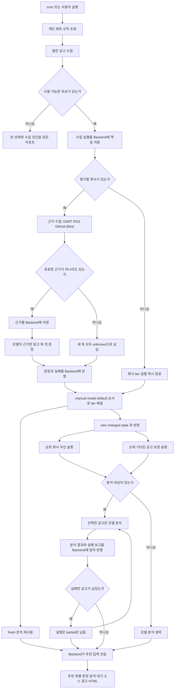
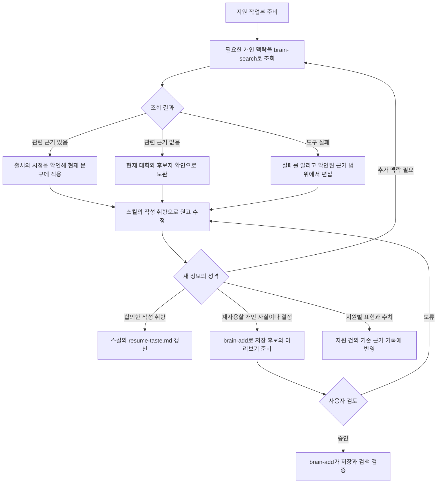
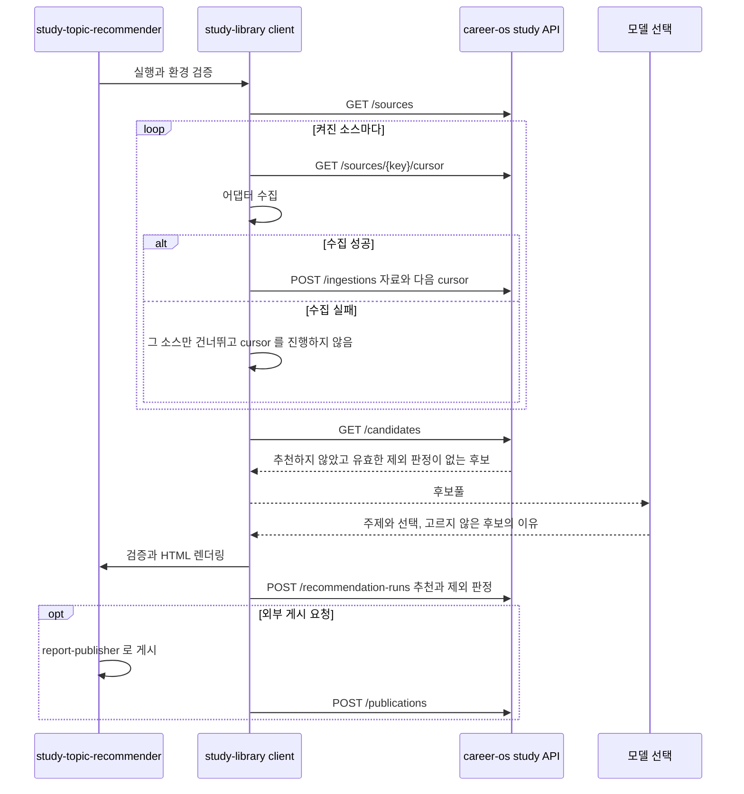

# 실행 흐름

career-os의 각 흐름은 외부 입력을 검증하고, 사용자 판단에 필요한 산출물을 만든 뒤,
승인 없이는 외부 상태를 바꾸지 않는 데서 끝난다.

이 문서는 각 스킬이 **어떤 순서로 돌고 어디서 갈라지는지**를 담는다.
정상 경로와 함께 실패, 빈 상태, 동시 충돌의 갈래를 적는다.
무엇을 약속하는지는 [`prd.md`](prd.md), 무엇을 저장하는지는 [`data-schema.md`](data-schema.md),
코드가 어디 있는지는 [`code-architecture.md`](code-architecture.md)가 담는다.

명령의 인자와 플래그 조합은 각 스킬의 `references/`가 소유한다. 여기에 옮겨 적지 않는다.

## 공통

### 비공개 작업본 동기화

`application-package-writer`, `resume-preparer`, `interview-practice`와 `study-topic-recommender`는 공통 CLI로 다음 준비와 반영 절차를 실행한다.

```text
작성 skill
  └─ 로컬 CLI
       ├─ 외부 개발 환경: SSH로 홈서버 명령 호출
       └─ 홈서버 Hermes: 같은 홈서버 명령을 직접 호출
            └─ publish 잠금
                 └─ S3 release 검증과 current pointer 변경
                      └─ Bun S3Client
                           └─ SeaweedFS의 career-os bucket
```

로컬 CLI는 S3 credential을 읽지 않는다.
홈서버 명령만 SeaweedFS에 접근하며, 외부 개발 환경과 Hermes가 같은 release 계약을 사용한다.
파일별 책임과 코드를 읽는 순서는 [`scripts/career-workspace/README.md`](../scripts/career-workspace/README.md)에서 확인한다.

1. 로컬 `applications`, `library`와 `state`가 마지막으로 받은 revision에서 바뀌지 않았는지 검사한다.
2. 홈서버의 현재 revision과 manifest를 확인한다.
3. 로컬 변경이 없으면 현재 release를 임시 경로로 받고 파일 hash와 허용 경로를 검증한다.
4. 검증된 작업본만 기존 로컬 경로에 반영한다.
5. 기존 skill이 로컬 파일을 읽고 결과를 만든다.
6. 완료 단계는 같은 skill의 준비 기록과 시작 revision이 있을 때만 실행한다.
7. 관리 파일이 바뀌지 않았으면 원격 release를 만들지 않는다.
8. 파일이 바뀌면 실행 시작 revision을 조건으로 전체 작업본을 전송한다.
9. 홈서버는 잠금 안에서 불변 release 객체를 검증하고 현재 revision이 그대로일 때만 current pointer를 새 revision으로 바꾼다.

홈서버에 연결할 수 없거나 저장소가 초기화되지 않았으면 오래된 로컬 파일로 쓰기 작업을 계속하지 않는다.
다른 환경이 먼저 반영했으면 홈서버의 현재 release를 바꾸지 않고 로컬 결과와 충돌 경로를 보존한다.
전송이 중단되거나 검증이 실패해도 이전 release가 계속 현재 상태다.
prepare가 중단되면 다음 실행은 journal과 실제 root를 대조해 기존 작업본으로 복구한 뒤에만 새 release를 받는다.
journal과 실제 경로가 모순되면 자동 정리하지 않고 `RESTORE_REQUIRED`로 중단한다.
prepare 는 현재 로컬 hash 가 마지막 동기화 상태와 다르면 파일을 교체하지 않는다.
같은 `contentDigest` 를 다시 publish 하면 새 release 를 만들지 않는다.
재생성 가능한 cache와 게시 뒤 삭제하는 임시 리포트는 동기화하지 않는다.
관리 root 안의 `.env`와 숨김 파일은 원격으로 보내지 않으며, `prepare`가 발견하면 삭제하지 않고 `WORKSPACE_DIRTY`로 중단한다.
`.omc`는 원격으로 보내지 않지만 `prepare`를 막지 않는다. 저장소가 재생성 가능한 운영 산출물로 선언한 디렉터리이므로 `prepare`가 관리 root를 교체할 때 함께 사라진다.
`.DS_Store`와 `Thumbs.db`는 운영체제 메타데이터로 분류해 작업 변경에서 제외한다.

#### skill이 실행하는 명령

`applications`, `library` 또는 `state`를 읽기 전에 저장소 루트 기준 CLI에 현재 skill 이름을 전달한다.

```bash
bun "$(git rev-parse --show-toplevel)/career-os/scripts/career-workspace/cli.ts" \
  skill begin <SKILL_NAME> --json
```

이 명령이 실패하면 기존 로컬 파일로 작업을 계속하지 않는다.
오류 코드와 로컬 파일이 보존됐다는 사실을 알리고 중단한다.

산출물과 상태 검사가 성공한 뒤 같은 이름으로 완료 단계를 실행한다.

```bash
bun "$(git rev-parse --show-toplevel)/career-os/scripts/career-workspace/cli.ts" \
  skill finish <SKILL_NAME> --json
```

완료 단계가 실패해도 로컬 결과를 지우지 않는다.

### 추천 상태 Backend

`position-recommender` 가 쓰는 HTTP Backend 의 계약이다.
코드 배치는 [`code-architecture.md`](code-architecture.md#추천-상태-backend)가 소유한다.

모든 쓰기 요청은 `Authorization: Bearer` 와 `Idempotency-Key` 를 요구한다.
응답은 `Cache-Control: no-store` 를 쓰며 원본 token 과 DB 오류 전문을 담지 않는다.

상태 코드다.

| 상황 | 코드 |
| --- | --- |
| 같은 key 에 같은 본문 | 저장한 응답을 그대로 |
| 같은 key 에 다른 본문 | `409` |
| 요청 계약 오류 | `400` |
| 인증 실패 | `401` |
| version 충돌 | `409` |
| 정책을 설정하지 않은 상태의 수집 요청 | `409 POLICY_NOT_CONFIGURED` |
| 회사 tier 실행이 `pending` 인데 분석 실행 생성 | `409 COMPANY_TIER_RUN_PENDING` |
| DB 연결 실패 | `503` |

`GET /health/live` 는 process 상태만 확인한다.
`GET /health/ready` 는 DDL 을 실행하지 않고 DB 연결과 `_prisma_migrations` 의 적용된 migration 이름을 조회한다.
`GET /api/v1/auth/check` 는 유효한 Bearer token 에만 `204` 를 돌려준다.

세 단계가 각각 한 transaction 에서 끝난다.

1. `POST /collection-runs` 가 공고 버전과 수집 실행과 회사 tier 평가 실행 생성까지 한다.
   공고 분석 실행은 만들지 않는다.
2. `POST /company-tier-runs/:id/results` 가 모델 평가와 실패를 반영한다.
3. `POST /collection-runs/:id/analysis-runs` 가 회사마다 `manual`, `model`, `default` 순서로
   tier 를 해결한 뒤 공고 분석 실행을 만든다.

수집 실행 하나는 공고 분석 실행 하나만 가지므로 재시도는 저장한 응답을 그대로 돌려준다.
분석 결과 반영은 분석한 공고와 분석하지 못한 공고를 함께 받고
실행 상태를 `pending`, `partial`, `completed` 중 하나로 돌려준다.
`partial` 이면 client 가 남은 항목만 다시 보낸다. Backend 는 스스로 재시도하지 않는다.

외부 queue 와 worker 를 두지 않는다. cron 이 동기 HTTP 요청으로 단계를 진행한다.

### HTML 리포트 게시

사용자가 공유 링크를 요청했을 때만 외부 게시까지 이어간다.

1. 리포트 HTML을 시스템 임시 디렉터리에 만든다.
2. 개인 정보, 비공개 회사 맥락, 로컬 절대 경로를 검사한다.
3. `report-publisher` skill로 Cloudflare Pages에 게시한다.
4. 게시된 페이지와 핵심 링크가 열리는지 확인한다.
5. 임시 HTML과 중간 데이터를 삭제한다.
6. 검증된 URL과 다음 행동을 사용자에게 전달한다.

사용자가 로컬 사본을 명시적으로 요청한 경우에만 지정한 경로에 보존한다.

## application-package-writer

선택한 공고 하나에 맞춘 지원 자료를 만들고 제출 가능성을 검증한다.

1. 공고 경로가 없으면 private brain에서 현재 지원 대상을 찾고 대응하는 지원 디렉터리를 확인한다.
2. 공식 공고와 회사 문화 자료의 최신 상태를 확인한다.
3. 공고 항목을 쪼개 후보자 근거를 수집하고 항목마다 판정한다. 판정 값과 점수, 가중치는 `application-package-writer` 의 `references/fit-judgment.md` 가 소유한다.
4. 적합도 판정 뒤 후보자 인터뷰를 진행한다. 기존 답변을 읽고, 동기, 당시 제약, 본인 판단, 기각한 대안과 확인하지 못한 결과 중 비어 있는 독립 질문을 최대 넷까지 묶어 확인한다.
5. 지원 판단과 근거를 `evidence/`의 `fit.md`, `strategy.md`, `status.md`에 관심사별로 나눠 적는다. 공고 항목별 적합도 표는 공고의 주요 업무, 기대 경험과 우대 경험을 항목 단위로 모두 담는다.
6. 공고 책임, 제출 근거 방어와 경험 공백을 `evidence/interview-questions.json`에 구조화한다.
7. 지원 전략이 준비되면 `resume-preparer`가 이력서와 필요한 경력기술서를 작성하고 검증한다.
8. `application-package.html`을 만든다. 화면 구성은 [`code-architecture.md`](code-architecture.md#application-package-writer)가 소유한다.
9. 사용자는 이 화면에서 지원동기, 소유권, 가장 강한 사례, 공백과 입사 후 기여 시나리오를 검토한다.
10. 외부에 보이는 문장을 전수 검사해 대상 범위, 본인 역할, 측정 대상과 포지션 연결이 독자에게 다르게 해석되지 않는지 확인한다.
11. 같은 경험의 대상, 역할, 수치와 기간이 지원 전략, 이력서, 경력기술서와 지원서 답변에서 일치하는지 대조한다.
12. 문서 근거로 고칠 수 없는 사실만 질문으로 돌리고, 독립적인 질문은 최대 넷까지 묶는다.
13. 공고 원문, 후보자 답변과 제출 문서를 다시 대조하고 제출 문장의 내부 정보 유출을 검사한다.
14. 준비 상태와 함께 사람 확인 상태를 `complete` 또는 `needs_input`으로 남기며, 미확인 항목이 있으면 `ready`로 판정하지 않는다.
15. 최종 제출 문서, 근거 원장과 검토표의 문구 해시가 모두 일치해야 `ready`로 끝낸다.
16. `ready`여도 실제 제출은 사용자 승인 전까지 수행하지 않는다.

## interview-practice

### 답변 연습

짧은 답변을 반복하고 약점을 다음 실행에 반영한다.

1. 포지션별 연습이면 private brain에서 현재 지원 대상을 찾는다.
2. 대응하는 지원 디렉터리의 포지션 질문, 공개 질문 은행과 개인 질문 자료에서 문제를 고른다.
3. 사용자가 먼저 자신의 답변을 작성한다.
4. 에이전트가 정확성, 구조, 근거, 전달력을 평가한다.
5. 보완할 핵심과 다음 복습 시점을 정한다.
6. `state/drill-progress.json`에 진행 상태를 갱신한다.
7. 현재 지원 대상이 있으면 공고 책임, 근거 방어와 명시한 경험 공백을 후속 질문에 반영한다.
8. 답변이 충분하면 판단, 반례, 운영과 근거 경계로 최대 네 단계까지 꼬리질문을 이어간다.
9. 틀린 답변은 한 번 명확히 확인한 뒤 반복 압박하지 않고 학습 항목과 다음 복습 시점으로 전환한다.

사용자의 생각을 바탕으로 실제 말할 수 있는 답변을 만든다.

### 질문 은행 갱신

`interview-practice`의 공개 질문 유지보수 절차에서 일반 질문과 개인 경험 질문을 분리한다.

1. 등록된 공식 문서, 기술 블로그, 공개 영상과 GitHub 가이드에서 실행별 후보를 임시 경로에 수집한다.
2. 질문 은행의 카테고리와 수준 분포, 현재 공고의 책임과 private brain의 경험 경계를 비교한다.
3. 블로그, 영상과 GitHub 가이드에서 실무 사례와 빠진 범위만 찾고 기술 사실은 공식 원문에서 다시 검증한다.
4. 출처 묶음을 `public/question-bank/sources.json`에 등록하거나 기존 항목을 재사용한다.
5. 공개 질문 후보의 중복, 목표 수준, 답변 신호와 꼬리질문 깊이를 검증한다.
6. 일반화할 수 있는 질문만 `public/question-bank/`에 추가한다.
7. 개인 경력에서 반복해서 연습할 일반 질문은 `library/question-bank/`에 둔다.
8. 공고와 지원 근거에서 나온 포지션별 질문은 해당 `applications/` 디렉터리의 `evidence/interview-questions.json`에 둔다.
9. 답변 연습은 세 범위를 합쳐 사용할 수 있지만 공개 산출물에는 개인 질문과 포지션별 질문을 포함하지 않는다.
10. 일반 연습에서는 질문 은행을 수정하지 않으며, 공개·개인·포지션 질문 묶음이 모두 비었을 때만 필요한 최소 질문을 보강하고 연습을 이어간다.

## position-recommender

외부 채용 소스의 열린 공고에서 실제 지원 후보를 고르고, 회사를 세 축으로 판정한다.

1. 수집기가 `GET exclusions`로 개인 제외 규칙을 읽고, 등록된 소스 어댑터가 열린 공고를 공통 형태로 모은다.
2. 스크립트가 종료 여부, 마감일, 고용 형태, 역할, URL 중복과 개인 제외 규칙을 검사한다.
3. client가 후보풀과 소스 진단을 멱등 키와 함께 Backend에 보낸다. Backend는 공고 버전과 수집 실행, 회사 tier 평가 실행을 한 트랜잭션으로 저장하고 평가할 회사 큐를 반환한다.
4. 근거 수집기가 큐에 든 회사만 대상으로 OpenDART와 기술 블로그 RSS와 GitHub organization과 Blind를 조회한다. 유효기간이 남은 근거는 다시 모으지 않는다.
5. client가 모은 근거를 `PUT company-tier-runs/:companyTierRunId/evidence`로 저장한다. 응답은 회사별 저장 건수다. 그 회사의 유효한 근거는 `GET companies/:companyKey/evidence`로 따로 읽는다.
6. 모델이 그 근거만 읽고 축 셋을 각각 판정한다. 근거가 없는 축은 `unknown`으로 두고 `recommendedTier`도 내지 않는다.
7. client가 결과와 평가하지 못한 회사를 실행 ID와 함께 보낸다. 큐가 비어 있으면 회사 tier 실행은 만들어지는 즉시 완료다.
8. client가 공고 분석 실행 생성을 요청하면 Backend가 회사마다 `manual`, `model`, `default` 순서로 tier를 해결하고, `fresh` 분석을 재사용한 뒤 회사 우선 슬롯과 오래 기다린 공고 보장 슬롯으로 제한된 분석 큐를 반환한다.
9. 모델은 분석 큐에 든 공고만 읽고 그 회사의 저장된 근거를 함께 본다.
10. client가 분석 결과와 분석하지 못한 공고를 실행 ID와 함께 보낸다. Backend는 아직 끝나지 않은 항목 전체와 대조하고 한 트랜잭션으로 반영한다.
11. 실패한 공고가 남으면 실행은 `partial`로 남고 client는 남은 항목만 다시 보낸다.
12. client가 추천 실행을 요청하면 Backend가 현재 활성 공고, 유효한 분석, 축별 판정, 분석 대기와 수집 진단을 조립해 반환한다.
13. 스크립트가 추천 JSON을 검증하고 HTML을 만든 뒤 공개 범위와 링크를 검사한다.
14. 사용자가 공유 링크를 요청했으면 게시 결과를 검증한다.
15. 사용자는 추천과 회사별 축 셋, 분석 대기, 개인 제외 건수와 소스 실패를 확인하고 지원 또는 제외를 결정한다.



수집기는 외부 요청 전에 `GET api/positions/v1/exclusions`로 개인 제외 규칙을 읽는다.
Backend가 응답하지 않으면 종료 코드 1로 중단한다.
규칙이 필요 없는 환경도 빈 배열을 명시적으로 받아야 진행한다.

실패 소스가 허용 개수를 넘거나 후보가 0건이면 수집기는 후보풀을 남기고 종료 코드 1로 끝낸다.
그 뒤 단계를 진행하지 않는다.

### 근거 수집이 실패했을 때

**근거 수집의 실패는 그 회사의 판정을 막지 않는다.**
출처 하나가 실패하면 그 출처가 채우던 축만 `unknown`으로 남고 나머지 축은 그대로 판정한다.

| 실패 | 어떻게 되나 |
| --- | --- |
| OpenDART가 `013 조회된 데이타가 없습니다`를 낸다 | 사업보고서를 내지 않는 회사다. `compensation-upside`가 `unknown`으로 남는다 |
| 기술 블로그 RSS 주소가 없거나 응답하지 않는다 | `growth-scope`를 GitHub와 공고로만 채운다 |
| GitHub organization이 없다 | 같다 |
| Blind에서 그 회사를 찾지 못한다 | `compensation-upside`를 DART로만 채운다 |
| 한 출처도 성공하지 못했다 | 세 축 모두 `unknown`으로 남기고 **그 회사의 공고는 그대로 분석한다** |

근거를 하나도 모으지 못한 것은 평가 실패가 아니다.
`failures`에 넣지 않고 축이 비어 있는 판정으로 저장한다.
다음 실행에서 유효기간이 지난 근거만 다시 모으므로 같은 조회를 반복하지 않는다.

### 그 밖의 갈래

모델은 닫힌 공고를 추측해 제거하지 않는다.
마감일과 활성 상태처럼 명시적으로 확인할 수 있는 조건은 수집 코드가 처리한다.
수집 소스가 부분 실패했으면 해당 소스에서 보이지 않는 공고를 닫힌 것으로 바꾸지 않는다.
동시에 두 실행이 시작되면 같은 멱등 키는 기존 응답을 재사용하고,
다른 실행은 각 실행 ID로 분리한다.
회사 tier 평가는 다른 실행이 처리 중인 회사를 건너뛰고, 2시간이 지난 처리 중 표시는 회수한 뒤 다시 고른다.
회사 tier 실행이 끝나지 않은 상태에서 공고 분석 실행을 요청하면 `409 COMPANY_TIER_RUN_PENDING`으로 거절한다.
한 회사의 평가가 실패해도 그 회사만 기본 tier로 남고 그날 공고 분석은 계속 진행한다.
분석 반영은 아직 끝나지 않은 항목 전체와 일치할 때만 성공한다.
분석 대상이 없더라도 재사용 수, 분석 대기 수와 소스 진단을 담은 리포트를 만든다.

최종화 명령은 최종 답변에 넣을 수집 경고 줄을 함께 출력한다.
최종 답변 형식은 `position-recommender` 스킬 문서가 정하고 cron 실행과 수동 실행이 같은 형식을 쓴다.
수집 경고가 있으면 그 줄을 최종 답변에 그대로 전달하고, 없으면 줄을 만들지 않는다.

## resume-preparer

### 근거 감사와 개선

이력서와 경력기술서 문장을 실제 업무 근거에 연결하고 HTML 결과를 반복 개선한다.

1. `resume-preparer`가 공고, 지원 전략과 후보자 원문에서 제출할 대표 근거를 고른다.
2. 검증 장부에서 후보 문구와 관련 근거를 검색해 먼저 읽을 자료를 줄인다.
3. 공통 이력서 작성 규칙을 적용해 Markdown 원본을 작성한다.
4. 제품 전체에 만든 체계와 한 기능의 개선 사례를 분리하고, 같은 경험의 범위가 모든 제출 문서에서 일치하는지 전수 검사한다.
5. 디자인 계약으로 HTML과 PDF를 만든다.
6. 현재 HTML의 주장과 `state/verified-claims/`의 검증 완료 주장을 대조한다.
7. 문구, 판정 축과 로컬 근거 파일의 SHA-256이 모두 같으면 이전 판정을 재사용한다.
8. 등록되지 않은 주장, 바뀐 문구, 달라진 근거 파일과 실행 시점에 따라 달라지는 URL 근거만 다시 읽는다.
9. 업무 문서, 코드, 테스트, Git 이력, 공개 결과물을 대조해 다시 감사할 주장의 구현, 소유권, 결과와 경험 깊이를 판정한다.
10. 재사용한 판정과 새 판정을 합쳐 현재 HTML 해시와 연결된 공고별 근거 원장을 만든다.
11. 코드 사용과 기능 개발만 확인되고 운영 노하우가 불명확하면 제출 문구를 바꾸는 확인 질문만 최대 넷까지 묶는다.
12. 근거가 약한 문장은 삭제하거나 확인 가능한 표현으로 낮춘다.
13. 사용자 확인이나 수정 판정이 남으면 최종 평가를 시작하지 않는다.
14. 공고와 제출 PDF만으로 독립된 인사담당자와 실무담당자 판정을 먼저 만든다.
15. 근거 방어, 내용, 가독성, 채용 공고 적합도와 HTML 품질을 판정한다.
16. 두 검토자가 모두 통과하고 경쟁상 차단 항목이 없을 때만 검토표를 `pass`로 기록한다.
17. 검토표에는 평가한 파일명과 근거 원장과 같은 문구 해시를 기록한다.
18. 정적 검사와 실제 브라우저 렌더링으로 페이지 수와 잘림을 확인한다.
19. 보이는 문구가 바뀌면 같은 경험을 가리키는 모든 문서의 표현을 확인하고, 해당 문서의 근거 감사와 평가를 다시 실행한다.
20. 모든 주장이 `safe`이고 현재 HTML 해시와 일치하는 `schemaVersion: 3` 원장만 검증 장부에 반영한다.
21. 경력기술서가 있으면 별도 PDF와 통합 `submission.pdf`를 만들고, manifest의 파일 해시까지 제출 묶음 검사를 통과한다.
22. 면접에서 확인할 질문은 `evidence/interview-questions.json`에 선택적으로 남기며, 답변 연습은 `interview-practice`가 맡는다.

검증 장부가 없거나 읽을 수 없으면 전체 감사를 수행한다.
근거 파일이 바뀌면 그 파일을 참조하는 주장만 다시 감사하며, 다른 주장의 재사용 판정은 유지한다.
두 실행이 같은 장부를 고치면 비공개 작업 release의 revision 충돌 검사로 이전 결과를 보존하고 새 작업본에서 다시 합친다.

개인 연락처가 포함된 이력서는 사용자의 명시적 요청 없이 공개 게시하지 않는다.

### 개인 맥락 조회와 환원

지원 작업본 준비 후 대표 사례 사실 확인 단계에서 경력·역할 선호·경험 경계를 조회한다.
원고 작성 단계에서는 스킬의 개인 작성 취향을 적용하고, 새 질문이나 정정으로 부족해진 정보만 추가 조회한다.



조회한 출처의 시점보다 새로운 사용자 정정이 있으면 정정을 현재 문구에 반영하고 충돌 사실을 표시한다.
연속 편집에서는 이미 확인한 맥락을 재사용하고, 제출 문장을 바꾸는 불확실성이 생겼을 때 다시 조회한다.
brain 검색과 공개·비공개 분리, 저장 미리보기·승인·동시 수정 처리는 설치된 brain 스킬 계약을 따른다.
지원 작업본의 동시 수정은 기존 revision 비교 계약을 따른다.

## study-topic-recommender

등록된 외부 소스에서 그날 읽거나 볼 가치가 높은 자료를 선별한다.
소스와 수집한 자료, 추천 이력과 제외 판정은 `career-os` Backend 가 `fos_career` 에 저장한다.
skill 과 수집기는 `/api/study/v1` 만 호출하고 파일에 이력을 두지 않는다.
이유는 [ADR-118](adr/ADR-118-추천-상태는-career-os-api와-mysql이-관리한다.md)을 따른다.

### 실행 흐름

1. client 가 `GET /sources` 로 켜진 소스를 받는다.
2. 소스마다 `GET /sources/{sourceKey}/cursor?mode=` 로 이어서 모을 위치를 받는다.
3. 피드와 페이지 어댑터가 최신 글과 영상을 결정적으로 수집하고 URL 을 정규화한다.
   YouTube 채널은 공식 Atom 피드를 먼저 쓰고, 피드를 읽을 수 없을 때만 공개 채널 페이지로 물러선다.
4. client 가 모은 자료와 다음 cursor 를 `POST /ingestions` 로 한 번에 보낸다.
   서버는 자료 저장과 cursor 교체를 한 트랜잭션으로 한다.
5. client 가 `GET /candidates` 로 후보를 받는다.
   서버는 이미 추천한 자료와, 지금 기준 버전에서 유효기간이 남은 제외 판정이 있는 자료를 뺀다.
6. 모델은 받은 후보 중 사용자의 현재 업무, 목표 역할, 엔지니어링 판단 또는
   제품·사업 관점에 구체적으로 연결되는 자료만 선별한다.
7. 모델은 선별한 자료를 외부 원문에서 도출한 공부 주제로 묶고 각 주제에 커리어 관점의 질문을 작성한다.
   고르지 않은 후보마다 한 줄 이유를 남긴다.
8. 선택 검증은 후보풀에 없는 자료, 실행 내 중복, 직전 리포트 주제의 재선택을 거부한다.
9. 같은 선별 결과에서 주제 중심 HTML 을 만들고 공개 범위와 링크를 검증한다.
10. 검증이 끝나면 client 가 추천과 제외 판정을 `POST /recommendation-runs` 로 한 번에 저장한다.
11. 사용자가 공유 링크를 요청했으면 `report-publisher` 로 게시하고, 성공한 뒤에만 `POST /publications` 로 기록한다.
12. 시스템 임시 경로의 실행 자료를 정리한다.



### 갈라지는 곳

| 상황 | 동작 |
| --- | --- |
| 소스 하나의 수집이 실패한다 | 그 소스의 `POST /ingestions` 를 보내지 않고 cursor 를 진행하지 않는다. 나머지 소스는 계속 모은다 |
| 정상적인 빈 페이지를 확인했다 | 빈 `items` 와 다음 cursor 를 보낼 수 있다. 실패와 빈 상태를 구분한다 |
| cursor version 이 달라졌다 | `409` 다. 기존 cursor 를 유지하고 그 소스는 다음 실행에서 다시 모은다 |
| 후보가 0건이다 | 과거 자료로 채우지 않고 빈 상태의 리포트를 만든다. 추천 실행은 저장한다 |
| 후보를 여러 페이지로 받는 중에 `historyVersion` 이 바뀌었다 | 다른 실행이 끼어든 것이다. 후보 조회를 처음부터 다시 한다 |
| 같은 날 두 번 저장한다 | `reportId` 가 서울 날짜의 `morning-YYYY-MM-DD` 라 두 번째는 `409` 다. 같은 멱등 키와 같은 본문이면 저장된 응답을 다시 준다 |
| 이미 추천한 자료를 다시 저장하려 한다 | 서버가 `409` 로 거부한다. `study_recommended_materials.content_key` 가 UNIQUE 다 |
| Backend 장애, 인증 실패 | 파일로 물러서지 않고 오류 코드와 `requestId` 를 알린 뒤 중단한다 |
| `429` | `Retry-After` 초를 표시하되 자동으로 오래 기다리지 않는다 |

멱등 요청은 같은 본문과 같은 키로만 재시도한다.
같은 키에 다른 본문이 필요하면 cursor 조회부터 다시 시작한다.
응답 유실이 의심될 때도 로컬에서 성공으로 보지 않고, 서버의 영수증 재응답이나 충돌 응답으로 판정한다.
token 과 원문 payload 는 출력하지 않는다.

### 제외 판정의 재사용

고르지 않은 후보는 매일 다시 판단하지 않는다.
판정은 후보자 기준 버전과 유효기간을 함께 저장하고, 둘 중 하나가 어긋나면 다시 후보로 나온다.

| 바뀐 것 | 결과 |
| --- | --- |
| 유효기간이 지났다 | 다시 후보로 나온다 |
| 사람이 후보자 기준 버전을 올렸다 | 모든 제외 판정이 무효가 되어 다시 후보로 나온다 |
| 같은 자료가 다른 소스에서 다시 수집됐다 | `contentKey` 가 같으므로 판정을 그대로 쓴다 |

관심사가 바뀌면 사람이 기준 버전을 올린다. 그래야 예전 기준으로 제외한 자료가 다시 보인다.
이유는 [ADR-127](adr/ADR-127-공부-추천은-고르지-않은-후보의-판정을-재사용한다.md)을 따른다.

### 소스 관리

소스의 원본은 `study_sources` 다. 사람은 `manage_reading_sources.ts` 로 더하고 고치고 끈다.
이 명령이 `PUT /sources/{sourceKey}` 를 부르고, 무엇을 왜 바꿨는지 `note` 에 남긴다.
cron 이 실패한 소스를 끄는 데 커밋과 배포가 필요 없다.

archive 수집 진입점은 소스 필드가 아니라 `sourceKey` 별 고정 registry 가 소유한다.
Kurly 와 OliveYoung 은 최근 수집에서는 `feed` adapter 이고, archive mode 에서만 registry 의 sitemap index 수집기를 쓴다.
필드가 비어 있으면 추정값을 만들지 않고, 없는 URL 필드는 명시적인 `null` 로 보낸다.
이유는 [ADR-126](adr/ADR-126-읽을거리-소스-목록은-backend가-원본을-가진다.md)을 따른다.

### 학습자료 HTTP 계약

기본 경로는 `/api/study/v1` 이다. 인증은 추천 Backend 의 Bearer token 하나를 쓴다.

| endpoint | 계약 |
| --- | --- |
| `GET /sources` | 소스 목록과 version |
| `PUT /sources/{sourceKey}` | 소스 전체 교체. `expectedVersion` 검사와 `note` |
| `GET /sources/{sourceKey}/cursor?mode=` | mode 별 opaque cursor 와 version |
| `POST /ingestions` | 자료 묶음과 다음 cursor 원자 저장 |
| `GET /candidates` | 추천하지 않았고 유효한 제외 판정이 없는 후보, `historyVersion`, 지금의 `candidateContextVersion` |
| `POST /recommendation-runs` | 추천 주제와 자료, 제외 판정의 원자 저장 |
| `POST /publications` | 외부 게시 성공 이력 |
| `PUT /recommendation-control` | 후보자 기준 버전을 바꾼다. 사람이 관심사가 바뀌었을 때 부른다 |

요청 본문은 1 MiB 이하이고 오류 응답은 `{error:{code,message,requestId}}` 다.
응답은 `Cache-Control: private, no-store` 와 `X-Robots-Tag: noindex, nofollow` 를 쓴다.
모든 쓰기 요청은 멱등 키를 요구하며 같은 key 와 다른 요청 hash 는 `409` 로 거부한다.
version 충돌도 `409`, 본문 상한 초과는 `413`, rate limit 은 `429`, 저장소 장애는 `503` 을 쓴다.

API 후보 `Candidate` 는 후보풀의 `ReadingCandidate` 로 변환한다.
`Candidate.id` 는 `contentKey` 이며 선택 파일의 `candidateId` 로 쓴다.
`recentStudyTopicKeys` 는 후보풀의 같은 필드로 전달한다.
`historyVersion` 은 여러 페이지를 받는 동안 이력이 바뀌지 않았는지 확인하는 데만 쓰고 추천 저장 본문에 넣지 않는다.
`candidateContextVersion` 은 추천 저장 본문에 그대로 돌려보낸다. 그 사이 사람이 기준을 올렸으면 서버가 `409` 로 거부한다.
서버가 추천 저장 시점에 직전 주제와 누적 추천 집합을 다시 검증한다.

만들지 않는 경로가 있다.
`fos-blog` 관리 화면을 위해 설계했던 자료 조회와 읽음 상태 변경, 추천 조회, legacy import 경로다.
그 화면이 없어 쓰는 쪽이 없다.

실행 명령과 플래그 조합은 스킬의
[`references/execution.md`](../.claude/skills/study-topic-recommender/references/execution.md)가 소유한다.
저장 모델과 cursor 형식은 [`data-schema.md`](data-schema.md#study-topic-recommender)가 소유한다.

### 판정에 공통으로 적용하는 것

외부 자료가 없는 학습 주제를 모델이 새로 만들지 않는다.
공식 문서, 모델 발표와 최신 소식이라는 이유만으로 추천하지 않는다.
기능 사용법만 나열하거나 사용자의 역할에서 전이할 판단이 없는 자료는 제외한다.
새로운 후보가 없으면 과거 자료를 다시 채우지 않고 빈 상태를 보여준다.
`study-topic-recommender` 호출만으로 외부 게시를 승인한 것으로 보지 않는다.

## sync-profile

원티드, LinkedIn, GitHub 프로필을 이력서 원고 기준으로 갱신한다.

1. 공통 CLI로 작업본을 준비한다. `library/`와 `applications/`를 읽기 때문이다.
2. 대상별 원고를 `library/profiles/`에서 읽는다.
   원고가 없으면 가장 최근 지원의 이력서 초안을 출발점으로 삼아 공개 범위를 조정한 새 원고를 만든다.
3. 사용자가 한 곳만 말해도 세 곳을 모두 읽고 원본과 어긋난 지점을 표로 보고한다.
4. 공개 범위를 사용자에게 확인받는다. 사내 운영 수치, 사내 조직명과 도구 이름,
   진행 중인 프로젝트의 종료월 표기가 여기 해당한다.
5. 원고에 없던 문장을 새로 썼으면 `resume-preparer`의 판정 모델로 근거를 확인한다.
6. 무엇을 어떻게 바꿀지 보여주고 승인을 받는다.
7. 대상별 절차로 반영한다. **한 번에 한 항목씩 넣고 결과를 확인한다.**
8. 반영한 값이 서버에 저장됐는지 대상별 방법으로 확인한다.
9. 반영한 내용을 원고에 다시 적는다. 폼 제약으로 원고와 다르게 넣었으면 그 사실과 이유를 함께 남긴다.
10. 완료 단계로 작업본을 발행한다.

갈라지는 곳이다.

- **화면에 값이 보이는 것은 저장의 증거가 아니다.** 원티드는 새로고침 뒤 서버에서 다시 조회하고,
  LinkedIn은 프로필 화면으로 돌아가 확인하고, GitHub은 이미지 로드 상태를 확인한다.
- 세 곳 중 하나라도 실패하면 그것을 먼저 알린다. 나머지가 성공했다고 넘어가지 않는다.
- 로그인 화면이 나오면 멈추고 사용자에게 알린다. 자격 증명을 대신 입력하지 않는다.
- 공개 범위 판단은 사용자만 한다. 지원본에 있던 문장이라도 그대로 옮기지 않는다.

대상별 절차와 조작 스크립트는 스킬의
[`references/`](../.claude/skills/sync-profile/)가 소유한다.
