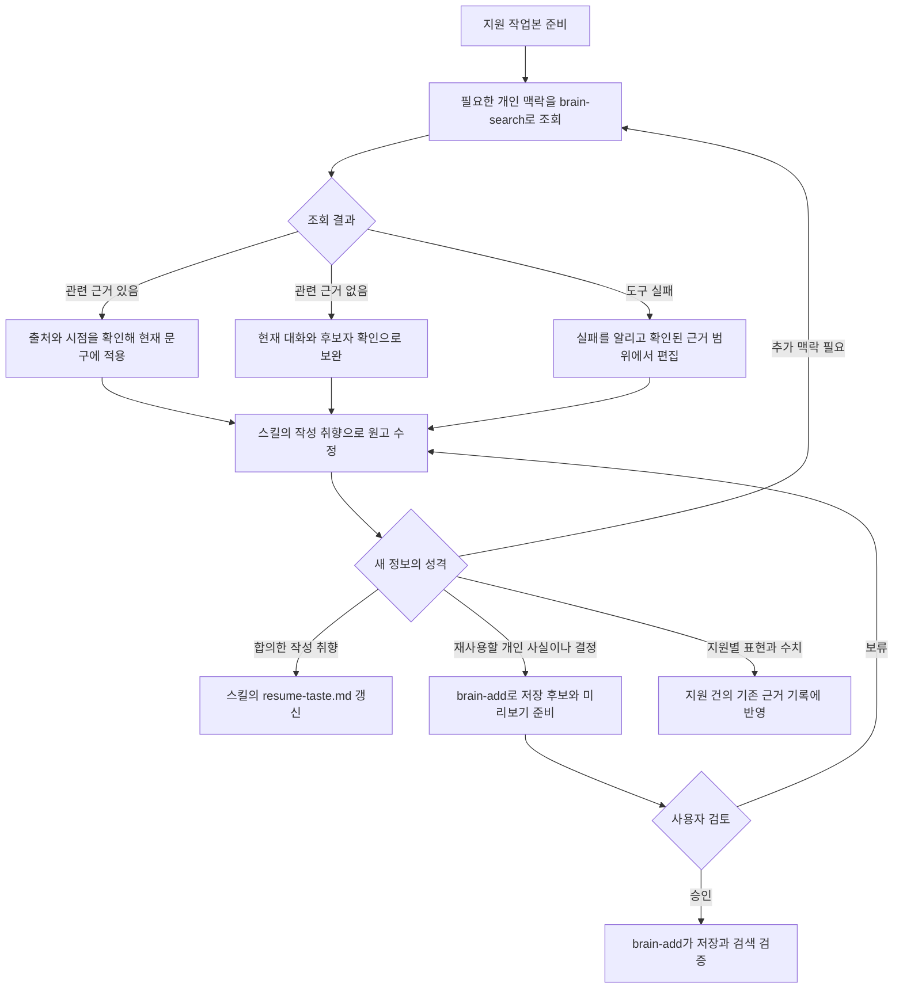

# 실행 흐름

career-os의 각 흐름은 외부 입력을 검증하고, 사용자 판단에 필요한 산출물을 만든 뒤, 승인 없이는 외부 상태를 바꾸지 않는 데서 끝난다.

## 비공개 작업 파일의 목표 흐름

`application-package-writer`, `resume-preparer`, `interview-practice`와 `study-topic-recommender`는 공통 CLI로 다음 준비와 반영 절차를 실행한다.

```text
작성 skill
  └─ 로컬 CLI
       ├─ 외부 개발 환경: SSH로 홈서버 명령 호출
       └─ 홈서버 Hermes: 같은 홈서버 명령을 직접 호출
            └─ publish 잠금
                 └─ S3 release 검증과 current pointer 변경
                      └─ Bun S3Client
                           └─ SeaweedFS의 career-os bucket
```

로컬 CLI는 S3 credential을 읽지 않는다.
홈서버 명령만 SeaweedFS에 접근하며, 외부 개발 환경과 Hermes가 같은 release 계약을 사용한다.
파일별 책임과 코드를 읽는 순서는 [`scripts/career-workspace/README.md`](../scripts/career-workspace/README.md)에서 확인한다.

1. 로컬 `applications`, `library`와 `state`가 마지막으로 받은 revision에서 바뀌지 않았는지 검사한다.
2. 홈서버의 현재 revision과 manifest를 확인한다.
3. 로컬 변경이 없으면 현재 release를 임시 경로로 받고 파일 hash와 허용 경로를 검증한다.
4. 검증된 작업본만 기존 로컬 경로에 반영한다.
5. 기존 skill이 로컬 파일을 읽고 결과를 만든다.
6. 완료 단계는 같은 skill의 준비 기록과 시작 revision이 있을 때만 실행한다.
7. 관리 파일이 바뀌지 않았으면 원격 release를 만들지 않는다.
8. 파일이 바뀌면 실행 시작 revision을 조건으로 전체 작업본을 전송한다.
9. 홈서버는 잠금 안에서 불변 release 객체를 검증하고 현재 revision이 그대로일 때만 current pointer를 새 revision으로 바꾼다.

홈서버에 연결할 수 없거나 저장소가 초기화되지 않았으면 오래된 로컬 파일로 쓰기 작업을 계속하지 않는다.
다른 환경이 먼저 반영했으면 홈서버의 현재 release를 바꾸지 않고 로컬 결과와 충돌 경로를 보존한다.
전송이 중단되거나 검증이 실패해도 이전 release가 계속 현재 상태다.
prepare가 중단되면 다음 실행은 journal과 실제 root를 대조해 기존 작업본으로 복구한 뒤에만 새 release를 받는다.
journal과 실제 경로가 모순되면 자동 정리하지 않고 `RESTORE_REQUIRED`로 중단한다.
재생성 가능한 cache와 게시 뒤 삭제하는 임시 리포트는 동기화하지 않는다.
관리 root 안의 `.env`, 숨김 파일과 `.omc`는 원격으로 보내지 않으며, `prepare`가 발견하면 삭제하지 않고 `WORKSPACE_DIRTY`로 중단한다.
`.DS_Store`와 `Thumbs.db`는 운영체제 메타데이터로 분류해 작업 변경에서 제외한다.

### skill이 실행하는 명령

`applications`, `library` 또는 `state`를 읽기 전에 저장소 루트 기준 CLI에 현재 skill 이름을 전달한다.

```bash
bun "$(git rev-parse --show-toplevel)/career-os/scripts/career-workspace/cli.ts" \
  skill begin <SKILL_NAME> --json
```

이 명령이 실패하면 기존 로컬 파일로 작업을 계속하지 않는다.
오류 코드와 로컬 파일이 보존됐다는 사실을 알리고 중단한다.

산출물과 상태 검사가 성공한 뒤 같은 이름으로 완료 단계를 실행한다.

```bash
bun "$(git rev-parse --show-toplevel)/career-os/scripts/career-workspace/cli.ts" \
  skill finish <SKILL_NAME> --json
```

완료 단계가 실패해도 로컬 결과를 지우지 않는다.

## 포지션 추천

외부 채용 소스의 열린 공고에서 실제 지원 후보를 고른다.

1. 등록된 소스 어댑터에서 열린 공고를 찾는다.
2. 소스 어댑터가 개별 공고를 공통 형태로 수집한다.
3. 스크립트가 종료 여부, 마감일, 고용 형태, 역할과 URL 중복을 검사한다.
4. 유효한 공고만 이번 실행의 임시 후보풀에 저장한다.
5. 모델이 private brain의 현재 커리어 정보와 원문 공고를 읽고 개수 제한 없이 기준을 통과한 추천 대상을 선별하며 전체 후보의 적합도 순위와 한 줄 판단을 만든다.
6. 추천 결과와 전체 후보 순위가 후보풀의 모든 공고와 정확히 일치하는지 검증한다.
7. 같은 추천 데이터에서 상위 3건의 우선 검토 카드, 나머지 추천, 별도 보류·주의 목록과 검색 가능한 전체 순위로 구성된 반응형 HTML 리포트를 만든다.
8. 사용자가 공유 링크를 요청했으면 공개 범위와 게시 결과를 검증한다.
9. 사용자는 로컬 검토 화면 또는 검증된 공개 URL에서 공고 원문을 확인하고 지원 또는 제외를 결정한다.
10. 로컬 렌더 또는 게시 검증이 끝나면 후보풀, 추천 데이터와 HTML을 삭제한다.

모델은 닫힌 공고를 추측해 제거하지 않는다.
마감일과 활성 상태처럼 명시적으로 확인할 수 있는 조건은 수집 코드가 처리한다.

## 지원 준비와 검증

선택한 공고 하나에 맞춘 지원 자료를 만들고 제출 가능성을 검증한다.

1. 공고 경로가 없으면 private brain에서 현재 지원 대상을 찾고 대응하는 지원 디렉터리를 확인한다.
2. 공식 공고와 회사 문화 자료의 최신 상태를 확인한다.
3. 공고 항목을 컴포넌트 단위로 쪼개 후보자 근거를 수집하고 확인됨, 강한 인접, 인접 경험, 공백과 사용자 확인으로 판정한다. 구분별 가중치를 적용해 적합도 총점과 구분별 소계를 계산한다.
4. 적합도 판정 뒤 후보자 인터뷰를 진행한다. 기존 답변을 읽고, 동기, 당시 제약, 본인 판단, 기각한 대안과 확인하지 못한 결과 중 비어 있는 독립 질문을 최대 6개까지 묶어 확인한다.
5. 지원 판단과 근거를 `evidence/application-package.md`에 통합한다. 공고 항목별 적합도 표는 공고의 주요 업무, 기대 경험과 우대 경험을 항목 단위로 모두 담는다.
6. 공고 책임, 제출 근거 방어와 경험 공백을 `evidence/interview-questions.json`에 구조화한다.
7. 지원 전략이 준비되면 `resume-preparer`가 이력서와 필요한 경력기술서를 작성하고 검증한다.
8. `application-package.html`의 상단에는 적합도 총점, 준비 상태, 결론, 제출 후보 PDF와 필요한 경우의 지원서 입력값을 고정해 보여준다. 총점과 구분별 소계는 색이 있는 원으로 표시한다.
9. 본문은 네 탭으로 나눈다. `공고 적합도`는 공고 항목별 대조 표와 팀·인접 사례 링크를, `지원 전략`은 승부처, 지원동기, 기여 시나리오, 공백과 다음 행동을, `공고 원문`은 `evidence/posting.md`를, `상세 자료`는 이력서 원문, 면접 질문, 후보자 인터뷰 기록과 개별 PDF를 담는다.
10. 사용자는 이 화면에서 지원동기, 소유권, 가장 강한 사례, 공백과 입사 후 기여 시나리오를 검토한다.
11. 외부에 보이는 문장을 전수 검사해 대상 범위, 본인 역할, 측정 대상과 포지션 연결이 독자에게 다르게 해석되지 않는지 확인한다.
12. 같은 경험의 대상, 역할, 수치와 기간이 지원 전략, 이력서, 경력기술서와 지원서 답변에서 일치하는지 대조한다.
13. 문서 근거로 고칠 수 없는 사실만 질문으로 돌리고, 독립적인 질문은 최대 6개까지 묶는다.
14. 공고 원문, 후보자 답변과 제출 문서를 다시 대조하고 계약 검사로 누락과 공개 범위를 확인한다.
15. 준비 상태와 함께 사람 확인 상태를 `complete` 또는 `needs_input`으로 남기며, 미확인 항목이 있으면 `ready`로 판정하지 않는다.
16. 최종 제출 문서, 근거 원장과 검토표의 문구 해시가 모두 일치해야 `ready`로 끝낸다.
17. `ready`여도 실제 제출은 사용자 승인 전까지 수행하지 않는다.

## 이력서 근거 감사와 개선

이력서와 경력기술서 문장을 실제 업무 근거에 연결하고 HTML 결과를 반복 개선한다.

1. `resume-preparer`가 공고, 지원 전략과 후보자 원문에서 제출할 대표 근거를 고른다.
2. 공통 이력서 작성 규칙을 적용해 Markdown 원본을 작성한다.
3. 제품 전체에 만든 체계와 한 기능의 개선 사례를 분리하고, 같은 경험의 범위가 모든 제출 문서에서 일치하는지 전수 검사한다.
4. 디자인 계약으로 HTML과 PDF를 만든다.
5. 최신 이력서, private brain의 경험 경계와 공개 경력 자료에서 검증할 주장을 추출한다.
6. 업무 문서, 코드, 테스트, Git 이력, 공개 결과물을 대조한다.
7. 구현, 소유권, 결과와 경험 깊이를 분리해 근거 장부를 만든다.
8. 코드 사용과 기능 개발만 확인되고 운영 노하우가 불명확하면 제출 문구를 바꾸는 확인 질문만 최대 6개까지 묶는다.
9. 근거가 약한 문장은 삭제하거나 확인 가능한 표현으로 낮춘다.
10. 사용자 확인이나 수정 판정이 남으면 최종 평가를 시작하지 않는다.
11. 공고와 제출 PDF만으로 독립된 인사담당자와 실무담당자 판정을 먼저 만든다.
12. 근거 방어, 내용, 가독성, 채용 공고 적합도와 HTML 품질을 판정한다.
13. 두 검토자가 모두 통과하고 경쟁상 차단 항목이 없을 때만 검토표를 `pass`로 기록한다.
14. 검토표에는 평가한 파일명과 근거 원장과 같은 문구 해시를 기록한다.
15. 정적 검사와 실제 브라우저 렌더링으로 페이지 수와 잘림을 확인한다.
16. 보이는 문구가 바뀌면 같은 경험을 가리키는 모든 문서의 표현을 확인하고, 해당 문서의 근거 감사와 평가를 다시 실행한다.
17. 경력기술서가 있으면 별도 PDF와 통합 `submission.pdf`를 만들고, manifest의 파일 해시까지 제출 묶음 검사를 통과한다.
18. 면접에서 확인할 질문은 `evidence/interview-questions.json`에 선택적으로 남기며, 답변 연습은 `interview-practice`가 맡는다.

개인 연락처가 포함된 이력서는 사용자의 명시적 요청 없이 공개 게시하지 않는다.

## 기술·인성 면접 답변 연습

짧은 답변을 반복하고 약점을 다음 실행에 반영한다.

1. 포지션별 연습이면 private brain에서 현재 지원 대상을 찾는다.
2. 대응하는 지원 디렉터리의 포지션 질문, 공개 질문 은행과 개인 질문 자료에서 문제를 고른다.
3. 사용자가 먼저 자신의 답변을 작성한다.
4. 에이전트가 정확성, 구조, 근거, 전달력을 평가한다.
5. 보완할 핵심과 다음 복습 시점을 정한다.
6. `state/drill-progress.json`에 진행 상태를 갱신한다.
7. 현재 지원 대상이 있으면 공고 책임, 근거 방어와 명시한 경험 공백을 후속 질문에 반영한다.
8. 답변이 충분하면 판단, 반례, 운영과 근거 경계로 최대 네 단계까지 꼬리질문을 이어간다.
9. 틀린 답변은 한 번 명확히 확인한 뒤 반복 압박하지 않고 학습 항목과 다음 복습 시점으로 전환한다.

사용자의 생각을 바탕으로 실제 말할 수 있는 답변을 만든다.

## 아침 읽을거리 추천

등록된 외부 소스에서 그날 읽거나 볼 가치가 높은 자료를 선별한다.

1. 공통 CLI가 홈서버의 최신 `state/` release를 준비한다.
2. `state/morning-study-history.json`에서 이전에 추천한 자료의 `contentKey`와 직전 리포트의 `studyTopicKey`를 읽는다.
3. `config/external-reading-sources.ts`의 활성 소스를 모두 읽는다.
4. 피드와 페이지 어댑터가 최신 글과 영상을 결정적으로 수집하고 URL을 정규화한다.
5. 같은 실행의 URL 중복을 제거하고 이전 이력과 같은 `contentKey`를 가진 후보를 표시한다.
6. 모델은 이전 추천을 제외한 후보 중 사용자의 현재 업무, 목표 역할, 엔지니어링 판단 또는 제품·사업 관점에 구체적으로 연결되는 자료만 선별한다.
7. 모델은 선별한 자료를 외부 원문에서 도출한 공부 주제로 묶고 각 주제에 커리어 관점의 질문을 작성한다.
8. 선택 검증은 후보풀에 없는 자료, 실행 내 중복, 이전 자료와 직전 리포트 주제의 재선택을 거부한다.
9. 같은 선별 결과에서 주제 중심 HTML을 만들고 공개 범위와 링크를 검증한다. JSON은 검증과 이력 반영에 사용한다.
10. 검증된 리포트의 자료만 누적 이력에 원자적으로 반영한다.
11. 완료 단계가 누적 이력이 포함된 작업본을 새 홈서버 release로 반영한다.
12. 사용자가 공유 링크를 요청했으면 `report-publisher`로 Cloudflare Pages에 게시하고 공개 URL을 검증한다.
13. 로컬 검토 또는 게시 검증을 마치면 시스템 임시 경로의 실행 자료를 정리한다.

외부 자료가 없는 학습 주제를 모델이 새로 만들지 않는다.
공식 문서, 모델 발표와 최신 소식이라는 이유만으로 추천하지 않는다.
기능 사용법만 나열하거나 사용자의 역할에서 전이할 판단이 없는 자료는 제외한다.
새로운 후보가 없으면 과거 자료를 다시 채우지 않고 빈 상태를 보여준다.
홈서버 release 충돌이나 이력 반영 실패가 발생하면 임시 리포트와 로컬 이력을 보존하고 이전 원격 release를 바꾸지 않는다.
`study-topic-recommender` 호출만으로 외부 게시를 승인한 것으로 보지 않는다.

## 이력서 작성 중 개인 맥락 조회와 환원

지원 작업본 준비 후 대표 사례 사실 확인 단계에서 경력·역할 선호·경험 경계를 조회한다.
원고 작성 단계에서는 스킬의 개인 작성 취향을 적용하고, 새 질문이나 정정으로 부족해진 정보만 추가 조회한다.



조회한 출처의 시점보다 새로운 사용자 정정이 있으면 정정을 현재 문구에 반영하고 충돌 사실을 표시한다.
연속 편집에서는 이미 확인한 맥락을 재사용하고, 제출 문장을 바꾸는 불확실성이 생겼을 때 다시 조회한다.
brain 검색과 공개·비공개 분리, 저장 미리보기·승인·동시 수정 처리는 설치된 brain 스킬 계약을 따른다.
지원 작업본의 동시 수정은 기존 revision 비교 계약을 따른다.

## 질문 은행 갱신

`interview-practice`의 공개 질문 유지보수 절차에서 일반 질문과 개인 경험 질문을 분리한다.

1. 등록된 공식 문서, 기술 블로그, 공개 영상과 GitHub 가이드에서 실행별 후보를 임시 경로에 수집한다.
2. 질문 은행의 카테고리와 수준 분포, 현재 공고의 책임과 private brain의 경험 경계를 비교한다.
3. 블로그, 영상과 GitHub 가이드에서 실무 사례와 빠진 범위만 찾고 기술 사실은 공식 원문에서 다시 검증한다.
4. 출처 묶음을 `public/question-bank/sources.json`에 등록하거나 기존 항목을 재사용한다.
5. 공개 질문 후보의 중복, 목표 수준, 답변 신호와 꼬리질문 깊이를 검증한다.
6. 일반화할 수 있는 질문만 `public/question-bank/`에 추가한다.
7. 개인 경력에서 반복해서 연습할 일반 질문은 `library/question-bank/`에 둔다.
8. 공고와 지원 근거에서 나온 포지션별 질문은 해당 `applications/` 디렉터리의 `evidence/interview-questions.json`에 둔다.
9. 답변 연습은 세 범위를 합쳐 사용할 수 있지만 공개 산출물에는 개인 질문과 포지션별 질문을 포함하지 않는다.
10. 일반 연습에서는 질문 은행을 수정하지 않으며, 공개·개인·포지션 질문 묶음이 모두 비었을 때만 필요한 최소 질문을 보강하고 연습을 이어간다.

## HTML 리포트 게시

사용자가 공유 링크를 요청했을 때만 외부 게시까지 이어간다.

1. 리포트 HTML을 시스템 임시 디렉터리에 만든다.
2. 개인 정보, 비공개 회사 맥락, 로컬 절대 경로를 검사한다.
3. `report-publisher` skill로 Cloudflare Pages에 게시한다.
4. 게시된 페이지와 핵심 링크가 열리는지 확인한다.
5. 임시 HTML과 중간 데이터를 삭제한다.
6. 검증된 URL과 다음 행동을 사용자에게 전달한다.

사용자가 로컬 사본을 명시적으로 요청한 경우에만 지정한 경로에 보존한다.
