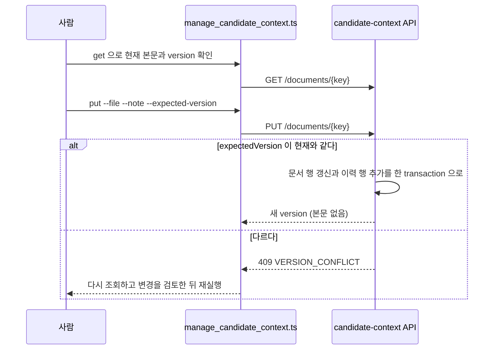
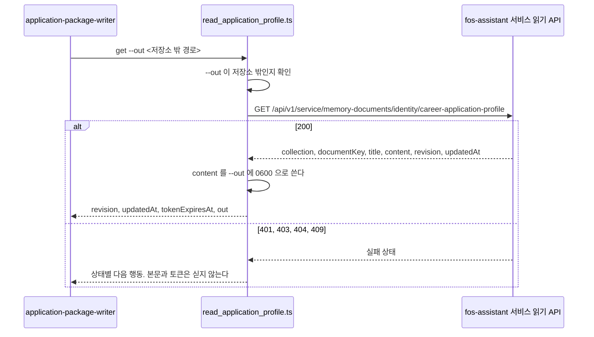
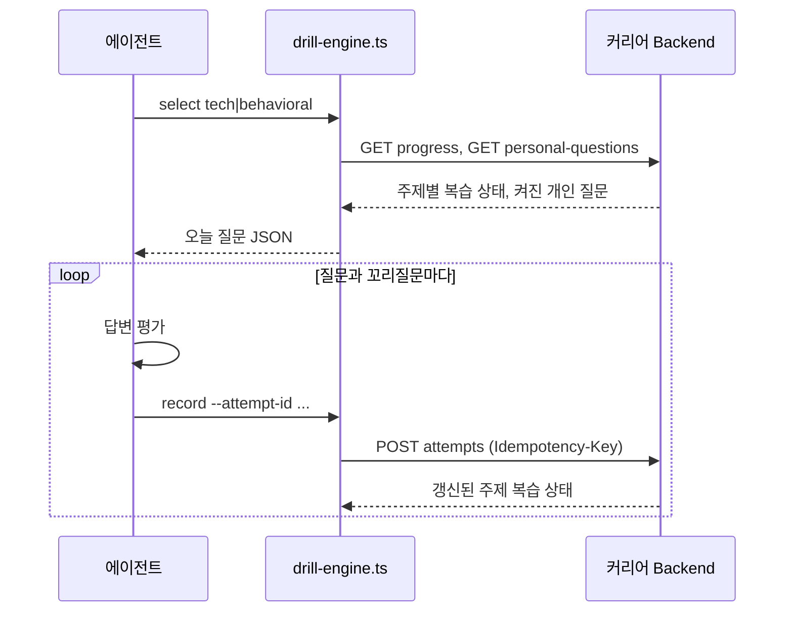
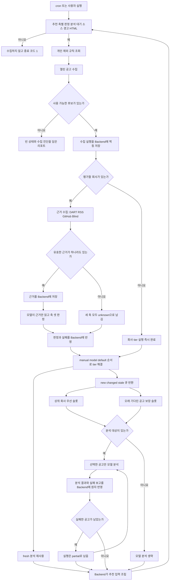
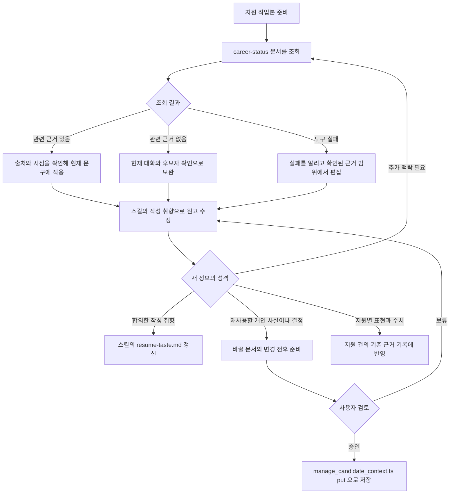
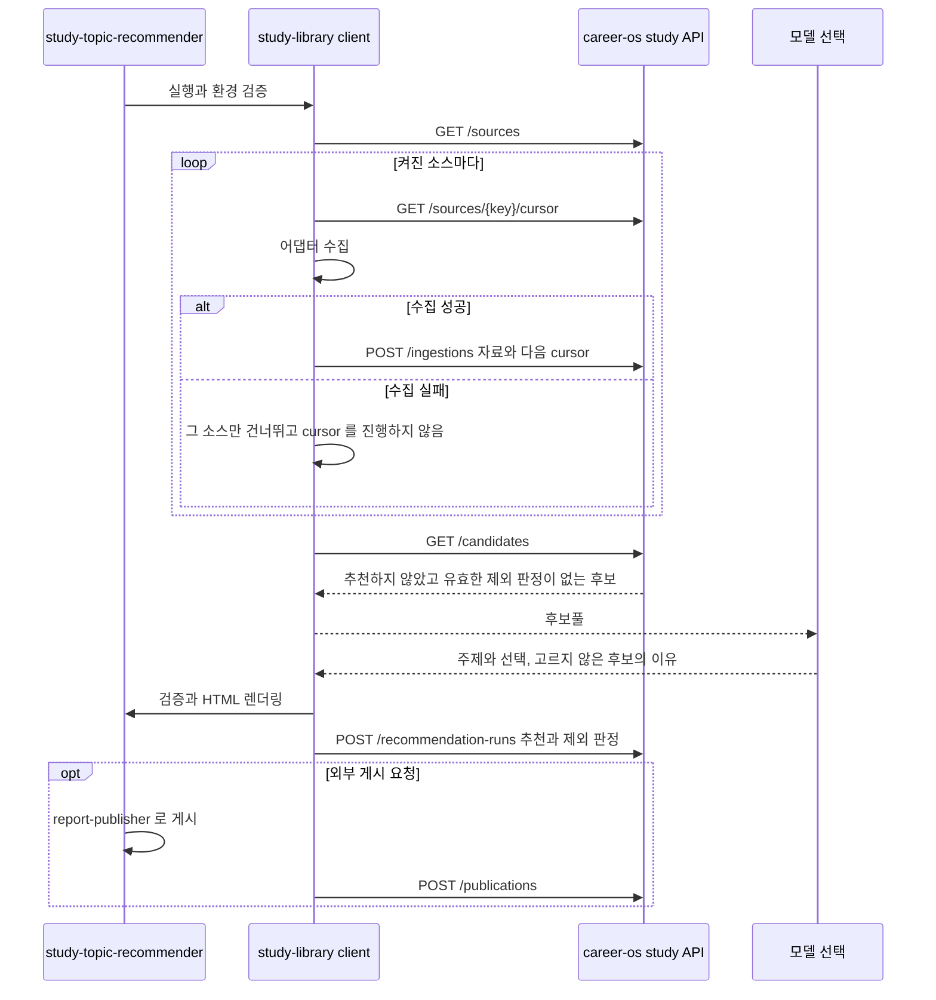
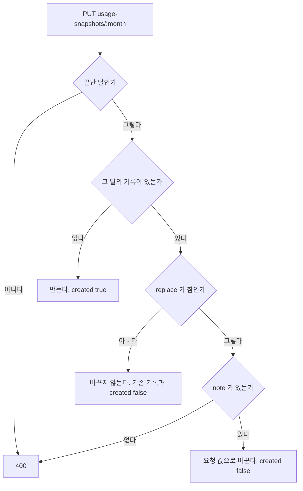
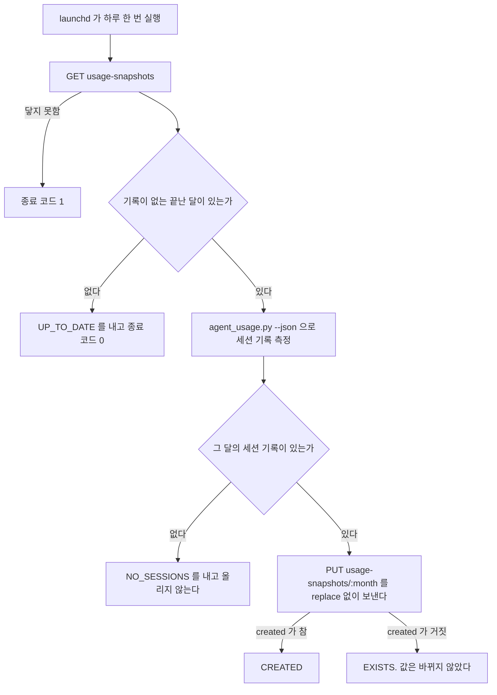
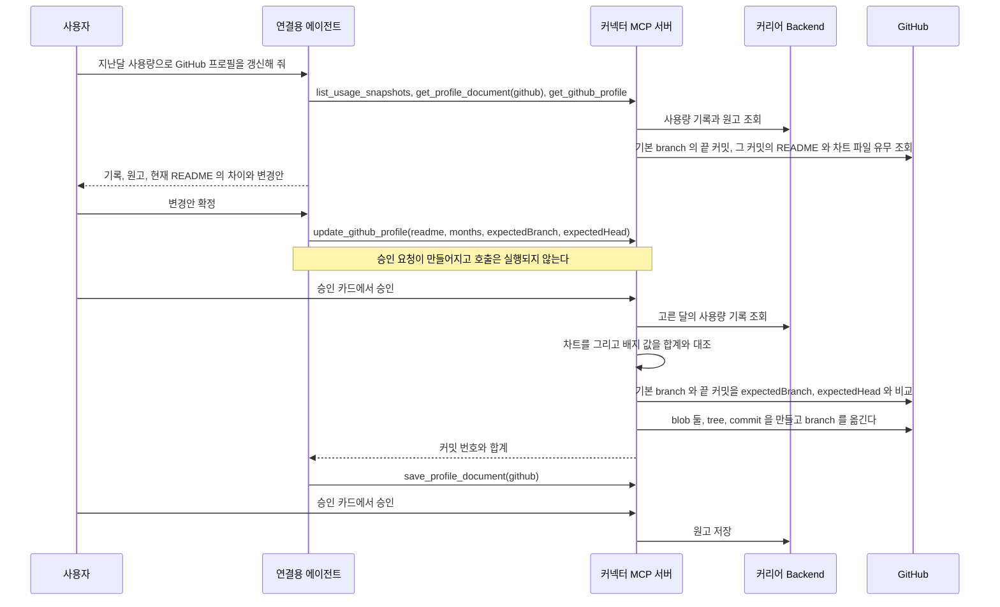
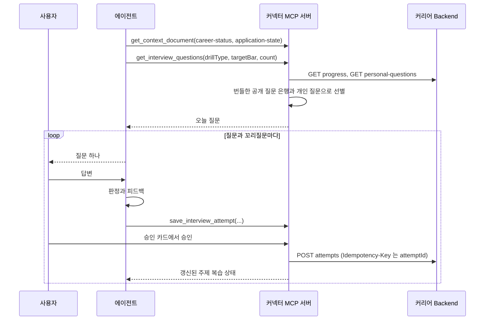

# 실행 흐름

career-os의 각 흐름은 외부 입력을 검증하고, 사용자 판단에 필요한 산출물을 만든 뒤,
승인 없이는 외부 상태를 바꾸지 않는 데서 끝난다.

이 문서는 각 스킬이 **어떤 순서로 돌고 어디서 갈라지는지**를 담는다.
정상 경로와 함께 실패, 빈 상태, 동시 충돌의 갈래를 적는다.
무엇을 약속하는지는 [`prd.md`](prd.md), 무엇을 저장하는지는 [`data-schema.md`](data-schema.md),
코드가 어디 있는지는 [`code-architecture.md`](code-architecture.md)가 담는다.

명령의 인자와 플래그 조합은 각 스킬의 `references/`가 소유한다. 여기에 옮겨 적지 않는다.

## 공통

### 비공개 작업본 동기화

plugin 의 `application-package-writer`, `resume-preparer`, `interview-question-prep` 는 다음 준비와 반영 절차를 실행한다.
스킬은 로컬 실행기 `workspace` 로 부르고, 이 실행기는 아래 공통 CLI 와 같은 코드다.

```text
작성 skill
  └─ 로컬 CLI
       ├─ 외부 개발 환경: SSH로 홈서버 명령 호출
       └─ 홈서버 Hermes: 같은 홈서버 명령을 직접 호출
            └─ publish 잠금
                 └─ S3 release 검증과 current pointer 변경
                      └─ Bun S3Client
                           └─ SeaweedFS의 career-os bucket
```

로컬 CLI는 S3 credential을 읽지 않는다.
홈서버 명령만 SeaweedFS에 접근하며, 외부 개발 환경과 Hermes가 같은 release 계약을 사용한다.
파일별 책임과 코드를 읽는 순서는 [`scripts/career-workspace/README.md`](../scripts/career-workspace/README.md)에서 확인한다.

1. 로컬 `applications`, `library`와 `state`가 마지막으로 받은 revision에서 바뀌지 않았는지 검사한다.
2. 홈서버의 현재 revision과 manifest를 확인한다.
3. 로컬 변경이 없으면 현재 release를 임시 경로로 받고 파일 hash와 허용 경로를 검증한다.
4. 검증된 작업본만 기존 로컬 경로에 반영한다.
5. 기존 skill이 로컬 파일을 읽고 결과를 만든다.
6. 완료 단계는 같은 skill의 준비 기록과 시작 revision이 있을 때만 실행한다.
7. 관리 파일이 바뀌지 않았으면 원격 release를 만들지 않는다.
8. 파일이 바뀌면 실행 시작 revision을 조건으로 전체 작업본을 전송한다.
9. 홈서버는 잠금 안에서 불변 release 객체를 검증하고 현재 revision이 그대로일 때만 current pointer를 새 revision으로 바꾼다.

홈서버에 연결할 수 없거나 저장소가 초기화되지 않았으면 오래된 로컬 파일로 쓰기 작업을 계속하지 않는다.
다른 환경이 먼저 반영했으면 홈서버의 현재 release를 바꾸지 않고 로컬 결과와 충돌 경로를 보존한다.
전송이 중단되거나 검증이 실패해도 이전 release가 계속 현재 상태다.
prepare가 중단되면 다음 실행은 journal과 실제 root를 대조해 기존 작업본으로 복구한 뒤에만 새 release를 받는다.
journal과 실제 경로가 모순되면 자동 정리하지 않고 `RESTORE_REQUIRED`로 중단한다.
prepare 는 현재 로컬 hash 가 마지막 동기화 상태와 다르면 파일을 교체하지 않는다.
같은 `contentDigest` 를 다시 publish 하면 새 release 를 만들지 않는다.
재생성 가능한 cache와 게시 뒤 삭제하는 임시 리포트는 동기화하지 않는다.
관리 root 안의 `.env`와 숨김 파일은 원격으로 보내지 않으며, `prepare`가 발견하면 삭제하지 않고 `WORKSPACE_DIRTY`로 중단한다.
`.omc`는 원격으로 보내지 않지만 `prepare`를 막지 않는다. 저장소가 재생성 가능한 운영 산출물로 선언한 디렉터리이므로 `prepare`가 관리 root를 교체할 때 함께 사라진다.
`.DS_Store`와 `Thumbs.db`는 운영체제 메타데이터로 분류해 작업 변경에서 제외한다.

#### skill이 실행하는 명령

`applications`, `library` 또는 `state`를 읽기 전에 저장소 루트 기준 CLI에 현재 skill 이름을 전달한다.

```bash
bun "$(git rev-parse --show-toplevel)/career-os/scripts/career-workspace/cli.ts" \
  skill begin <SKILL_NAME> --json
```

이 명령이 실패하면 기존 로컬 파일로 작업을 계속하지 않는다.
오류 코드와 로컬 파일이 보존됐다는 사실을 알리고 중단한다.

산출물과 상태 검사가 성공한 뒤 같은 이름으로 완료 단계를 실행한다.

```bash
bun "$(git rev-parse --show-toplevel)/career-os/scripts/career-workspace/cli.ts" \
  skill finish <SKILL_NAME> --json
```

완료 단계가 실패해도 로컬 결과를 지우지 않는다.

#### plugin 스킬이 실행하는 명령

plugin 스킬은 같은 단계를 로컬 실행기로 부른다. `<CAREER_LOCAL>` 은 스킬 본문이 알려 준 `bun --no-env-file "<plugin 경로>/dist/career-local.js"` 다.

```bash
<CAREER_LOCAL> workspace begin <SKILL_NAME> --json
<CAREER_LOCAL> workspace finish <SKILL_NAME> --json
```

작업본의 위치는 `CAREER_WORKSPACE_ROOT` 이고 없으면 `~/.fos-career/workspace` 다.
`CAREER_WORKSPACE_COMMAND` 나 `CAREER_WORKSPACE_SSH_TARGET` 이 있으면 위 동기화를 그대로 거친다.
둘 다 없으면 동기화하지 않는다. `begin` 은 관리 디렉터리 셋을 만들고 `mode: "local"` 을 내며, `finish` 는 원격에 아무것도 보내지 않는다.
로컬 모드에는 세션 기록, `WORKSPACE_DIRTY` 검사, release 비교가 없다. 작업본을 두 환경에서 함께 쓰지 않는다는 전제다. 두 환경에서 쓰려면 동기화 설정을 켠다.
`workspace paths --json` 은 작업본의 위치와 동기화 방식만 알려 준다.

`position-recommender`와 `study-topic-recommender`의 장기 추천 상태는 Backend에서 읽고 쓴다.

### 커리어 Backend

커리어 Backend 의 공통 HTTP 계약이다. 스킬별 경로는 각 스킬 절이 소유한다.
코드 배치는 [`code-architecture.md`](code-architecture.md#커리어-backend)가 소유한다.

모든 쓰기 요청은 `Authorization: Bearer` 와 `Idempotency-Key` 를 요구한다.
응답은 `Cache-Control: no-store` 를 쓰며 원본 token 과 DB 오류 전문을 담지 않는다.

상태 코드다.

| 상황 | 코드 |
| --- | --- |
| 같은 key 에 같은 본문 | 저장한 응답을 그대로 |
| 같은 key 에 다른 본문 | `409` |
| 요청 계약 오류 | `400` |
| 인증 실패 | `401` |
| version 충돌 | `409` |
| 정책을 설정하지 않은 상태의 수집 요청 | `409 POLICY_NOT_CONFIGURED` |
| `position-preferences` 문서가 없는 상태의 수집 요청 | `409 CANDIDATE_CONTEXT_MISSING` |
| 회사 tier 실행이 `pending` 인데 분석 실행 생성 | `409 COMPANY_TIER_RUN_PENDING` |
| `learning-interests` 문서가 없는 상태의 공부 후보 조회 | `409 CANDIDATE_CONTEXT_MISSING` |
| DB 연결 실패 | `503` |

`GET /health/live` 는 process 상태만 확인한다.
`GET /health/ready` 는 DDL 을 실행하지 않고 DB 연결과 `_prisma_migrations` 의 적용된 migration 이름을 조회한다.
`GET /api/v1/auth/check` 는 유효한 Bearer token 에만 `204` 를 돌려준다.

세 단계가 각각 한 transaction 에서 끝난다.

1. `POST /collection-runs` 가 공고 버전과 수집 실행과 회사 tier 평가 실행 생성까지 한다.
   공고 분석 실행은 만들지 않는다.
2. `POST /company-tier-runs/:id/results` 가 모델 평가와 실패를 반영한다.
3. `POST /collection-runs/:id/analysis-runs` 가 회사마다 `manual`, `model`, `default` 순서로
   tier 를 해결한 뒤 공고 분석 실행을 만든다.

수집 실행 하나는 공고 분석 실행 하나만 가지므로 재시도는 저장한 응답을 그대로 돌려준다.
분석 결과 반영은 분석한 공고와 분석하지 못한 공고를 함께 받고
실행 상태를 `pending`, `partial`, `completed` 중 하나로 돌려준다.
`partial` 이면 client 가 남은 항목만 다시 보낸다. Backend 는 스스로 재시도하지 않는다.

외부 queue 와 worker 를 두지 않는다. cron 이 동기 HTTP 요청으로 단계를 진행한다.

### 후보자 맥락 문서

스킬이 판단에 쓰는 개인 맥락이다. 기본 경로는 `/api/candidate-context/v1` 이다.
문서 키와 칸은 [`data-schema.md`](data-schema.md#후보자-맥락-문서)가 소유한다.

| endpoint | 계약 |
| --- | --- |
| `GET /documents` | 저장된 문서의 키, `version`, `updatedAt`. 본문은 담지 않는다 |
| `GET /documents/{documentKey}` | 본문, `version`, `note`, `updatedAt`. 없으면 `404` |
| `PUT /documents/{documentKey}` | 본문 전체 교체. `expectedVersion` 과 `note` 를 받는다. 새 문서는 `expectedVersion: 0` 이다. 응답은 `documentKey`, `version`, `updatedAt` 만 담는다. 멱등 영수증(`request_receipts`)에 본문 사본이 남지 않도록 본문과 `note` 를 돌려주지 않고, 본문은 `GET` 으로만 읽는다 |

사람이 `scripts/candidate-context/manage_candidate_context.ts` 로 고친다. 스킬은 변경 전후를 보여 주고 승인을 받은 뒤에만 같은 명령으로 저장한다.

문서 저장은 다른 저장 값을 함께 바꾸지 않는다.
`position-preferences` 를 저장한 뒤 포지션 분석 정책을 맞추는 단계가 없다.
Backend 가 수집 실행을 저장할 때 이 문서의 `version` 에서 기준 버전 `position-preferences:v{version}` 을 계산해 회사 tier 실행에 적는다.
공고 분석 실행은 문서를 다시 읽지 않고 같은 수집의 회사 tier 실행에 적힌 기준 버전을 이어 쓴다.
수집 뒤에 문서를 새로 저장해도 한 수집 안의 회사 tier 평가와 공고 분석은 같은 기준 버전을 쓴다.
CLI 로 저장하든 다른 client 로 저장하든 다음 수집부터 새 기준 버전이 쓰인다.
이유는 [ADR-134](adr/ADR-134-공고-분석의-기준-버전은-position-preferences-문서-버전에서-계산한다.md)를 따른다.

새 DB 에서 첫 수집 전에 준비할 것은 둘이고 순서는 상관없다.

- `position-preferences` 와 `application-state` 문서를 `put --expected-version 0` 으로 만든다.
- `scripts/position-recommender/configure_position_analysis_policy.ts` 로 분석 정책을 만든다.

정책이 없으면 수집 요청이 `409 POLICY_NOT_CONFIGURED` 로 끝난다.
정책은 있고 `position-preferences` 문서가 없으면 `409 CANDIDATE_CONTEXT_MISSING` 으로 끝난다.


```mermaid
sequenceDiagram
    participant Human as 사람
    participant CLI as manage_candidate_context.ts
    participant API as candidate-context API
    Human->>CLI: get 으로 현재 본문과 version 확인
    CLI->>API: GET /documents/{key}
    Human->>CLI: put --file --note --expected-version
    CLI->>API: PUT /documents/{key}
    alt expectedVersion 이 현재와 같다
        API->>API: 문서 행 갱신과 이력 행 추가를 한 transaction 으로
        API-->>CLI: 새 version (본문 없음)
    else 다르다
        API-->>CLI: 409 VERSION_CONFLICT
        CLI-->>Human: 다시 조회하고 변경을 검토한 뒤 재실행
    end
```

| 상황 | 동작 |
| --- | --- |
| 없는 문서 키 | `400`. 문서 키는 넷으로 고정한다 |
| 본문이 비었거나 64 KiB 를 넘는다 | `400` |
| 같은 문서를 두 사람이 동시에 저장한다 | 문서 행을 잠그고 `expectedVersion` 을 비교한다. 늦은 쪽이 `409` 다 |
| 조회한 문서가 없다 | `404`. CLI 는 새 문서를 `put --expected-version 0` 으로 만들라고 안내한다 |

이유는 [ADR-131](adr/ADR-131-후보자-맥락은-backend-문서로-두고-공부-추천-기준-버전을-문서-버전에서-계산한다.md)을 따른다.

### 지원서 공통 프로필

이름, 연락처, 병역, 학력과 정확한 재직 기간을 담은 문서다. 원본은 fos-assistant Memory 의 `identity` collection 에 있는 민감 문서 `career-application-profile` 이다.
career-os 는 서비스 토큰으로 읽기만 한다. 이유는 [ADR-136](adr/ADR-136-지원서-공통-프로필은-fos-assistant-memory에서-서비스-토큰으로-읽는다.md)을 따른다.

plugin 의 `application-package-writer` 가 지원서 입력을 준비할 때 로컬 실행기 `application-profile` 로 부른다.
실행기는 `.env` 를 탐색하지 않고 셸 환경 변수 `FOS_ASSISTANT_URL`, `FOS_ASSISTANT_SERVICE_TOKEN` 에서 연결값을 읽는다.

```bash
<CAREER_LOCAL> application-profile get --out "${TMPDIR:-/tmp}/career-application-profile.md"
```

저장소를 연 노트북에서는 같은 CLI 를 직접 부를 수 있다. Bun 은 실행한 디렉터리의 `.env` 만 자동으로 읽으므로 `--env-file` 로 `career-os/.env` 를 넘긴다.

```bash
bun --env-file=career-os/.env career-os/scripts/application-profile/read_application_profile.ts get --out "${TMPDIR:-/tmp}/career-application-profile.md"
```

CLI 는 `GET {FOS_ASSISTANT_URL}/api/v1/service/memory-documents/identity/career-application-profile` 을 `Authorization: Bearer {FOS_ASSISTANT_SERVICE_TOKEN}` 으로 부른다.
`FOS_ASSISTANT_ACCESS_CLIENT_ID` 와 secret 이 있으면 `CF-Access-Client-Id`, `CF-Access-Client-Secret` 머리말을 함께 보낸다. 둘 다 없으면 보내지 않고, 하나만 있으면 요청 전에 실패한다.
본문은 `--out` 파일에만 쓰고, 표준 출력에는 판 번호와 시각만 낸다. 스킬은 그 파일을 읽어 쓴 뒤 지운다.


```mermaid
sequenceDiagram
    participant Skill as application-package-writer
    participant CLI as read_application_profile.ts
    participant FA as fos-assistant 서비스 읽기 API
    Skill->>CLI: get --out <저장소 밖 경로>
    CLI->>CLI: --out 이 저장소 밖인지 확인
    CLI->>FA: GET /api/v1/service/memory-documents/identity/career-application-profile
    alt 200
        FA-->>CLI: collection, documentKey, title, content, revision, updatedAt
        CLI->>CLI: content 를 --out 에 0600 으로 쓴다
        CLI-->>Skill: revision, updatedAt, tokenExpiresAt, out
    else 401, 403, 404, 409
        FA-->>CLI: 실패 상태
        CLI-->>Skill: 상태별 다음 행동. 본문과 토큰은 싣지 않는다
    end
```

| 상황 | CLI 의 동작 |
| --- | --- |
| `FOS_ASSISTANT_URL` 이나 `FOS_ASSISTANT_SERVICE_TOKEN` 이 없다 | 요청하지 않고 실패한다. 셸 환경(노트북 직접 호출이면 `career-os/.env`)에 두 값을 채우라고 알린다 |
| Access ID 와 secret 중 하나만 있다 | 요청하지 않고 실패한다. 어느 변수가 빠졌는지만 알리고 값은 출력하지 않는다 |
| `--out` 이 git 저장소 안이다 | 요청하지 않고 실패한다 |
| `401` | 토큰이 없거나 틀렸거나 폐기됐거나 만료됐다. fos-assistant 웹 화면에서 새로 발급해 `.env` 를 바꾸라고 알린다 |
| `403` | 요청에 `Origin` 머리말이 붙었거나 Cloudflare Access 가 거절했다. CLI 결함과 `FOS_ASSISTANT_ACCESS_CLIENT_ID`, secret 값을 함께 확인하라고 알리고 실패한다. 값은 출력하지 않는다 |
| `404 MEMORY_NOT_FOUND` | 문서가 없거나 토큰이 `identity` 의 민감 읽기를 받지 않는다. fos-assistant 웹 화면에서 문서와 토큰 권한을 확인하라고 알린다 |
| `409 MEMORY_ENCRYPTION_UNAVAILABLE` | fos-assistant 에 민감 본문의 key 가 없다. 운영자에게 알리라고 하고 실패한다 |
| `5xx` 나 연결 실패 | 두 번까지 다시 시도한 뒤 실패한다 |
| 응답 본문이 계약과 다르다 | 실패한다. `collection` 과 `documentKey` 가 요청한 값과 다를 때도 같다 |

어느 실패든 스킬은 공통 프로필 없이 지원서 입력을 준비하지 않고 멈춘다.
새로 확인한 공통 프로필 사실은 career-os 가 쓰지 않는다. 사용자에게 fos-assistant 웹 화면에서 고치라고 안내한다.

### HTML 리포트 게시

사용자가 공유 링크를 요청했을 때만 외부 게시까지 이어간다.

1. 리포트 HTML을 시스템 임시 디렉터리에 만든다.
2. 개인 정보, 비공개 회사 맥락, 로컬 절대 경로를 검사한다.
3. `report-publisher` skill로 Cloudflare Pages에 게시한다.
4. 게시된 페이지와 핵심 링크가 열리는지 확인한다.
5. 임시 HTML과 중간 데이터를 삭제한다.
6. 검증된 URL과 다음 행동을 사용자에게 전달한다.

사용자가 로컬 사본을 명시적으로 요청한 경우에만 지정한 경로에 보존한다.

## application-package-writer

선택한 공고 하나에 맞춘 지원 자료를 만들고 제출 가능성을 검증한다.

1. 공고 경로가 없으면 `application-state` 문서에서 현재 지원 대상을 찾고 대응하는 지원 디렉터리를 확인한다.
2. 공식 공고와 회사 문화 자료의 최신 상태를 확인하고 공고 원문을 `evidence/posting.md` 에 저장한다.
3. 공고 항목을 쪼개 후보자 근거를 수집하고 항목마다 판정한다. 판정 값과 점수, 가중치는 plugin 의 `application-package-writer` 스킬 `references/fit-judgment.md` 가 소유한다.
4. 적합도 판정 뒤 후보자 인터뷰를 진행한다. 기존 답변을 읽고, 동기, 당시 제약, 본인 판단, 기각한 대안과 확인하지 못한 결과 중 비어 있는 독립 질문을 최대 넷까지 묶어 확인한다.
5. 후보자가 이 자리에서 얻을 경험을 물었거나 같은 회사에 성격이 다른 공고가 둘 이상 열려 있으면, 이 자리에서 다루게 될 것과 다루지 못할 것을 공개 자료로 판정한다. 그 밖에는 건너뛴다.
6. 지원 판단과 근거를 `evidence/`의 `fit.md`, `strategy.md`, `status.md`에 관심사별로 나눠 적는다. 공고 항목별 적합도 표는 공고의 주요 업무, 기대 경험과 우대 경험을 항목 단위로 모두 담는다.
7. 공고 책임, 제출 근거 방어와 경험 공백을 `evidence/interview-questions.json`에 구조화한다.
8. 외부에 보이는 문장을 전수 검사해 대상 범위, 본인 역할, 측정 대상과 포지션 연결이 독자에게 다르게 해석되지 않는지 확인한다.
9. 같은 경험의 대상, 역할, 수치와 기간이 지원 전략과 지원서 답변에서 일치하는지 대조한다.
10. 문서 근거로 고칠 수 없는 사실만 초안과 함께 질문으로 돌리고, 독립적인 질문은 최대 넷까지 묶는다. 사용자는 지원동기, 소유권, 가장 강한 사례, 공백과 입사 후 기여 시나리오를 확인한다.
11. 전체 지원 요청이면 작업본 세션을 닫고 `resume-preparer`를 불러 이력서와 필요한 경력기술서를 작성하고 검증하게 한 뒤, 세션을 다시 연다.
12. 로컬 실행기 `package validate` 로 제출 문서의 내부 정보를 검사하고 `package render` 로 `application-package.html`을 만든다. 화면 구성은 [`code-architecture.md`](code-architecture.md#application-package-writer)가 소유한다.
13. 공고 원문, 후보자 답변과 제출 문서를 다시 대조하고 제출 문장의 내부 정보 유출을 검사한다.
14. 준비 상태와 함께 사람 확인 상태를 `complete` 또는 `needs_input`으로 남기며, 미확인 항목이 있으면 `ready`로 판정하지 않는다.
15. 최종 제출 문서, 근거 원장과 검토표의 문구 해시가 모두 일치해야 `ready`로 끝낸다.
16. `ready`여도 실제 제출은 사용자 승인 전까지 수행하지 않는다.

## interview-practice

### 답변 연습

짧은 답변을 반복하고 약점을 다음 실행에 반영한다.

1. `drill-engine.ts memory` 로 후보자 맥락을 얻는다. `CAREER_MEMORY=backend` 면 출력에 담긴 `career-status` 와 `application-state` 본문으로 출력이 알려 준 칸을 채우고, `file` 이면 출력이 그대로 맥락이다. 포지션별 연습이면 맥락의 `targets` 에서 지원 디렉터리를 고른다.
2. `drill-engine.ts select` 가 `CAREER_STORE` 로 고른 저장소에서 주제별 복습 상태와 켜진 개인 질문을 읽고, 공개 질문 은행과 지원 디렉터리의 포지션 질문을 합쳐 문제를 고른다.
3. 사용자가 먼저 자신의 답변을 작성한다.
4. 에이전트가 정확성, 구조, 근거, 전달력을 평가한다.
5. 보완할 핵심을 짧은 피드백으로 정한다.
6. `drill-engine.ts record` 가 점수와 피드백을 저장소에 기록한다. 저장소가 기록과 함께 그 주제의 다음 복습일을 정한다. Backend 는 같은 transaction 에서 정한다.
7. 현재 지원 대상이 있으면 공고 책임, 근거 방어와 명시한 경험 공백을 후속 질문에 반영한다.
8. 답변이 충분하면 판단, 반례, 운영과 근거 경계로 최대 네 단계까지 꼬리질문을 이어간다.
9. 틀린 답변은 한 번 명확히 확인한 뒤 반복 압박하지 않고 학습 항목으로 전환한다.


```mermaid
sequenceDiagram
  participant M as 에이전트
  participant C as drill-engine.ts
  participant B as 커리어 Backend
  M->>C: select tech|behavioral
  C->>B: GET progress, GET personal-questions
  B-->>C: 주제별 복습 상태, 켜진 개인 질문
  C-->>M: 오늘 질문 JSON
  loop 질문과 꼬리질문마다
    M->>M: 답변 평가
    M->>C: record --attempt-id ...
    C->>B: POST attempts (Idempotency-Key)
    B-->>C: 갱신된 주제 복습 상태
  end
```

| 상황 | 동작 |
| --- | --- |
| 복습 상태가 없음 | 모든 질문을 신규로 본다 |
| 개인 질문이 없음 | 공개 질문과 포지션 질문만 쓴다 |
| 고를 질문이 없음 | `select` 가 빈 목록을 돌려주고 에이전트가 질문 은행 보강을 안내한다 |
| `CAREER_STORE` 나 `CAREER_MEMORY` 가 없음 | 명령이 종료 코드 1 로 끝나고 `drill-engine.ts doctor` 를 안내한다 |
| `CAREER_MEMORY=backend` 인데 문서를 읽지 못함 | `memory` 가 종료 코드 1 로 끝난다. 없는 문서는 키를 알려 주고, 에이전트는 맥락 없이 연습하지 않는다 |
| `backend` 인데 Backend 에 닿지 못함 | `select` 와 `record` 가 종료 코드 1 로 끝난다. 에이전트는 기록되지 않았다고 알리고 파일에 따로 쓰지 않는다 |
| 같은 기록을 다시 보냄 | 같은 `attemptId` 는 저장한 응답을 그대로 돌려준다. 횟수가 두 번 오르지 않는다 |
| 두 대화가 같은 주제를 동시에 기록 | 주제 행을 잠가 순서대로 반영한다 |

사용자의 생각을 바탕으로 실제 말할 수 있는 답변을 만든다.

### 질문 은행 갱신

공개 질문 은행은 이 저장소의 유지 절차로만 고친다. 절차는 `public/question-bank/MAINTENANCE.md` 가 소유한다.
plugin 의 `interview-question-prep` 는 3, 5 단계까지 같은 기준으로 고른 질문을 공개 은행 대신 개인 질문으로 저장한다.

1. 등록된 공식 문서, 기술 블로그, 공개 영상과 GitHub 가이드에서 실행별 후보를 임시 경로에 수집한다.
2. 질문 은행의 카테고리와 수준 분포, 현재 공고의 책임과 `career-status` 문서의 경험 경계를 비교한다.
3. 블로그, 영상과 GitHub 가이드에서 실무 사례와 빠진 범위만 찾고 기술 사실은 공식 원문에서 다시 검증한다.
4. 출처 묶음을 `public/question-bank/sources.json`에 등록하거나 기존 항목을 재사용한다.
5. 공개 질문 후보의 중복, 목표 수준, 답변 신호와 꼬리질문 깊이를 검증한다.
6. 일반화할 수 있는 질문만 `public/question-bank/`에 추가한다.
7. 개인 경력에서 반복해서 연습할 일반 질문은 `save_personal_question` 도구나 `drill-engine.ts personal add` 로 Backend 에 둔다.
8. 공고와 지원 근거에서 나온 포지션별 질문은 해당 `applications/` 디렉터리의 `evidence/interview-questions.json`에 둔다.
9. 답변 연습은 세 범위를 합쳐 사용할 수 있지만 공개 산출물에는 개인 질문과 포지션별 질문을 포함하지 않는다.
10. 일반 연습에서는 질문 은행을 수정하지 않으며, 공개·개인·포지션 질문 묶음이 모두 비었을 때만 필요한 최소 질문을 보강하고 연습을 이어간다.

### Claude Code 에서 공고별 질문 연습

plugin 의 `interview-question-prep` 스킬이 Claude Code 에서만 한다. 답변 판정과 기록 규칙은 `interview-practice` 스킬과 같다.

1. `workspace begin interview-question-prep` 로 작업본을 준비한다. 실패하면 멈춘다.
2. `get_context_document` 로 `career-status` 와 `application-state` 를 읽고 연습할 지원 디렉터리를 고른다.
3. `interview select <tech|behavioral> --application-dir <작업본>/applications/<회사>/<직무> --target-bar <bar>` 가 공개, 개인, 공고별 질문을 섞어 고른다. 저장소는 늘 Backend 다.
4. 답변과 꼬리질문마다 `save_interview_attempt` 로 기록한다.
5. `workspace finish interview-question-prep` 로 끝낸다. 이 스킬은 작업본 파일을 고치지 않으므로 동기화 모드에서도 새 release 를 만들지 않는다.

외부 자료에서 질문을 찾을 때는 `interview-sources collect` 가 임시 디렉터리에 후보를 모은다.
공식 원문으로 확인한 질문만 사용자 확인을 받아 `save_personal_question` 으로 저장한다.

| 상황 | 동작 |
| --- | --- |
| 지원 디렉터리에 `evidence/interview-questions.json` 이 없다 | `interview select` 가 종료 코드 1 로 끝난다. 공고별 질문 없이 `interview-practice` 로 연습하라고 안내한다 |
| Backend 연결값이 셸 환경에 없다 | `interview select` 가 종료 코드 1 로 끝난다. 환경 변수를 설정하라고 안내한다 |
| 수집한 모든 출처가 실패했다 | 질문을 만들지 않고 멈춘다. 등록 출처 수정은 저장소 유지 절차다 |

### 면접 연습 HTTP 계약

`/api/interview/v1` 이다. 인증, 멱등 키와 공통 상태 코드는 「커리어 Backend」 절을 따른다.
칸의 타입과 제약은 [`data-schema.md`](data-schema.md#면접-연습-table)가 소유한다.

| 경로 | 요청 | 응답 |
| --- | --- | --- |
| `GET progress?drillType=` | `drillType` 은 `tech` 나 `behavioral` | `{ items: [{ drillType, topic, passCount, failCount, nextReviewDate, lastPassedDate }] }` |
| `POST attempts` | `attemptId`, `drillType`, `questionId`, `topic`, `question`, `score`, 선택 칸 `feedback`, `targetCompany`, `targetRole`, `targetValueAxis`, `rootQuestionId`, `parentQuestion`, `followUpDepth`, `followUpAxis`, `stopReason` | `{ attemptId, evaluatedOn, progress: { drillType, topic, passCount, failCount, nextReviewDate, lastPassedDate } }` |
| `GET personal-questions?drillType=` | | `{ items: [질문] }`. 켜진 질문만 |
| `PUT personal-questions/:questionId` | `{ enabled, drillType, question }`. `drillType` 은 `tech` 나 `behavioral` 이고, `question` 은 공개 질문 은행의 질문 항목 형식 | `{ questionId, drillType, topic, enabled, updatedAt }` |

- `POST attempts` 는 `Idempotency-Key` 가 본문의 `attemptId` 와 다르면 `400` 이다.
- `POST attempts` 는 주제 행이 없으면 만들고, 있으면 잠근 뒤 갱신한다. 기록 추가와 주제 갱신이 한 transaction 이다.
- `evaluatedOn` 은 Backend 가 요청을 받은 시각의 Asia/Seoul 날짜다. client 가 보내지 않는다.
- `PUT personal-questions` 는 같은 `questionId` 를 덮어쓴다. 경로의 `questionId` 와 `question.id` 가 다르면 `400` 이다.

## position-recommender

외부 채용 소스의 열린 공고에서 실제 지원 후보를 고르고, 회사를 세 축으로 판정한다.

1. 수집 명령이 `position-preferences` 와 `application-state` 문서를 읽는다. 하나라도 없으면 수집을 시작하지 않는다. 둘 다 있으면 version 과 본문을 실행 디렉터리의 `candidate-context.json` 에 둔다. 분석 정책과 대조하지 않는다.
2. 수집기가 `GET exclusions`로 개인 제외 규칙을 읽고, 등록된 소스 어댑터가 열린 공고를 공통 형태로 모은다.
3. 스크립트가 종료 여부, 마감일, 고용 형태, 역할, URL 중복과 개인 제외 규칙을 검사한다.
4. client가 후보풀과 소스 진단을 멱등 키와 함께 Backend에 보낸다. Backend는 `position-preferences` 문서의 version 에서 기준 버전을 계산하고, 공고 버전과 수집 실행, 회사 tier 평가 실행을 한 트랜잭션으로 저장한 뒤 평가할 회사 큐를 반환한다.
5. 근거 수집기가 큐에 든 회사만 대상으로 OpenDART와 기술 블로그 RSS와 GitHub organization과 Blind를 조회한다. 유효기간이 남은 근거는 다시 모으지 않는다.
6. client가 모은 근거를 `PUT company-tier-runs/:companyTierRunId/evidence`로 저장한다. 응답은 회사별 저장 건수다. 그 회사의 유효한 근거는 `GET companies/:companyKey/evidence`로 따로 읽는다.
7. 모델이 그 근거만 읽고 축 셋을 각각 판정한다. 근거가 없는 축은 `unknown`으로 두고 `recommendedTier`도 내지 않는다.
8. client가 결과와 평가하지 못한 회사를 실행 ID와 함께 보낸다. 큐가 비어 있으면 회사 tier 실행은 만들어지는 즉시 완료다.
9. client가 공고 분석 실행 생성을 요청하면 Backend가 회사마다 `manual`, `model`, `default` 순서로 tier를 해결하고, `fresh` 분석을 재사용한 뒤 회사 우선 슬롯과 오래 기다린 공고 보장 슬롯으로 제한된 분석 큐를 반환한다.
   기준 버전은 문서에서 다시 계산하지 않고 같은 수집의 회사 tier 실행 값을 이어 쓴다.
10. 모델은 분석 큐에 든 공고만 읽고 그 회사의 저장된 근거와 실행 디렉터리의 `candidate-context.json` 을 함께 본다.
11. client가 분석 결과와 분석하지 못한 공고를 실행 ID와 함께 보낸다. Backend는 아직 끝나지 않은 항목 전체와 대조하고 한 트랜잭션으로 반영한다.
12. 실패한 공고가 남으면 실행은 `partial`로 남고 client는 남은 항목만 다시 보낸다.
13. client가 추천 실행을 요청하면 Backend가 현재 활성 공고, 유효한 분석, 축별 판정, 분석 대기와 수집 진단을 조립해 반환한다.
14. 스크립트가 비공개 추천 JSON을 검증하고 공개 HTML을 만든 뒤 공개 범위와 링크를 검사한다.
    HTML에는 공고 이름과 링크, 공개 회사 근거와 축별 판정, 처리 건수와 수집 상태만 넣는다.
    개인별 추천 이유와 상세 해석, 가정, 순위 메모, 지원 준비, 현재 직장 비교 기준과 원본 오류는 JSON에만 남긴다.
15. 사용자가 공유 링크를 요청했으면 게시 결과를 검증한다.
16. 사용자는 추천과 회사별 축 셋, 분석 대기, 개인 제외 건수와 소스 실패를 확인하고 지원 또는 제외를 결정한다.


```mermaid
flowchart TD
    A[cron 또는 사용자 실행] --> P{position-preferences 와 application-state 문서가 있는가}
    P -- 아니요 --> P2[수집하지 않고 종료 코드 1]
    P -- 예 --> B[개인 제외 규칙 조회]
    B --> C[열린 공고 수집]
    C --> D{사용 가능한 후보가 있는가}
    D -- 아니요 --> E[빈 상태와 수집 진단을 담은 리포트]
    D -- 예 --> F[수집 실행을 Backend에 멱등 저장]
    F --> T{평가할 회사가 있는가}
    T -- 예 --> U[근거 수집: DART RSS GitHub Blind]
    U --> U2{유효한 근거가 하나라도 있는가}
    U2 -- 예 --> U3[근거를 Backend에 저장]
    U2 -- 아니요 --> U4[세 축 모두 unknown으로 남김]
    U3 --> V1[모델이 근거만 읽고 축 셋 판정]
    V1 --> V[판정과 실패를 Backend에 반영]
    U4 --> V
    T -- 아니요 --> W[회사 tier 실행 즉시 완료]
    V --> X[manual model default 순서로 tier 해결]
    W --> X
    X --> G[fresh 분석 재사용]
    X --> H[new changed stale 큐 반환]
    H --> I[상위 회사 우선 슬롯]
    H --> J[오래 기다린 공고 보장 슬롯]
    I --> K{분석 대상이 있는가}
    J --> K
    K -- 예 --> L[선택한 공고만 모델 분석]
    K -- 아니요 --> M[모델 분석 생략]
    L --> N[분석 결과와 실패 보고를 Backend에 원자 반영]
    N --> R{실패한 공고가 남았는가}
    R -- 예 --> S[실행은 partial로 남음]
    S --> L
    S --> O
    R -- 아니요 --> O
    G --> O[Backend가 추천 입력 조립]
    M --> O
    O --> P[추천 축별 판정 분석 대기 소스 경고 HTML]
```

수집기는 외부 요청 전에 `GET api/positions/v1/exclusions`로 개인 제외 규칙을 읽는다.
Backend가 응답하지 않으면 종료 코드 1로 중단한다.
규칙이 필요 없는 환경도 빈 배열을 명시적으로 받아야 진행한다.

실패 소스가 허용 개수를 넘거나 후보가 0건이면 수집기는 후보풀을 남기고 종료 코드 1로 끝낸다.
그 뒤 단계를 진행하지 않는다.

### 근거 수집이 실패했을 때

**근거 수집의 실패는 그 회사의 판정을 막지 않는다.**
출처 하나가 실패하면 그 출처가 채우던 축만 `unknown`으로 남고 나머지 축은 그대로 판정한다.

| 실패 | 어떻게 되나 |
| --- | --- |
| OpenDART가 `013 조회된 데이타가 없습니다`를 낸다 | 사업보고서를 내지 않는 회사다. `compensation-upside`가 `unknown`으로 남는다 |
| 기술 블로그 RSS 주소가 없거나 응답하지 않는다 | `growth-scope`를 GitHub와 공고로만 채운다 |
| GitHub organization이 없다 | 같다 |
| Blind에서 그 회사를 찾지 못한다 | `compensation-upside`를 DART로만 채운다 |
| 한 출처도 성공하지 못했다 | 세 축 모두 `unknown`으로 남기고 **그 회사의 공고는 그대로 분석한다** |

근거를 하나도 모으지 못한 것은 평가 실패가 아니다.
`failures`에 넣지 않고 축이 비어 있는 판정으로 저장한다.
다음 실행에서 유효기간이 지난 근거만 다시 모으므로 같은 조회를 반복하지 않는다.

### 그 밖의 갈래

모델은 닫힌 공고를 추측해 제거하지 않는다.
마감일과 활성 상태처럼 명시적으로 확인할 수 있는 조건은 수집 코드가 처리한다.
수집 소스가 부분 실패했으면 해당 소스에서 보이지 않는 공고를 닫힌 것으로 바꾸지 않는다.
동시에 두 실행이 시작되면 같은 멱등 키는 기존 응답을 재사용하고,
다른 실행은 각 실행 ID로 분리한다.
회사 tier 평가는 다른 실행이 처리 중인 회사를 건너뛰고, 2시간이 지난 처리 중 표시는 회수한 뒤 다시 고른다.
회사 tier 실행이 끝나지 않은 상태에서 공고 분석 실행을 요청하면 `409 COMPANY_TIER_RUN_PENDING`으로 거절한다.
한 회사의 평가가 실패해도 그 회사만 기본 tier로 남고 그날 공고 분석은 계속 진행한다.
분석 반영은 아직 끝나지 않은 항목 전체와 일치할 때만 성공한다.
분석 대상이 없더라도 재사용 수, 분석 대기 수와 소스 진단을 담은 리포트를 만든다.

최종화 명령은 최종 답변에 넣을 수집 경고 줄을 함께 출력한다.
최종 답변 형식은 `position-recommender` 스킬 문서가 정하고 cron 실행과 수동 실행이 같은 형식을 쓴다.
수집 경고가 있으면 그 줄을 최종 답변에 그대로 전달하고, 없으면 줄을 만들지 않는다.

### Claude Code 에서 공고 추천

plugin 의 `position-recommender` 스킬이 Claude Code 에서만 같은 단계를 돈다.
명령은 로컬 실행기 `<CAREER_LOCAL> position <하위 명령>` 이고 하위 명령과 출력은 위와 같다.
공고 분석의 프로젝트 근거는 `<CAREER_LOCAL> workspace paths --json` 이 알려 주는 `evidenceDir` 에서 읽는다.
홈서버 예약 실행도 이 plugin 스킬을 쓴다. 저장소 사본은 없다.

## resume-preparer

### 근거 감사와 개선

이력서와 경력기술서 문장을 실제 업무 근거에 연결하고 HTML 결과를 반복 개선한다.

1. `resume-preparer`가 공고, 지원 전략과 후보자 원문에서 제출할 대표 근거를 고른다.
2. 검증 장부에서 후보 문구와 관련 근거를 검색해 먼저 읽을 자료를 줄인다.
3. 공통 이력서 작성 규칙을 적용해 Markdown 원본을 작성한다.
4. 제품 전체에 만든 체계와 한 기능의 개선 사례를 분리하고, 같은 경험의 범위가 모든 제출 문서에서 일치하는지 전수 검사한다.
5. 디자인 계약으로 HTML과 PDF를 만든다.
6. 현재 HTML의 주장과 `state/verified-claims/`의 검증 완료 주장을 대조한다.
7. 문구, 판정 축과 로컬 근거 파일의 SHA-256이 모두 같으면 이전 판정을 재사용한다.
8. 등록되지 않은 주장, 바뀐 문구, 달라진 근거 파일과 실행 시점에 따라 달라지는 URL 근거만 다시 읽는다.
9. 업무 문서, 코드, 테스트, Git 이력, 공개 결과물을 대조해 다시 감사할 주장의 구현, 소유권, 결과와 경험 깊이를 판정한다.
10. 재사용한 판정과 새 판정을 합쳐 현재 HTML 해시와 연결된 공고별 근거 원장을 만든다.
11. 코드 사용과 기능 개발만 확인되고 운영 노하우가 불명확하면 제출 문구를 바꾸는 확인 질문만 최대 넷까지 묶는다.
12. 근거가 약한 문장은 삭제하거나 확인 가능한 표현으로 낮춘다.
13. 사용자 확인이나 수정 판정이 남으면 최종 평가를 시작하지 않는다.
14. 공고와 제출 PDF만으로 독립된 인사담당자와 실무담당자 판정을 먼저 만든다.
15. 근거 방어, 내용, 가독성, 채용 공고 적합도와 HTML 품질을 판정한다.
16. 두 검토자가 모두 통과하고 경쟁상 차단 항목이 없을 때만 검토표를 `pass`로 기록한다.
17. 검토표에는 평가한 파일명과 근거 원장과 같은 문구 해시를 기록한다.
18. 정적 검사와 실제 브라우저 렌더링으로 페이지 수와 잘림을 확인한다.
19. 보이는 문구가 바뀌면 같은 경험을 가리키는 모든 문서의 표현을 확인하고, 해당 문서의 근거 감사와 평가를 다시 실행한다.
20. 모든 주장이 `safe`이고 현재 HTML 해시와 일치하는 `schemaVersion: 3` 원장만 검증 장부에 반영한다.
21. 경력기술서가 있으면 별도 PDF와 통합 `submission.pdf`를 만들고, manifest의 파일 해시까지 제출 묶음 검사를 통과한다.
22. 면접에서 확인할 질문은 `evidence/interview-questions.json`에 선택적으로 남기며, 답변 연습은 `interview-practice`가 맡는다.

검증 장부가 없거나 읽을 수 없으면 전체 감사를 수행한다.
근거 파일이 바뀌면 그 파일을 참조하는 주장만 다시 감사하며, 다른 주장의 재사용 판정은 유지한다.
두 실행이 같은 장부를 고치면 비공개 작업 release의 revision 충돌 검사로 이전 결과를 보존하고 새 작업본에서 다시 합친다.

개인 연락처가 포함된 이력서는 사용자의 명시적 요청 없이 공개 게시하지 않는다.

### 개인 맥락 조회와 환원

지원 작업본 준비 후 대표 사례 사실 확인 단계에서 경력·역할 선호·경험 경계를 조회한다.
원고 작성 단계에서는 스킬의 개인 작성 취향을 적용하고, 새 질문이나 정정으로 부족해진 정보만 추가 조회한다.


```mermaid
flowchart TD
    A[지원 작업본 준비] --> B[career-status 문서를 조회]
    B --> C{조회 결과}
    C -->|관련 근거 있음| D[출처와 시점을 확인해 현재 문구에 적용]
    C -->|관련 근거 없음| E[현재 대화와 후보자 확인으로 보완]
    C -->|도구 실패| F[실패를 알리고 확인된 근거 범위에서 편집]
    D --> G[스킬의 작성 취향으로 원고 수정]
    E --> G
    F --> G
    G --> H{새 정보의 성격}
    H -->|추가 맥락 필요| B
    H -->|합의한 작성 취향| I[스킬의 resume-taste.md 갱신]
    H -->|재사용할 개인 사실이나 결정| J[바꿀 문서의 변경 전후 준비]
    H -->|지원별 표현과 수치| K[지원 건의 기존 근거 기록에 반영]
    J --> L{사용자 검토}
    L -->|승인| M[manage_candidate_context.ts put 으로 저장]
    L -->|보류| G
```

조회한 출처의 시점보다 새로운 사용자 정정이 있으면 정정을 현재 문구에 반영하고 충돌 사실을 표시한다.
연속 편집에서는 이미 확인한 맥락을 재사용하고, 제출 문장을 바꾸는 불확실성이 생겼을 때 다시 조회한다.
저장할 때 `note` 에 확인한 날짜와 내용을 남긴다. 다른 저장과 겹치면 `409` 이고, 다시 조회해 변경 전후를 새로 보여 준다.
계약은 [「후보자 맥락 문서」](#후보자-맥락-문서) 절이 소유한다.
지원 작업본의 동시 수정은 기존 revision 비교 계약을 따른다.

### Claude Code 에서 이력서 준비

plugin 의 `resume-preparer` 스킬이 Claude Code 에서만 위 단계를 돈다. 저장소 사본은 없다.

1. `<CAREER_LOCAL> workspace begin resume-preparer --json` 으로 작업본을 준비한다. 결과의 `root` 아래 `applications/` 를 읽는다.
2. 개인 맥락은 `get_context_document` 로 읽고, 승인받은 새 사실은 `save_context_document` 로 저장한다.
3. HTML·PDF 변환, 주장 원장 검증, 검증 완료 주장의 판정과 검색과 반영, 제출 묶음 생성과 검증은 `<CAREER_LOCAL> resume <하위 명령>` 으로 한다.
4. 검증 완료 주장은 작업본의 `state/verified-claims/` 에 쓴다. 주장 원장의 근거 경로는 Claude Code 를 연 디렉터리 기준이다.
5. `<CAREER_LOCAL> workspace finish resume-preparer --json` 으로 끝낸다.

지원 패키지 검사와 검토 화면은 plugin 의 `application-package-writer` 가 로컬 실행기 `package` 로 한다. 이 스킬도 Claude Code 에서만 돈다.

## study-topic-recommender

등록된 외부 소스에서 그날 읽거나 볼 가치가 높은 자료를 선별한다.
소스와 수집한 자료, 추천 이력과 제외 판정은 `career-os` Backend 가 `fos_career` 에 저장한다.
skill 과 수집기는 `/api/study/v1` 만 호출하고 파일에 이력을 두지 않는다.
이유는 [ADR-118](adr/ADR-118-추천-상태는-career-os-api와-mysql이-관리한다.md)을 따른다.

### 실행 흐름

1. client 가 `GET /sources` 로 켜진 소스를 받는다.
2. 소스마다 `GET /sources/{sourceKey}/cursor?mode=` 로 이어서 모을 위치를 받는다.
3. 피드와 페이지 어댑터가 최신 글과 영상을 결정적으로 수집하고 URL 을 정규화한다.
   YouTube 채널은 공식 Atom 피드를 먼저 쓰고, 피드를 읽을 수 없을 때만 공개 채널 페이지로 물러선다.
   URL 정규화 결과가 같은 글은 한 번만 저장한다.
4. client 가 모은 자료와 다음 cursor 를 `POST /ingestions` 로 한 번에 보낸다.
   서버는 자료 저장과 cursor 교체를 한 트랜잭션으로 한다.
   소스 하나가 수집에 실패해도 나머지 소스는 계속 수집하고, 실패한 소스는 `failed` 상태로 남긴다.
5. client 가 `GET /candidates` 로 후보와 `learning-interests` 문서를 함께 받는다.
   서버는 이미 추천한 자료와, 지금 기준 버전에서 유효기간이 남은 제외 판정이 있는 자료를 뺀다.
6. 모델은 받은 후보 중 `learning-interests` 문서에 적힌 관심사에 구체적으로 연결되는 자료만 선별한다.
   관심사의 내용은 그 문서가, 원문을 비교하는 기준은 스킬 본문이 소유한다.
7. 모델은 선별한 자료를 외부 원문에서 도출한 공부 주제로 묶고 각 주제에 커리어 관점의 질문을 작성한다.
   고르지 않은 후보마다 한 줄 이유를 남긴다.
8. 선택 검증은 후보풀에 없는 자료, 실행 내 중복, 직전 리포트 주제의 재선택을 거부한다.
9. 같은 선별 결과에서 주제 중심 HTML 을 만들고 공개 범위와 링크를 검증한다.
10. 검증이 끝나면 client 가 추천과 제외 판정을 `POST /recommendation-runs` 로 한 번에 저장한다.
11. 사용자가 공유 링크를 요청했으면 `report-publisher` 로 게시하고, 성공한 뒤에만 `POST /publications` 로 기록한다.
12. 시스템 임시 경로의 실행 자료를 정리한다.


```mermaid
sequenceDiagram
    participant Skill as study-topic-recommender
    participant Client as study-library client
    participant API as career-os study API
    participant Model as 모델 선택
    Skill->>Client: 실행과 환경 검증
    Client->>API: GET /sources
    loop 켜진 소스마다
        Client->>API: GET /sources/{key}/cursor
        Client->>Client: 어댑터 수집
        alt 수집 성공
            Client->>API: POST /ingestions 자료와 다음 cursor
        else 수집 실패
            Client->>Client: 그 소스만 건너뛰고 cursor 를 진행하지 않음
        end
    end
    Client->>API: GET /candidates
    API-->>Client: 추천하지 않았고 유효한 제외 판정이 없는 후보
    Client-->>Model: 후보풀
    Model-->>Client: 주제와 선택, 고르지 않은 후보의 이유
    Client->>Skill: 검증과 HTML 렌더링
    Client->>API: POST /recommendation-runs 추천과 제외 판정
    opt 외부 게시 요청
        Skill->>Skill: report-publisher 로 게시
        Client->>API: POST /publications
    end
```

### 갈라지는 곳

| 상황 | 동작 |
| --- | --- |
| 소스 하나의 수집이 실패한다 | 그 소스의 `POST /ingestions` 를 보내지 않고 cursor 를 진행하지 않는다. 나머지 소스는 계속 모은다 |
| 정상적인 빈 페이지를 확인했다 | 빈 `items` 와 다음 cursor 를 보낼 수 있다. 실패와 빈 상태를 구분한다 |
| cursor version 이 달라졌다 | `409` 다. 기존 cursor 를 유지하고 그 소스는 다음 실행에서 다시 모은다 |
| `learning-interests` 문서가 없다 | `409 CANDIDATE_CONTEXT_MISSING` 이다. 후보풀을 만들지 않고 중단하며 문서를 저장하라고 알린다 |
| 후보가 0건이다 | 과거 자료로 채우지 않고 빈 상태의 리포트를 만든다. 추천 실행은 저장한다 |
| 후보를 여러 페이지로 받는 중에 `historyVersion` 이나 `candidateContextVersion` 이 바뀌었다 | 후보풀을 남기지 않고 중단한다. 다음 실행에서 처음부터 조회한다 |
| 같은 날 두 번 저장한다 | `reportId` 가 서울 날짜의 `morning-YYYY-MM-DD` 라 두 번째는 `409` 다. 같은 멱등 키와 같은 본문이면 저장된 응답을 다시 준다 |
| 이미 추천한 자료를 다시 저장하려 한다 | 서버가 `409` 로 거부한다. `study_recommended_materials.content_key` 가 UNIQUE 다 |
| Backend 장애, 인증 실패 | 파일로 물러서지 않고 오류 코드와 `requestId` 를 알린 뒤 중단한다 |
| `429` | `Retry-After` 초를 표시하되 자동으로 오래 기다리지 않는다 |

멱등 요청은 같은 본문과 같은 키로만 재시도한다.
같은 키에 다른 본문이 필요하면 cursor 조회부터 다시 시작한다.
응답 유실이 의심될 때도 로컬에서 성공으로 보지 않고, 서버의 영수증 재응답이나 충돌 응답으로 판정한다.
token 과 원문 payload 는 출력하지 않는다.

### 제외 판정의 재사용

고르지 않은 후보는 매일 다시 판단하지 않는다.
판정은 후보자 기준 버전과 유효기간을 함께 저장하고, 둘 중 하나가 어긋나면 다시 후보로 나온다.

| 바뀐 것 | 결과 |
| --- | --- |
| 유효기간이 지났다 | 다시 후보로 나온다 |
| `learning-interests` 문서를 새로 저장했다 | 기준 버전이 바뀌어 모든 제외 판정이 무효가 되고 다시 후보로 나온다 |
| 같은 자료가 다른 소스에서 다시 수집됐다 | `contentKey` 가 같으므로 판정을 그대로 쓴다 |

기준 버전은 `learning-interests:v{version}` 이고 서버가 문서 버전에서 계산한다. 사람이 따로 올리지 않는다.
관심사를 고쳐 저장하면 예전 기준으로 제외한 자료가 다음 후보 조회부터 다시 보인다.
이유는 [ADR-127](adr/ADR-127-공부-추천은-고르지-않은-후보의-판정을-재사용한다.md)과
[ADR-131](adr/ADR-131-후보자-맥락은-backend-문서로-두고-공부-추천-기준-버전을-문서-버전에서-계산한다.md)을 따른다.

### 소스 관리

소스의 원본은 `study_sources` 다. 사람은 `manage_reading_sources.ts` 로 더하고 고치고 끈다.
이 명령이 `PUT /sources/{sourceKey}` 를 부르고, 무엇을 왜 바꿨는지 `note` 에 남긴다.
cron 이 실패한 소스를 끄는 데 커밋과 배포가 필요 없다.

archive 수집 진입점은 소스 필드가 아니라 `sourceKey` 별 고정 registry 가 소유한다.
Kurly 와 OliveYoung 은 최근 수집에서는 `feed` adapter 이고, archive mode 에서만 registry 의 sitemap index 수집기를 쓴다.
필드가 비어 있으면 추정값을 만들지 않고, 없는 URL 필드는 명시적인 `null` 로 보낸다.
이유는 [ADR-126](adr/ADR-126-읽을거리-소스-목록은-backend가-원본을-가진다.md)을 따른다.

### 학습자료 HTTP 계약

기본 경로는 `/api/study/v1` 이다. 인증은 커리어 Backend 의 Bearer token 하나를 쓴다.

| endpoint | 계약 |
| --- | --- |
| `GET /sources` | 소스 목록과 version |
| `PUT /sources/{sourceKey}` | 소스 전체 교체. `expectedVersion` 검사와 `note` |
| `GET /sources/{sourceKey}/cursor?mode=` | mode 별 opaque cursor 와 version |
| `POST /ingestions` | 자료 묶음과 다음 cursor 원자 저장 |
| `GET /candidates` | 추천하지 않았고 유효한 제외 판정이 없는 후보, `historyVersion`, 지금의 `candidateContextVersion`, `learningInterests` 의 `version` 과 `body` |
| `POST /recommendation-runs` | 추천 주제와 자료, 제외 판정의 원자 저장 |
| `GET /recommendation-runs/{reportId}/status` | 기존 추천 실행의 존재 여부. 이관 명령이 ingestion 전에 확인한다 |
| `POST /publications` | 외부 게시 성공 이력 |

요청 본문은 1 MiB 이하이고 오류 응답은 `{error:{code,message,requestId}}` 다.
응답은 `Cache-Control: private, no-store` 와 `X-Robots-Tag: noindex, nofollow` 를 쓴다.
모든 쓰기 요청은 멱등 키를 요구하며 같은 key 와 다른 요청 hash 는 `409` 로 거부한다.
version 충돌도 `409`, 본문 상한 초과는 `413`, rate limit 은 `429`, 저장소 장애는 `503` 을 쓴다.

API 후보 `Candidate` 는 후보풀의 `ReadingCandidate` 로 변환한다.
`Candidate.id` 는 `contentKey` 이며 선택 파일의 `candidateId` 로 쓴다.
`recentStudyTopicKeys` 는 후보풀의 같은 필드로 전달한다.
`historyVersion` 은 여러 페이지를 받는 동안 이력이 바뀌지 않았는지 확인하는 데만 쓰고 추천 저장 본문에 넣지 않는다.
`candidateContextVersion` 은 추천 저장 본문에 그대로 돌려보낸다. 그 사이 `learning-interests` 문서가 새로 저장됐으면 서버가 `409` 로 거부한다.
`learningInterests` 는 후보풀 옆 메타데이터에 담아 모델이 선별할 때 읽는다. 여러 페이지를 받는 동안 모든 페이지가 같은 값을 준다.
서버가 추천 저장 시점에 직전 주제와 누적 추천 집합을 다시 검증한다.

만들지 않는 경로가 있다.
`fos-blog` 관리 화면을 위해 설계했던 자료 조회와 읽음 상태 변경, 추천 조회, legacy import 경로다.
그 화면이 없어 쓰는 쪽이 없다.

실행 명령과 플래그 조합은 plugin `study-collection` 스킬의
[`references/execution.md`](../plugin/skills/study-collection/references/execution.md)가 소유한다.
저장 모델과 cursor 형식은 [`data-schema.md`](data-schema.md#study-topic-recommender)가 소유한다.

### 판정에 공통으로 적용하는 것

외부 자료가 없는 학습 주제를 모델이 새로 만들지 않는다.
공식 문서, 모델 발표와 최신 소식이라는 이유만으로 추천하지 않는다.
기능 사용법만 나열하거나 사용자의 역할에서 전이할 판단이 없는 자료는 제외한다.
새로운 후보가 없으면 과거 자료를 다시 채우지 않고 빈 상태를 보여준다.
`study-topic-recommender` 호출만으로 외부 게시를 승인한 것으로 보지 않는다.

## sync-profile

원티드, LinkedIn, GitHub 프로필을 이력서 원고 기준으로 갱신한다.

1. 대상별 원고를 커리어 Backend 에서 읽는다. `list_profile_documents` 와 `get_profile_document` 도구를 쓴다.
   문서 키는 `wanted`, `linkedin`, `github` 이다. 홈서버 SSH 와 비공개 작업본이 필요 없다.
   Backend 에 닿지 못하면 멈추고 사용자에게 알린다. 로컬 파일로 대신하지 않는다.
2. 원고가 없으면 가장 최근 지원의 이력서 초안을 출발점으로 삼아 공개 범위를 조정한 새 원고를 만든다.
   **이때만** `<CAREER_LOCAL> workspace begin sync-profile --json` 으로 작업본을 준비한다. 결과의 `root` 아래 `applications/` 를 읽기 때문이다.
3. 사용자가 한 곳만 말해도 세 곳을 모두 읽고 원본과 어긋난 지점을 표로 보고한다.
   달이 바뀌었으면 원티드의 진행 중 프로젝트 종료월과 GitHub 의 지난달 사용량도 대상이다.
   사용량은 `list_usage_snapshots` 도구로 기록을 읽는다. 스킬이 그 자리에서 측정해 프로필에 쓰지 않는다.
4. 공개 범위를 사용자에게 확인받는다. 사내 운영 수치, 사내 조직명과 도구 이름,
   진행 중인 프로젝트의 종료월 표기가 여기 해당한다.
5. 원고에 없던 문장을 새로 썼으면 `resume-preparer`의 판정 모델로 근거를 확인한다.
6. 무엇을 어떻게 바꿀지 보여주고 승인을 받는다.
7. 대상별 절차로 반영한다. **한 번에 한 항목씩 넣고 결과를 확인한다.**
8. 반영한 값이 서버에 저장됐는지 대상별 방법으로 확인한다.
9. 반영한 내용을 원고에 다시 적어 `save_profile_document` 도구로 저장한다. 1단계에서 읽은 `version` 을 `expectedVersion` 으로 넘긴다.
   폼 제약으로 원고와 다르게 넣었으면 그 사실과 이유를 원고에 함께 남긴다.
10. 2단계에서 작업본을 준비했으면 완료 단계로 작업본을 발행한다.

갈라지는 곳이다.

- **화면에 값이 보이는 것은 저장의 증거가 아니다.** 원티드는 서버에서 다시 조회하고,
  LinkedIn은 편집 화면을 다시 열어 값과 문단 수를 읽고, GitHub은 원격 파일과 이미지 로드 상태를 확인한다.
- 에이전트 사용량은 수집기가 달이 끝난 직후에 측정해 기록한다. 세션 기록이 지워진 뒤에는 그 달을 다시 셀 수 없다.
  지난달 기록이 없으면 스킬은 수집기를 한 번 실행하고, 그래도 없으면 그 달을 차트에서 뺀다.
- 원고 저장이 `409` 로 거절되면 다른 곳에서 원고가 바뀐 것이다. 다시 읽어 차이를 보여 준 뒤에 저장한다.
- 세 곳 중 하나라도 실패하면 그것을 먼저 알린다. 나머지가 성공했다고 넘어가지 않는다.
- 로그인 화면이 나오면 멈추고 사용자에게 알린다. 자격 증명을 대신 입력하지 않는다.
- 공개 범위 판단은 사용자만 한다. 지원본에 있던 문장이라도 그대로 옮기지 않는다.

스킬은 plugin 의 Claude Code 전용 `sync-profile` 이다. 원고와 사용량 기록은 MCP 도구로, 사용량 수집은 로컬 실행기 `<CAREER_LOCAL> usage` 로 한다.
대상별 절차와 조작 스크립트는 [`plugin/skills/sync-profile/`](../plugin/skills/sync-profile/)가 소유한다.

### 프로필 HTTP 계약

`/api/profile/v1` 이다. 인증, 멱등 키와 공통 상태 코드는 「커리어 Backend」 절을 따른다.
칸의 타입과 제약은 [`data-schema.md`](data-schema.md#프로필-원고-table)가 소유한다.

| 경로 | 요청 | 응답 |
| --- | --- | --- |
| `GET documents` | | `{ documents: [{ documentKey, version, updatedAt }] }`. 문서 키 순이고 본문은 담지 않는다 |
| `GET documents/:documentKey` | | `{ document: { documentKey, body, version, note, updatedAt } }`. 없으면 `404` |
| `PUT documents/:documentKey` | `{ body, note, expectedVersion }` | `{ document: { documentKey, version, updatedAt } }` |
| `GET usage-snapshots` | | `{ snapshots: [기록] }`. 달 오름차순 |
| `PUT usage-snapshots/:month` | `claudeTokens`, `codexTokens`, `unpricedTokens`, `measuredOn`, `source`, 선택 칸 `claudeCostUsd`, `codexCostUsd`, `sessions`, `note`, `replace` | `{ snapshot: 기록, created }` |

기록 하나는 `{ month, claudeTokens, codexTokens, claudeCostUsd, codexCostUsd, sessions, unpricedTokens, measuredOn, source, note, createdAt, updatedAt }` 다.
비운 칸은 `null` 로 낸다. `measuredOn` 은 `YYYY-MM-DD` 이고 `createdAt` 과 `updatedAt` 은 UTC ISO 문자열이다.

원고 저장은 [「후보자 맥락 문서」](#후보자-맥락-문서)와 같은 규칙이다.

- 본문 전체를 교체한다. 새 문서는 `expectedVersion: 0` 이고, 현재 `version` 과 다르면 `409 VERSION_CONFLICT` 다.
- 문서 행 갱신과 이력 행 추가가 한 transaction 이다.
- 응답에 본문과 `note` 를 담지 않는다. 멱등 영수증(`request_receipts`)에 원고 사본이 남지 않게 하기 위해서다.
- 문서 키는 `wanted`, `linkedin`, `github` 셋이고 그 밖의 키는 `400` 이다.
- 본문이 비었거나 UTF-8 64 KiB 를 넘으면 `400` 이다.

사용량 기록 저장은 처음 값을 지킨다.

| 상황 | 동작 |
| --- | --- |
| 그 달의 기록이 없다 | 만들고 `created: true` 로 돌려준다 |
| 기록이 있고 `replace` 가 참이 아니다 | 바꾸지 않고 저장돼 있던 기록을 `created: false` 로 돌려준다. `200` 이고 오류가 아니다 |
| 기록이 있고 `replace` 가 참이다 | 요청 값으로 바꾸고 `created: false` 로 돌려준다. `created_at` 은 그대로 둔다 |
| `replace` 가 참인데 `note` 가 없다 | `400` |
| `:month` 가 `YYYY-MM` 형식이 아니다 | `400` |
| 아직 끝나지 않은 달이나 미래의 달이다 | `400`. 요청을 받은 시각의 `Asia/Seoul` 달보다 앞선 달만 받는다 |
| 같은 달의 첫 기록을 두 요청이 동시에 보낸다 | 하나만 만들고 `created: true` 다. 늦은 쪽은 먼저 저장된 기록을 `created: false` 로 받는다 |


```mermaid
flowchart TD
    A[PUT usage-snapshots/:month] --> B{끝난 달인가}
    B -->|아니다| C[400]
    B -->|그렇다| D{그 달의 기록이 있는가}
    D -->|없다| E[만든다. created true]
    D -->|있다| F{replace 가 참인가}
    F -->|아니다| G[바꾸지 않는다. 기존 기록과 created false]
    F -->|그렇다| H{note 가 있는가}
    H -->|없다| C
    H -->|있다| I[요청 값으로 바꾼다. created false]
```

수집기는 `replace` 를 보내지 않는다. 그래서 같은 달을 뒤늦게 다시 측정해 올려도 처음 값이 남는다.
`replace` 는 사람이 잘못 들어간 기록을 고칠 때만 `scripts/profile/manage_profile.ts usage put --replace --note` 로 보낸다.
이유는 [ADR-133](adr/ADR-133-프로필-원고와-에이전트-사용량-기록은-backend의-profile-모듈이-갖는다.md)을 따른다.

### 사용량 수집

세션 기록이 있는 기기에서 `scripts/agent-usage/collect_usage.ts` 가 매일 한 번 돈다.
측정값을 그 기기의 파일에 두지 않고 Backend 에 올린다. 근거는 [ADR-133](adr/ADR-133-프로필-원고와-에이전트-사용량-기록은-backend의-profile-모듈이-갖는다.md)이다.


```mermaid
flowchart TD
    L[launchd 가 하루 한 번 실행] --> G[GET usage-snapshots]
    G -->|닿지 못함| X[종료 코드 1]
    G --> T{기록이 없는 끝난 달이 있는가}
    T -->|없다| U[UP_TO_DATE 를 내고 종료 코드 0]
    T -->|있다| M[agent_usage.py --json 으로 세션 기록 측정]
    M --> D{그 달의 세션 기록이 있는가}
    D -->|없다| N[NO_SESSIONS 를 내고 올리지 않는다]
    D -->|있다| P[PUT usage-snapshots/:month 를 replace 없이 보낸다]
    P -->|created 가 참| C[CREATED]
    P -->|created 가 거짓| E[EXISTS. 값은 바뀌지 않았다]
```

1. Backend 의 기록 목록을 먼저 읽는다. 닿지 못하면 측정하지 않고 0 이 아닌 종료 코드로 끝낸다.
2. 대상 달을 정한다. 끝난 달 가운데 기록이 없는 달이다.
   - 달이 끝났는지는 UTC 로 판정한다. 측정 스크립트가 세션 기록의 UTC 시각으로 달을 나누기 때문이다.
     UTC 로 끝난 달은 `Asia/Seoul` 로도 끝난 달이라 Backend 가 거절하지 않는다.
   - 기록이 하나도 없으면 가장 최근에 끝난 달 하나만 대상이다.
   - 기록이 있으면 가장 오래된 기록보다 뒤의 달만 대상이다.
     그보다 앞의 달은 세션 기록이 일부만 남아 있어, 측정하면 실제보다 작은 값이 측정값으로 남는다.
3. 대상 달이 없으면 측정하지 않는다. 세션 기록 전체를 읽는 일이라 매일 할 이유가 없다.
4. 대상 달이 있으면 한 번 측정하고 달마다 `PUT` 을 보낸다. `replace` 를 보내지 않는다.
   이미 기록된 달은 Backend 가 값을 바꾸지 않고 `created: false` 로 답한다.
5. 표준 출력에는 달과 결과 코드만 한 줄씩 낸다. 토큰 수와 비용은 내지 않는다. launchd 가 이 출력을 로그 파일에 쌓는다.
   `FAILED` 이면 표준 오류에 그 달과 오류 요약(상태, `code`, 있으면 `requestId`) 한 줄을 낸다. 토큰과 본문은 담지 않는다.

| 결과 코드 | 뜻 |
| --- | --- |
| `CREATED` | 그 달의 기록을 새로 만들었다 |
| `EXISTS` | 그 달의 기록이 이미 있어 바뀌지 않았다 |
| `NO_SESSIONS` | 그 달의 세션 기록이 기기에 없어 올리지 않았다 |
| `UP_TO_DATE` | 대상 달이 없다. 달 자리에는 `-` 를 낸다 |
| `FAILED` | 그 달의 저장이 실패했다. 남은 달을 마저 시도한 뒤 종료 코드 1 로 끝낸다 |

수집기가 한 달 넘게 돌지 않으면 그 달의 값은 실제보다 작게 기록된다. 그 사실은 측정한 날로만 드러난다.
수집기는 기록을 고치지 않는다. 고치려면 사람이 `manage_profile.ts usage put` 에 `replace` 와 사유를 준다.

`launchd` 등록은 `scripts/agent-usage/manage_launchd.ts` 가 한다. plist 에는 token 과 주소를 적지 않는다.
실행 명령이 `bun --env-file=<저장소>/career-os/.env` 라 연결값은 `.env` 에서만 읽는다.

## fos-career 커넥터

fos-assistant 의 연결용 에이전트가 커넥터의 MCP 도구로 커리어 Backend 와 GitHub 를 부른다.
도구의 입력과 결과, 오류 코드는 [`data-schema.md`](data-schema.md#fos-career-커넥터)가 소유한다.
plugin 의 배치와 설치 계약은 [`code-architecture.md`](code-architecture.md#fos-career-커넥터)가 소유한다.

### 연결

1. 사용자가 fos-assistant 의 연결 화면에 커리어 Backend 의 token 을 넣는다. GitHub token 은 비워 둘 수 있다.
2. fos-assistant 가 후보 값으로 `check_connection` 을 부른다. 이 도구는 Backend 에 인증된 조회를 한 번 하고, GitHub token 이 있으면 프로필 저장소를 한 번 읽는다.
3. 둘 다 통과해야 연결이 저장된다. Backend 의 주소와 프로필 저장소 이름은 사용자가 넣지 않고 운영자가 준다.

### 대화에서 프로필 갱신


```mermaid
sequenceDiagram
    participant U as 사용자
    participant M as 연결용 에이전트
    participant C as 커넥터 MCP 서버
    participant B as 커리어 Backend
    participant G as GitHub
    U->>M: 지난달 사용량으로 GitHub 프로필을 갱신해 줘
    M->>C: list_usage_snapshots, get_profile_document(github), get_github_profile
    C->>B: 사용량 기록과 원고 조회
    C->>G: 기본 branch 의 끝 커밋, 그 커밋의 README 와 차트 파일 유무 조회
    M-->>U: 기록, 원고, 현재 README 의 차이와 변경안
    U->>M: 변경안 확정
    M->>C: update_github_profile(readme, months, expectedBranch, expectedHead)
    Note over M,C: 승인 요청이 만들어지고 호출은 실행되지 않는다
    U->>C: 승인 카드에서 승인
    C->>B: 고른 달의 사용량 기록 조회
    C->>C: 차트를 그리고 배지 값을 합계와 대조
    C->>G: 기본 branch 와 끝 커밋을 expectedBranch, expectedHead 와 비교
    C->>G: blob 둘, tree, commit 을 만들고 branch 를 옮긴다
    C-->>M: 커밋 번호와 합계
    M->>C: save_profile_document(github)
    U->>C: 승인 카드에서 승인
    C->>B: 원고 저장
```

1. 에이전트가 사용량 기록, GitHub 원고와 현재 README 를 읽는다. 셋은 승인 없이 읽는다.
2. 기록에 지난달이 없으면 멈추고 알린다. 측정은 세션 기록이 있는 기기의 수집기가 한다.
3. 현재 README 와 변경안의 차이, 차트에 넣을 달, 그 달들의 합계를 보여 주고 확인받는다.
4. `update_github_profile` 을 한 번 부른다. 1단계에서 읽은 `branch` 와 `head` 를 `expectedBranch`, `expectedHead` 로 함께 넣는다. 승인 카드에서 승인하면 실행된다.
5. 결과로 받은 커밋 번호와 합계를 알린다.
6. 올라간 README 를 `save_profile_document` 로 GitHub 원고에 저장한다. 이것도 승인 카드에서 승인한다.

문서를 고칠 때도 순서가 같다. 현재 본문과 `version` 을 읽고, 변경 전후를 보여 주고, 확인받은 뒤 저장 도구를 한 번 부른다.

### 대화에서 면접 연습

plugin 의 `interview-practice` 스킬이 MCP 도구만으로 연습한다. 공고별 질문 연습은 Claude Code 의 `interview-question-prep` 이 같은 판단 규칙으로 한다.


```mermaid
sequenceDiagram
    participant U as 사용자
    participant M as 에이전트
    participant C as 커넥터 MCP 서버
    participant B as 커리어 Backend
    M->>C: get_context_document(career-status, application-state)
    M->>C: get_interview_questions(drillType, targetBar, count)
    C->>B: GET progress, GET personal-questions
    C->>C: 번들한 공개 질문 은행과 개인 질문으로 선별
    C-->>M: 오늘 질문
    loop 질문과 꼬리질문마다
        M-->>U: 질문 하나
        U->>M: 답변
        M->>M: 판정과 피드백
        M->>C: save_interview_attempt(...)
        U->>C: 승인 카드에서 승인
        C->>B: POST attempts (Idempotency-Key 는 attemptId)
        C-->>M: 갱신된 주제 복습 상태
    end
```

1. 후보자 맥락은 `get_context_document` 로 `career-status` 와 `application-state` 를 읽는다. 둘 중 하나가 `CAREER_NOT_FOUND` 면 맥락 없이 연습하지 않고 문서를 먼저 저장하라고 알린다.
2. `get_interview_questions` 는 공개 질문과 켜진 개인 질문에서 고른다. 공고별 질문(`applications/` 의 파일)은 쓰지 않는다. 그 연습은 Claude Code 의 `interview-question-prep` 이 한다.
3. 답변 하나마다 `save_interview_attempt` 를 한 번 부른다. `attemptId` 를 넘기지 않으면 서버가 새로 만들어 결과에 싣는다.
4. 개인 질문은 `save_personal_question` 으로 더하고 끈다. 끌 때는 `list_personal_questions` 로 읽은 질문 본문을 그대로 넘기고 `enabled: false` 로 둔다.
5. 고를 질문이 없으면 빈 목록을 알리고 끝낸다. 외부 자료에서 개인 질문을 찾는 일은 Claude Code 의 `interview-question-prep` 이 한다.

### 대화에서 공부 추천

plugin 의 `study-topic-recommender` 스킬이 이미 수집된 후보에서 고른다.
수집은 Claude Code 의 `study-collection` 이나 예약 실행의 `morning_reading_cli.ts --collect-only` 가 한다. 커넥터는 외부 피드에 닿지 않는다.

1. `get_study_candidates` 가 `GET /api/study/v1/candidates` 한 쪽만 읽는다. 결과는 후보, `recentStudyTopicKeys`, `candidateContextVersion`, `learningInterests` 다. `learning-interests` 문서가 없으면 `CAREER_LEARNING_INTERESTS_MISSING` 으로 멈춘다.
2. 에이전트가 `learningInterests.body` 를 기준으로 원문을 비교해 주제를 고르고, 고르지 않은 후보마다 제외 이유를 붙인다.
3. 고른 결과를 대화에 글로 보여 준다. HTML 리포트와 외부 게시는 Claude Code 의 `study-collection` 이 한다.
4. `save_study_recommendation` 을 한 번 부른다. 승인 카드에서 승인하면 `POST /api/study/v1/recommendation-runs` 로 저장된다.
5. 오늘 리포트가 이미 있으면 `CAREER_STUDY_ALREADY_SAVED` 다. 커넥터가 409 를 받은 뒤 `GET /api/study/v1/recommendation-runs/{reportId}/status` 로 확인해 구분한다. 에이전트는 멈추고 알린다.
6. 후보를 읽은 뒤 기준이 바뀌었거나, 이미 추천한 주제나 자료를 골랐거나, 같은 요청이 아직 처리 중이면 `CAREER_STUDY_CONFLICT` 다. 잠시 뒤 후보를 다시 읽고 새로 고르되, 한 번 더 충돌하면 멈춘다.

### 커넥터에서 갈라지는 곳

| 상황 | 동작 |
| --- | --- |
| README 의 Tokens 배지 값이 고른 달의 합계와 다르다 | `CAREER_BADGE_MISMATCH`. GitHub 에 아무것도 쓰지 않는다. 결과가 기록의 합계를 알려 주므로 에이전트가 README 를 고쳐 다시 승인받는다 |
| 고른 달 가운데 기록이 없는 달이 있다 | `CAREER_USAGE_MONTH_MISSING`. 없는 달을 알려 준다. 숫자를 인자로 받아 채우지 않는다 |
| GitHub token 을 넣지 않았다 | GitHub 도구 둘만 `CAREER_GITHUB_NOT_CONFIGURED` 로 답한다. 나머지 도구는 돈다 |
| 승인을 기다리는 사이에 다른 곳에서 문서를 저장했다 | `CAREER_VERSION_CONFLICT`. 다시 읽고 변경을 검토한 뒤 새로 승인받는다 |
| 승인을 기다리는 사이에 README 가 커밋되거나 기본 branch 가 바뀌었다 | `CAREER_GITHUB_STALE_REVIEW`. 실행 첫머리에서 기본 branch 와 끝 커밋을 `expectedBranch`, `expectedHead` 와 비교하고, 다르면 GitHub 에 아무것도 쓰지 않는다. 최신 끝 커밋 위에 검토한 원고를 다시 올리지 않는다. 다시 읽고 변경안을 맞춘 뒤 새로 승인받는다 |
| branch 를 옮기는 마지막 요청에서 프로필 저장소에 다른 커밋이 올라왔음을 알게 된다 | `CAREER_GITHUB_CONFLICT`. branch 를 강제로 옮기지 않는다. 그 앞 단계의 409 와 422 는 `CAREER_GITHUB_UNAVAILABLE` 이다 |
| 올릴 README 와 차트가 저장소의 것과 같다 | 커밋을 만들지 않고 `changed: false` 로 성공한다. 같은 요청을 다시 승인해도 빈 커밋이 쌓이지 않는다 |
| 실행 결과가 「실행했는지 알 수 없음」 으로 온다 | 같은 도구를 다시 부르지 않는다. `get_github_profile` 이나 문서 조회로 반영됐는지 확인한다 |
| 면접 기록 저장 결과를 알 수 없다 | `CAREER_NETWORK` 나 `CAREER_INVALID_RESPONSE`. 오류에 실린 `attemptId` 로 나머지 인자를 바꾸지 않고 다시 승인받아 보낸다. Backend 가 같은 `attemptId` 의 저장한 응답을 돌려줘 횟수가 두 번 오르지 않는다. 다시 보낸 호출도 `CAREER_INVALID_RESPONSE` 면 저장은 됐을 가능성이 크므로 더 보내지 않고 알린다 |
| 같은 `attemptId` 의 면접 기록 요청이 아직 처리 중이다 | `CAREER_ATTEMPT_PENDING`. 잠시 뒤 오류에 실린 `attemptId` 로 나머지 인자를 바꾸지 않고 새로 승인받아 보낸다 |
| 공부 추천 저장 결과를 알 수 없다 | 다른 인자를 하나도 바꾸지 않고 오류에 실린 `generatedAt` 만 더해 다시 승인받아 보낸다. 같은 `reportId` 와 `generatedAt` 이면 멱등 키가 같다. 본문이 다르면 `IDEMPOTENCY_CONFLICT` 409 가 된다 |
| 공부 후보가 비었다 | 정상 응답이다. 꺼진 소스에서만 나온 자료, 이미 추천한 자료, 지금 기준에서 유효한 제외 판정, 요청 필터를 거른 뒤 남은 미추천 후보가 없다. 빈 결과만으로 수집 실행 여부나 웹 자료 유무를 단정하지 않는다. 빈 결과를 알리고 저장하지 않는다. `learning-interests` 문서가 없으면 `CAREER_LEARNING_INTERESTS_MISSING`, token 거절은 `CAREER_UNAUTHORIZED`, 장애는 `CAREER_UNAVAILABLE` 이나 `CAREER_NETWORK` 오류로 따로 온다 |
| 저장할 본문이 승인 인자 상한을 넘는다 | fos-assistant 가 호출을 거절한다. 노트북의 CLI 로 저장하라고 안내한다 |
| 원티드나 LinkedIn 을 고쳐 달라고 한다 | 원고만 고치고, 사이트 반영은 Claude Code 에서 이 plugin 의 `sync-profile` 로 하라고 안내한다 |

README 갱신과 GitHub 원고 저장은 따로 승인받는 두 호출이다.
GitHub 갱신만 승인하고 원고 저장을 거절하면 원고가 프로필보다 낡은 채로 남는다. 다음 갱신 때 1단계의 차이 보고에서 드러난다.
