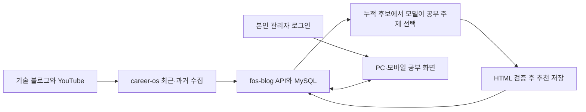

# career-os 제품 요구사항

career-os는 커리어 탐색부터 지원 준비, 면접 연습, 기술 학습까지 이어지는 개인 운영 도구다.

## 사용자 문제

채용 공고, 경력 근거, 지원 문서, 면접 준비 자료가 흩어지면 판단과 개선이 반복되지 않는다.
career-os는 외부 자료를 수집하고 사용자의 실제 이력과 대조해 다음 행동을 정할 수 있게 한다.

## 제품 약속

- 실제로 열린 개별 공고만 추천 후보로 다룬다.
- 추천과 이력서의 주장은 확인 가능한 경력과 작업 근거에 연결한다.
- 동기, 본인 판단, 기각한 대안과 설명 가능성처럼 사람만 확정할 수 있는 내용은 사용자에게 돌려주고 답변 준비까지 연결한다.
- 마감 여부, 중복, 명시적 제외처럼 결정적으로 판정할 수 있는 조건은 코드로 처리한다.
- 공고 적합도와 읽을거리의 최종 선별은 모델이 맥락을 보고 판단한다.
- 사용자가 보는 분석 결과는 공개 범위를 점검한 HTML 리포트로 제공한다.
- Hermes, Codex CLI와 Claude Code에서 만든 비공개 지원 자료는 다음 실행이 같은 현재 revision으로 이어받는다.
- 비공개 작업 release는 홈서버 범용 객체 저장소의 `career-os` collection에 보관한다.
- 지원서 제출, 로그인, 메시지 전송, 공개 게시처럼 외부 상태를 바꾸는 작업은 사용자 승인 뒤에 수행한다.

## 제품 영역

### 공고 탐색과 지원 판단

`position-recommender`는 등록된 채용 소스에서 공고를 수집한다.
수집 단계는 닫힌 공고와 명백한 제외 대상을 제거하고, 모델은 남은 후보 중 지원 가치가 높은 공고를 추천한다.

현재 지원 대상과 회사별 지원 판단은 private brain에서 확인하고, 공고별 실행 자료는 대응하는 `applications/` 디렉터리에서 관리한다.

### 지원 문서와 검증

`application-package-writer`는 공고가 찾는 사람과 후보자의 경험, 이력과 방향성이 부합하는지 판정하는 일을 첫 목표로 삼는다.
공고 항목을 컴포넌트 단위로 쪼개 판정하고 가중 점수로 적합도를 표시하며, 부합하지 않는다는 판정도 결론으로 남긴다.
그 판정 위에서 후보자 인터뷰, 지원 전략과 면접 검증 포인트를 준비한다.
전체 지원 요청에서는 이 결과를 `resume-preparer`로 이어 사용자가 실행 순서를 다시 판단하지 않게 한다.
사용자는 하나의 로컬 `application-package.html`에서 승부처, 공백, 지원동기와 다음 행동을 확인한다.
화면 구성은 [`data-schema.md`](data-schema.md)의 「검토 화면」이 소유한다.

`resume-preparer`는 이력서와 경력기술서를 작성하고, 사람 확인, 주장 근거 감사, 인사담당자와 실무담당자 리뷰, HTML·PDF 렌더링과 제출 묶음 검증을 한 흐름에서 수행한다.

이력서의 개인 작성 취향은 스킬 참조 문서가 소유한다.
경력, 역할 선호와 경험 경계는 brain에서 필요한 시점에 조회하고, 사용자 정정으로 새로 확인한 개인 지식은 기존 brain 환원 절차로 연결한다.
다른 공고에서도 같은 작성 취향을 적용하되, 제출 문구와 수치는 해당 지원의 근거로 확정한다.
모든 제출 문서는 공통 작성 규칙을 적용해 추상적인 표현보다 실제 제품, 문제, 수행한 작업과 확인한 결과를 먼저 보여준다.
초안을 사용자에게 보여주기 전에 외부 문장을 전수 검사하며, 제품 전체의 경험과 한 기능의 사례를 구분하고 같은 경험의 범위를 모든 제출 문서에서 일치시킨다.
사실 감사와 설득력 평가는 내부 단계와 별도 기준을 유지한다.
최종 종료 조건은 제출 문서, 근거 원장과 검토표의 문구 해시가 모두 같은 버전인지 검사한다.
대표 경험 설명과 꼬리질문 연습은 `interview-practice`가 담당한다.

### 면접 준비와 답변 연습

`interview-practice`는 기술·인성·포지션별 질문을 준비하고 사용자가 먼저 답한 내용을 채점해 복습 상태에 반영한다.
공개 가능한 일반 질문 수집은 필요할 때만 내부 유지보수 절차로 실행하며, 포지션 질문과 개인 답변을 공개 질문 은행에 넣지 않는다.
등록된 기술 블로그, 공개 영상과 GitHub 가이드에서 질문 후보를 수집하고, 공식 원문으로 기술 사실을 검증해 부족한 영역을 보강한다.
현재 직장과 경험 경계는 private brain에서 읽고, 회사 서열이 아니라 문제 규모와 책임 수준으로 질문 난도와 꼬리질문 깊이를 정한다.

### 아침 읽을거리

`study-topic-recommender`는 회사 기술 블로그, 개발 동향과 공개 영상 소스를 수집한다.
고정 주제를 생성하지 않고, 해당 날짜에 수집된 외부 글과 영상 중 사용자의 현재 업무와 다음 커리어에 적용할 판단을 얻을 수 있는 자료만 선별한다.
선별한 자료는 공부 주제별로 묶고, 이전에 추천한 같은 글과 영상은 홈서버 release에 누적한 이력으로 다시 추천하지 않는다.
직전 리포트와 같은 공부 주제도 다음 리포트에서 반복하지 않는다.

### 학습자료 보관과 웹 UI · 설계 중

**수집한 글과 영상을 누적 보관하고, PC와 모바일에서 같은 즐겨찾기·읽음 상태·개인 메모로 다시 찾는다.**
사용자가 홈서버 MySQL 사용을 승인했으며, 학습자료와 개인 상태의 기준 저장소로 설계한다.
`fos-blog`의 기존 DB에 학습자료용 테이블을 추가하고, 블로그 안에 공부 화면을 둔다.
이 절은 합의한 다음 기능의 요구사항이며 현재 구현된 기능을 뜻하지 않는다.

| 사용자 행동 | 필요한 동작 |
| --- | --- |
| 오래된 좋은 글 찾기 | 최신 피드 수집과 과거 자료 수집을 분리하고, 누적 자료를 검색한다 |
| 나중에 다시 보기 | 자료에 별표를 추가·해제하고 즐겨찾기 목록에서 조회한다 |
| 학습 완료 기록 | 읽음 상태를 변경하며, 추천 여부·별표와 독립적으로 유지한다 |
| 내 생각 남기기 | 자료별 개인 메모를 저장하고 다른 기기에서도 조회·수정한다 |
| 기기를 바꿔 사용 | PC와 모바일이 같은 서버 상태를 조회하고 변경한다 |
| 새 추천 받기 | 그날 수집한 후보뿐 아니라 누적 자료도 비교하고 이전 추천을 제외한다 |

UI는 전체 자료, 오늘 추천, 즐겨찾기와 읽은 자료를 구분한다.
글과 영상, 주제와 출처를 필터링하고 원문을 열 수 있어야 한다.
재수집으로 자료 정보가 갱신돼도 사용자가 남긴 별표·읽음 상태·메모는 보존한다.

캐시는 반복 요청을 줄이는 임시 데이터로 유지하며 자료 목록을 대신하지 않는다.
과거 수집은 공개 보관 목록과 발행처가 제공하는 범위에서 진행 상황을 저장하고 이어서 수행한다.
기존 추천 이력과 실제 게시 결과의 누락·중복을 대조한 뒤 이전하며, 과거 추천 자료를 새 자료로 취급하지 않는다.

MySQL 접근과 상태 변경은 `fos-blog` 서버가 담당하고, `career-os`는 HTTP API로 수집 결과와 추천을 전달한다.
공부 화면은 블로그의 공통 관리자 로그인 후 본인에게 제공한다.
이후 관리자 기능도 같은 로그인 체계를 재사용한다.
Better Auth의 GitHub 로그인을 사용하고, 서버에 등록한 본인 GitHub 고유 ID만 허용한다.
실행과 오류 복구는 [추천 흐름](flow.md#학습자료-api-연동모드), 저장 책임은 [학습자료 API 연동 상태](data-schema.md#학습자료-api-연동-상태)를 따른다.
기존 S3 release는 지원 준비 파일의 현재 계약을 유지하며, DB 백업·복구는 블로그 운영 절차가 담당한다.
운영 DB 적용과 공개 배포는 구현 검증 후 별도로 진행한다.

## 성공 기준

- 추천 공고에 원문 URL, 활성 상태, 추천 근거가 있다.
- 종료되거나 지원 기한이 지난 공고가 추천 결과에 포함되지 않는다.
- 이력서 핵심 주장마다 확인 가능한 근거와 소유권 범위가 있다.
- 제출 문구를 바꿀 사람 확인 항목이 남으면 준비 완료로 판정하지 않는다.
- 지원 브리프는 회사·포지션 기준, 후보자 근거, 준비 상태와 다음 행동을 함께 제공한다.
- 공고의 모든 항목이 적합도 표에 오르고, 각 항목에 근거와 판정이 있다.
- 적합도 총점과 구분별 소계를 한 화면에서 색으로 구분해 확인할 수 있으며, 총점을 합격 확률로 표시하지 않는다.
- 면접 답변 연습은 복습 대상을 누적하고 다음 실행에서 활용한다.
- 면접 질문은 포지션 질문과 공통 기반을 함께 포함하고, 답변에 따라 판단, 반례, 운영과 근거 경계까지 깊어진다.
- 읽을거리 리포트는 공부 주제, 커리어에 연결할 질문, 외부 자료의 제목, 출처, 요약과 추천 이유를 제공한다.
- 이전에 추천한 같은 글과 영상은 다음 실행의 선별 결과에 포함되지 않는다.
- 직전 리포트와 같은 공부 주제는 다음 리포트의 선별 결과에 포함되지 않는다.
- 공식 자료나 최신 소식이어도 사용자의 현재 업무, 목표 역할, 엔지니어링 판단 또는 제품·사업 관점에 구체적으로 연결되지 않으면 추천하지 않는다.
- 게시 리포트에는 공개 가능한 정보만 포함되며 URL이 실제로 열린다.

- 비공개 지원 자료를 쓰는 skill은 홈서버 revision과 로컬 변경 상태를 확인한 뒤 실행한다.
- 다른 환경이 먼저 새 revision을 반영했으면 로컬 결과를 보존하고 덮어쓰지 않는다.

## 제품 경계

- 채용 플랫폼 계정과 지원서 제출을 자동으로 조작하지 않는다.
- 개인 경력과 지원 전략을 공개 리포트에 그대로 싣지 않는다.
- 외부 자료 없이 학습 주제나 채용 공고를 만들어내지 않는다.
- 기능 사용법만 나열한 문서와 전이할 판단이 없는 발표·홍보 자료를 최신성만으로 추천하지 않는다.
- 현재 파일 기반 기능에 웹 제품이나 관계형 데이터베이스를 필수 운영 요소로 두지 않는다.
  설계 중인 학습자료 UI는 예외로 MySQL과 서버 API를 사용하며, 기존 지원·면접 기능의 운영 조건은 바꾸지 않는다.
- 캐시, 임시 공개 리포트, token과 개인키를 실행 환경 사이의 작업 원본으로 동기화하지 않는다.
- 실행 이력과 완료 작업을 제품 문서에 계속 쌓지 않는다.
